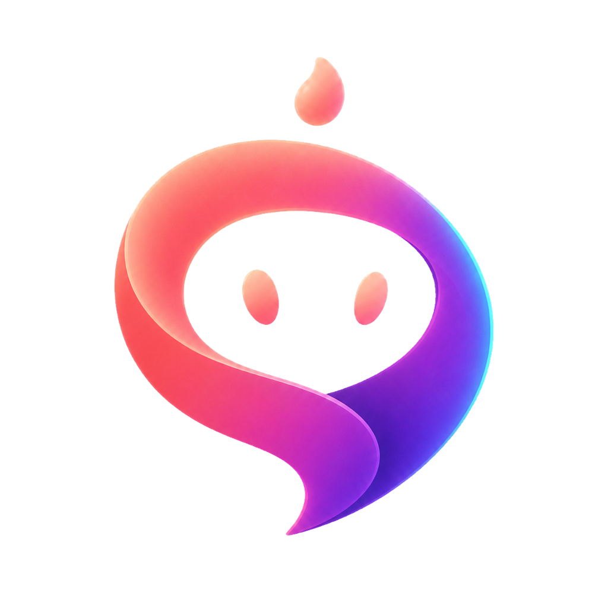
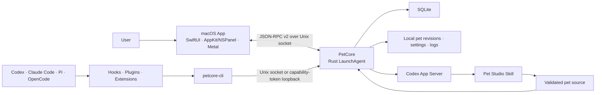

<p align="center">
  
</p>

# Agent Pet Companion

[简体中文](README.zh-CN.md) | English

Agent Pet Companion is a native macOS desktop companion for people who work with coding agents. You can step away from the chat while a local desktop pet quietly shows whether an Agent is working, needs attention, or has a result ready—and jump back to the relevant session from its bubble.

## Highlight Features

- **Ready out of the box** — includes two built-in pets with complete animations and interactions, so the full desktop-pet experience is available immediately after launch.
- **AI Pet Maker** — create highly customizable pets in virtually any visual style, choose higher-resolution quality when needed, and use AI to modify pets you already own.
- **Multi-agent sessions** — groups Codex, Claude Code, Pi Coding Agent, and OpenCode sessions by Agent across all projects. A collapsed Agent bubble shows one session, an expanded bubble shows up to three, and overflow opens Agent Connections; the complete row opens the corresponding host or exact session when available.
- **Local by design** — pets, settings, bounded session context, and diagnostics stay on the Mac unless you explicitly export a file. AI Pet Maker contacts your configured Codex provider only when you start a creation or edit.

## Features

- **Pet Library** — use the bundled `星雾团子` and `Bytebud 字节芽`, or import, preview, enable, export, and manage your own `.petpack` pets. A damaged local preview can be revalidated and rebuilt from its immutable package.
- **AI Pet Maker** — describe a pet, choose its style and quality, add reference images, then create or refine it through Codex.
- **Pet Configuration** — choose visibility, appearance, Standard/Smooth motion, and a message-attention preset; source, event, timeout, grouping, and interaction controls remain available under Advanced Settings.
- **Agent Connections** — separately shows local integration health and real-task verification, with typed check, repair, test, and managed-removal actions for Codex, Claude Code, Pi Coding Agent, and OpenCode.
- **Service & Diagnostics** — confirm that the companion is working, recover unhealthy services, and export a privacy-filtered diagnostics ZIP when support needs more detail.
- **Desktop overlay** — the pet body stays draggable during launch and state changes; resize it from the bottom-right handle, use the right-click menu, and open active agent sessions from native bubbles.

The app is local-first: pets, settings, normalized agent events, and diagnostics remain on the Mac unless the user explicitly exports a file. AI Pet Maker uses the current user's configured Codex provider only after the user starts a creation or edit. The app does not read agent credentials, tokens, cookies, or API keys.

## Installation

### Official GitHub Release

For a published version:

1. Open [GitHub Releases](https://github.com/xjxtree/agent-pet-companion/releases).
2. Download the ZIP matching your Mac—`macos-arm64` for Apple silicon or `macos-x86_64` for Intel—plus that version's `SHA256SUMS.txt`.
3. In the download directory, verify the selected ZIP, for example: `grep 'macos-arm64.zip' AgentPetCompanion-*-SHA256SUMS.txt | shasum -a 256 -c -`.
4. Extract the archive and move `AgentPetCompanion.app` to `/Applications`.
5. On first launch, Control-click or right-click the App in Finder, choose **Open**, then confirm **Open**. Alternatively, after macOS blocks a normal launch, use **System Settings → Privacy & Security → Open Anyway**.
6. Follow the three-scene setup: choose an included companion, connect the Agents you use, and watch the clearly labeled local demo.

Official archives are ad-hoc signed. They are not Developer ID signed or Apple-notarized and are not trusted by Gatekeeper by default, so the explicit first-open approval above is expected. The published checksum covers the exact downloadable ZIP. Installation needs no source toolchain and does not require `xattr`, disabling Gatekeeper, or another command-line bypass.

This is direct distribution through GitHub Releases, not Mac App Store publication. Apple silicon Macs should use the `arm64` archive rather than running the `x86_64` build through Rosetta.

### Updating an installed App

Agent Pet Companion quietly checks GitHub's latest stable Release after a
healthy launch and at most once per 24 hours. You can always run **Check for
Updates…** from the App menu or About window. The App accepts only a newer
stable `vX.Y.Z` Release with the exact official asset inventory and SHA-256
metadata reported by GitHub; it does not automatically download or install the
update. The repository does not require GitHub's Immutable Releases setting,
so verify the downloaded ZIP before replacing the installed App.

When an update is available:

1. use **Download for This Mac** to download and unzip the exact architecture
   ZIP;
2. quit Agent Pet Companion, move the new App to `/Applications`, and choose
   **Replace**;
3. open the new App from Applications, using Finder **Open** or **System
   Settings → Privacy & Security → Open Anyway** if macOS requests first-open
   approval.

The update guide appears next to the download action, at the top of the GitHub
Release, and whenever a release App is opened outside Applications. After the
new App starts, it preserves pets and settings while bringing PetCore, the CLI,
managed Agent connectors, the Codex plugin, and bundled pet-making Skills to
the versions shipped with that App. A problem with one Agent remains isolated
to that connection.

### Build from source

Requirements: macOS 14+, Apple Command Line Tools with Swift 6 and a macOS SDK, the Rust toolchain pinned by `rust-toolchain.toml`, and Python 3. Full Xcode is optional for this SwiftPM project.

```bash
git clone https://github.com/xjxtree/agent-pet-companion.git
cd agent-pet-companion
./script/build_app_bundle.sh
```

The ad-hoc-signed development app is written to `dist/`. Add `--archive` only when a separately verified handoff ZIP is needed. During development, this command explicitly quits the old UI host, rebuilds the bundle, opens the new one, and waits for the App/PetCore build identities to match:

```bash
./script/build_and_run.sh --run
```

## Usage

On first launch, the App resumes a short setup until you finish or explicitly skip it. The demo shows thinking, working, needs-attention, and completion using only local presentation state; it does not create Agent activity or diagnostics records. Closing the setup preserves the current scene for the next launch.

After setup, leave the App running and work normally in your Agent. The pet shows working, attention, and result states. A bubble action returns to the exact session when a validated route is available, opens the Agent host when only host-level navigation is safe, and stays unavailable when neither destination is valid.

Open the five management pages only when you want to switch or import a pet, create or edit one, adjust the ambient experience, connect an Agent, or recover and export diagnostics. AI creation requires a working Codex App Server and access through the current user's configured provider. Standard/Smooth playback never changes authored action duration, and Smooth appears only for validated native-20 pets.

Bundled pets are read-only defaults: they can be previewed, enabled, and exported, but not deleted or modified in place. App-created and imported pets can be revised; imported pets without a previous creation conversation start a new edit session from their validated package.

## Architecture



The macOS App owns the control center, menu-bar entry, desktop overlay, and rendering. PetCore owns durable state, pet validation and revision commits, generation jobs, normalized agent events, connector operations, and diagnostics. The App, PetCore, and `petcore-cli` are released as one versioned runtime set; quitting the UI closes the pet and windows while the PetCore LaunchAgent can continue preserving local event and data continuity.

## Documentation

| Document | Purpose |
|---|---|
| [Documentation index](docs/README.md) | Durable technical documentation and maintenance rules |
| [`.petpack` V1 specification](docs/specifications/AgentPetCompanion_Petpack_Whitepaper_V1.md) | Portable pet format and producer contract |
| [Contributing](CONTRIBUTING.md) | Development workflow and validation entrypoints |
| [Changelog](CHANGELOG.md) | Versioned user-visible changes for every GitHub Release |

## Contributing

Contributions are welcome. Read [CONTRIBUTING.md](CONTRIBUTING.md) and [AGENTS.md](AGENTS.md) before changing behavior or architecture. Keep changes focused, add the smallest useful test, update the durable document that owns the changed contract, and add user-visible changes to the `[Unreleased]` section of [CHANGELOG.md](CHANGELOG.md).

## License

Agent Pet Companion is available under the [MIT License](LICENSE).
