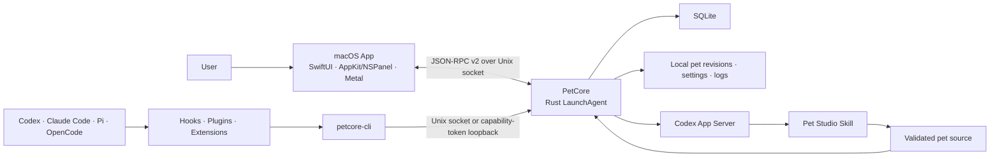

<p align="center">
  
</p>

# Agent Pet Companion

[简体中文](README.zh-CN.md) | English

Agent Pet Companion is a native macOS desktop companion for people who work with coding agents. It keeps pets local, shows them in a lightweight desktop overlay, and turns agent activity into visible pet states and session bubbles.

## Highlight Features

- **Ready out of the box** — includes two built-in pets with complete animations and interactions, so the full desktop-pet experience is available immediately after launch.
- **AI Pet Maker** — create highly customizable pets in virtually any visual style, choose higher-resolution quality when needed, and use AI to modify pets you already own.
- **Multi-agent sessions** — groups Codex, Claude Code, Pi Coding Agent, and OpenCode sessions by Agent across all projects. Each supported concurrent session can appear in its Agent bubble, and a click opens the corresponding host or session when available.
- **Rich pet configuration** — customize message-bubble transparency, session response rules, multi-session stacking, appearance, interaction, and other pet behavior.

## Features

- **Pet Library** — use the bundled `星雾团子` and `Bytebud 字节芽`, or import, preview, enable, export, and manage your own `.petpack` pets.
- **AI Pet Maker** — describe a pet, choose its style and quality, add reference images, then create or refine it through Codex.
- **Pet Configuration** — control visibility, bubbles, appearance, interaction, session grouping, and animation profile.
- **Agent Connections** — check, repair, test, or remove integrations for Codex, Claude Code, Pi Coding Agent, and OpenCode.
- **Service & Diagnostics** — inspect PetCore, local RPC, event-channel, and renderer health, then export a privacy-filtered diagnostics ZIP when needed.
- **Desktop overlay** — the pet body stays draggable during launch and state changes; resize it from the bottom-right handle, use the right-click menu, and open active agent sessions from native bubbles.

The app is local-first: pets, settings, normalized agent events, and diagnostics remain on the Mac unless the user explicitly exports a file. It does not read agent credentials, tokens, cookies, or API keys.

## Installation

### GitHub Release

When a release is available:

1. Open [GitHub Releases](https://github.com/xjxtree/agent-pet-companion/releases).
2. Download the ZIP matching your Mac—`macos-arm64` for Apple silicon or `macos-x86_64` for Intel—plus the versioned `SHA256SUMS.txt`.
3. In the download directory, verify the selected ZIP, for example: `grep 'macos-arm64.zip' AgentPetCompanion-*-SHA256SUMS.txt | shasum -a 256 -c -`.
4. Extract the archive and move `AgentPetCompanion.app` to `/Applications`.
5. Open the app and complete the checks under **Agent Connections**.

Do not run the `x86_64` archive on an Apple silicon Mac: it requires Rosetta and can trigger Apple's Intel-app support warning. The `arm64` archive and all of its bundled executables are Apple-silicon native and do not use Rosetta. Release ZIPs are ad-hoc signed for bundle-integrity verification and are not Apple-notarized. If macOS blocks the first launch, Control-click the app, choose **Open**, and confirm once. The matching GitHub Release records the checksums and validation scope.

### Build from source

Requirements: macOS 14+, Apple Command Line Tools with Swift 6 and a macOS SDK, the Rust toolchain pinned by `rust-toolchain.toml`, and Python 3. Full Xcode is optional for this SwiftPM project.

```bash
git clone https://github.com/xjxtree/agent-pet-companion.git
cd agent-pet-companion
./script/build_app_bundle.sh
```

The ad-hoc-signed development app is written to `dist/`. Add `--archive` only when a separately verified handoff ZIP is needed. During development, this command explicitly quits the old UI host, rebuilds the bundle, opens the new one, and waits for the App/PetCore build identities to match:

```bash
./script/build_and_run.sh --run
```

## Usage

1. Open **Pet Library** and enable one of the bundled pets, or import your own `.petpack`.
2. Open **AI Pet Maker** to create a pet. This workflow requires a working Codex App Server from the Codex CLI or the bundled ChatGPT/Codex app, with provider access available to the current user.
3. Use **Pet Configuration** to choose the appearance, bubbles, input behavior, grouping, and animation profile. Native 20 FPS pets support Standard 10 FPS and Smooth 20 FPS playback; native 10 FPS pets remain at 10 FPS, and neither choice changes the authored action duration.
4. Use **Agent Connections** to install or verify the integrations you use.
5. Keep the app running while working with an agent. The pet reacts to start, tool, waiting, review, done, and failed events.
6. If something goes wrong, open **Service & Diagnostics**, export a diagnostics ZIP, and attach it to the issue.

Bundled pets are read-only defaults: they can be previewed, enabled, and exported, but not deleted or modified in place. App-created and imported pets can be revised; imported pets without a previous creation conversation start a new edit session from their validated package.

## Architecture



The macOS App owns the control center, menu-bar entry, desktop overlay, and rendering. PetCore owns durable state, pet validation and revision commits, generation jobs, normalized agent events, connector operations, and diagnostics. The two components are released as one versioned runtime set; quitting the UI closes the pet and windows while the PetCore LaunchAgent can continue preserving local event and data continuity.

## Documentation

| Document | Purpose |
|---|---|
| [Documentation index](docs/README.md) | Durable technical documentation and maintenance rules |
| [`.petpack` V1 specification](docs/specifications/AgentPetCompanion_Petpack_Whitepaper_V1.md) | Portable pet format and producer contract |
| [Contributing](CONTRIBUTING.md) | Development workflow and validation entrypoints |
| [Changelog](CHANGELOG.md) | Versioned user-visible changes for every GitHub Release |

## Contributing

Contributions are welcome. Read [CONTRIBUTING.md](CONTRIBUTING.md) and [AGENTS.md](AGENTS.md) before changing behavior or architecture. Keep changes focused, add the smallest useful test, update the durable document that owns the changed contract, and add user-visible changes to the `[Unreleased]` section of [CHANGELOG.md](CHANGELOG.md).

## License

Agent Pet Companion is available under the [MIT License](LICENSE).
