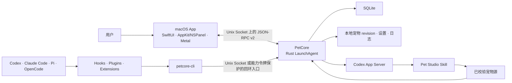

<p align="center">
  
</p>

# Agent Pet Companion

简体中文 | [English](README.md)

Agent Pet Companion 是一款面向编码 Agent 用户的 macOS 原生桌宠 App。它把宠物保存在本机，通过轻量桌面悬浮层展示，并将 Agent 活动转换为可见的宠物状态与会话气泡。

## 核心亮点

- **开箱即用**：内置两只拥有完整动画与交互能力的宠物，首次打开即可获得完整桌宠功能体验。
- **AI宠物制作**：支持高自由度、任意风格的宠物制作，可选择高分辨率宠物画质；已有宠物也支持通过 AI 修改。
- **多 Agent 会话支持**：按 Agent 汇总 Codex、Claude Code、Pi Coding Agent 和 OpenCode 在所有项目中的会话；每个受支持的并发会话都可显示在对应 Agent 气泡中，点击后可打开相应宿主或会话。
- **丰富的宠物配置**：支持消息气泡透明度、会话响应规则、多会话堆叠方式、外观、交互等丰富配置。

## 功能

- **宠物库**：使用内置的 `星雾团子` 与 `Bytebud 字节芽`，或导入、预览、启用、导出和管理自己的 `.petpack` 宠物。
- **AI宠物制作**：描述想要的宠物，选择风格、画质和参考图，再通过 Codex 创建或持续调整。
- **宠物配置**：设置显示、气泡、外观、交互、会话分组和动画档位。
- **Agent 连接**：检查、修复、测试或移除 Codex、Claude Code、Pi Coding Agent 和 OpenCode 集成。
- **服务与诊断**：查看 PetCore、本地 RPC、事件通道和桌宠渲染健康状态，并在需要时导出经过隐私过滤的诊断 ZIP。
- **桌面悬浮层**：宠物本体在启动和状态切换期间也始终可拖动；可使用右下角手柄缩放、通过右键菜单操作，并从原生气泡打开活动会话。

App 采用本地优先设计：宠物、设置、归一化 Agent 事件与诊断信息都保留在 Mac 上，只有用户主动导出时才会生成外部文件；App 不读取 Agent 凭据、Token、Cookie 或 API Key。

## 安装

### 从 GitHub Release 安装

存在发布包时：

1. 打开 [GitHub Releases](https://github.com/xjxtree/agent-pet-companion/releases)。
2. 按 Mac 架构下载 ZIP：Apple 芯片选择 `macos-arm64`，Intel Mac 选择 `macos-x86_64`；同时下载该版本的 `SHA256SUMS.txt`。
3. 在下载目录校验所选 ZIP，例如：`grep 'macos-arm64.zip' AgentPetCompanion-*-SHA256SUMS.txt | shasum -a 256 -c -`。
4. 解压归档，并将 `AgentPetCompanion.app` 移到 `/Applications`。
5. 打开 App，在 **Agent 连接**中完成所需集成检查。

不要在 Apple 芯片 Mac 上运行 `x86_64` 归档：它依赖 Rosetta，并可能触发 Apple 的 Intel App 支持终止提示。`arm64` 归档及其包内全部可执行文件均为 Apple 芯片原生版本，不使用 Rosetta。Release ZIP 使用 ad-hoc 签名校验包完整性，不进行 Apple 公证。若 macOS 首次启动时阻止打开，请按住 Control 点击 App，选择**打开**并确认一次。对应 GitHub Release 会记录校验和与验收范围。

### 从源码构建

需要 macOS 14+、包含 Swift 6 与 macOS SDK 的 Apple Command Line Tools、`rust-toolchain.toml` 固定的 Rust 工具链，以及 Python 3。本 SwiftPM 项目不强制安装完整 Xcode。

```bash
git clone https://github.com/xjxtree/agent-pet-companion.git
cd agent-pet-companion
./script/build_app_bundle.sh
```

默认仅将 ad-hoc 签名的开发 App 写入 `dist/`；只有需要单独校验的交接 ZIP 时才添加 `--archive`。开发过程中可使用以下命令：它会明确退出旧 UI Host、重新构建并打开新 App，再等待 App 与 PetCore 的构建标识一致。

```bash
./script/build_and_run.sh --run
```

## 使用

1. 打开**宠物库**，启用一只内置宠物，或导入自己的 `.petpack`。
2. 打开 **AI宠物制作**创建宠物。该流程需要 Codex CLI 或 ChatGPT/Codex App 内置的 Codex App Server 可用，并且当前用户拥有相应服务访问权限。
3. 在**宠物配置**中选择外观、气泡、输入行为、会话分组和动画档位。原生 20 FPS 宠物可选择标准 10 FPS 或流畅 20 FPS，原生 10 FPS 宠物只能使用 10 FPS；切换档位不会改变动作的制作时长。
4. 在 **Agent 连接**中安装或验证需要使用的集成。
5. 使用 Agent 工作时保持 App 运行；桌宠会响应开始、工具执行、等待、待查看、完成和失败事件。
6. 遇到问题时，打开**服务与诊断**，导出诊断 ZIP，并随 issue 一并提交。

内置宠物是只读默认资源：可以预览、启用和导出，但不能原地删除或修改。App 创建和外部导入的宠物均可修改；没有历史制作会话的导入宠物，会以当前已校验宠物包为基线新建修改会话。

## 技术架构



macOS App 负责控制中心、状态栏入口、桌面悬浮层和渲染；PetCore 负责持久状态、宠物校验与 revision 提交、制作任务、归一化 Agent 事件、连接器操作和诊断。两者作为同一个带版本的运行时集合发布；执行标准退出会关闭 UI 与桌宠，独立的 PetCore LaunchAgent 可继续维持本地事件与数据连续性。

## 主要文档

| 文档 | 用途 |
|---|---|
| [文档索引](docs/README.md) | 长期技术文档入口与维护规则 |
| [`.petpack` V1 规范](docs/specifications/AgentPetCompanion_Petpack_Whitepaper_V1.md) | 可移植宠物格式与生产者契约 |
| [参与贡献](CONTRIBUTING.md) | 开发流程与验证入口 |
| [版本变更记录](CHANGELOG.md) | 每个 GitHub Release 对应的用户可见变更 |

## Contributing

欢迎参与贡献。修改功能或架构前，请阅读 [CONTRIBUTING.md](CONTRIBUTING.md) 与 [AGENTS.md](AGENTS.md)。保持改动聚焦、添加最小有效测试、同步负责该契约的长期文档，并将用户可见变化写入 [CHANGELOG.md](CHANGELOG.md) 的 `[Unreleased]`。

## License

Agent Pet Companion 使用 [MIT License](LICENSE)。
