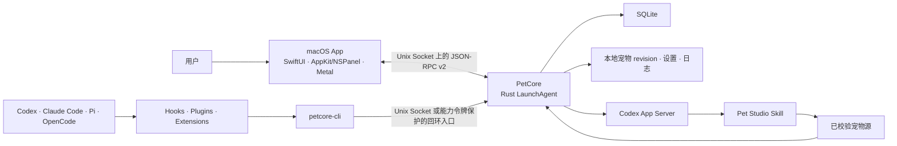

<p align="center">
  
</p>

# Agent Pet Companion

简体中文 | [English](README.md)

Agent Pet Companion 是一款面向编码 Agent 用户的 macOS 原生桌宠 App。你可以离开聊天窗口，让本地桌宠安静地告诉你 Agent 正在工作、需要你处理，还是已有结果可看，并可从气泡直接回到相关会话。

## 核心亮点

- **开箱即用**：内置两只拥有完整动画与交互能力的宠物，首次打开即可获得完整桌宠功能体验。
- **AI宠物制作**：支持高自由度、任意风格的宠物制作，可选择高分辨率宠物画质；已有宠物也支持通过 AI 修改。
- **多 Agent 会话支持**：按 Agent 汇总 Codex、Claude Code、Pi Coding Agent 和 OpenCode 在所有项目中的会话；每个受支持的并发会话都可显示在对应 Agent 气泡中，点击后可打开相应宿主或会话。
- **本地优先**：宠物、设置、有界会话上下文与诊断信息都保留在 Mac 上，只有你主动导出时才会生成外部文件；AI 宠物制作仅在你主动开始创建或修改时使用已配置的 Codex 服务。

## 功能

- **宠物库**：使用内置的 `星雾团子` 与 `Bytebud 字节芽`，或导入、预览、启用、导出和管理自己的 `.petpack` 宠物。
- **AI宠物制作**：描述想要的宠物，选择风格、画质和参考图，再通过 Codex 创建或持续调整。
- **宠物配置**：选择桌宠与气泡显示、外观、标准/流畅动效和消息提醒预设；来源、逐事件、收起时间、分组与交互控制保留在高级设置中。
- **Agent 连接**：检查、修复、测试或移除 Codex、Claude Code、Pi Coding Agent 和 OpenCode 集成。
- **服务与诊断**：确认桌宠是否正常工作，恢复异常服务，并在支持人员确实需要更多信息时导出经过隐私过滤的诊断 ZIP。
- **桌面悬浮层**：宠物本体在启动和状态切换期间也始终可拖动；可使用右下角手柄缩放、通过右键菜单操作，并从原生气泡打开活动会话。

App 采用本地优先设计：宠物、设置、归一化 Agent 事件与诊断信息都保留在 Mac 上，只有用户主动导出时才会生成外部文件。AI 宠物制作仅在用户主动开始创建或修改后，使用当前用户已配置的 Codex 服务；App 不读取 Agent 凭据、Token、Cookie 或 API Key。

## 安装

### 从正式 GitHub Release 安装

安装已发布版本：

1. 打开 [GitHub Releases](https://github.com/xjxtree/agent-pet-companion/releases)。
2. 按 Mac 架构下载 ZIP：Apple 芯片选择 `macos-arm64`，Intel Mac 选择 `macos-x86_64`；同时下载该版本的 `SHA256SUMS.txt`。
3. 在下载目录校验所选 ZIP，例如：`grep 'macos-arm64.zip' AgentPetCompanion-*-SHA256SUMS.txt | shasum -a 256 -c -`。
4. 解压归档，并将 `AgentPetCompanion.app` 移到 `/Applications`。
5. 首次启动时，在 Finder 中按住 Control 点击或右键点击 App，选择**打开**，再确认**打开**。也可以先尝试普通打开，然后前往**系统设置 → 隐私与安全性 → 仍要打开**并确认。
6. 按三幕首次设置选择内置桌宠、连接需要使用的 Agent，并观看明确标注的本地演示。

正式归档采用 ad-hoc 签名，没有 Developer ID 签名或 Apple 公证，默认不会受到 Gatekeeper 信任，因此首次打开需要上述用户授权。发布的校验和对应实际下载的 ZIP；安装不需要源码工具链，也不需要运行 `xattr`、关闭 Gatekeeper 或使用其他命令行绕过。

这是通过 GitHub Releases 进行的直接分发，不是发布到 Mac App Store。Apple 芯片 Mac 应直接使用 `arm64`，不要通过 Rosetta 运行 `x86_64` 包。

### 从源码构建

需要 macOS 14+、包含 Swift 6 与 macOS SDK 的 Apple Command Line Tools、`rust-toolchain.toml` 固定的 Rust 工具链，以及 Python 3。本 SwiftPM 项目不强制安装完整 Xcode。

```bash
git clone https://github.com/xjxtree/agent-pet-companion.git
cd agent-pet-companion
./script/build_app_bundle.sh
```

默认仅将 ad-hoc 签名的开发 App 写入 `dist/`；只有需要单独校验的交接 ZIP 时才添加 `--archive`。开发过程中可使用以下命令：它会明确退出旧 UI Host、重新构建并打开新 App，再等待 App 与 PetCore 的构建标识一致。

```bash
./script/build_and_run.sh --run
```

## 使用

首次启动时，App 会恢复一段简短设置，直到你完成或明确跳过。演示只使用本地界面状态展示思考、工作、需要处理和完成，不会生成 Agent 活动或诊断记录；暂时关闭会保留当前步骤，下次启动可继续。

完成设置后，让 App 保持运行并照常使用 Agent。桌宠会呈现工作、需要处理与已有结果等状态；气泡在存在已校验路由时返回具体会话，只能安全打开宿主时会明确打开 Agent 宿主，两种目标都无效时不会提供误导性的跳转。

只有在切换或导入宠物、创建或修改宠物、调整桌宠体验、连接 Agent，或恢复服务与导出诊断时，才需要打开五个管理页面。AI 制作需要可用的 Codex App Server 与当前用户已配置的服务访问权限。标准/流畅播放不会改变动作的制作时长，且只有经过校验的原生 20 FPS 宠物会显示流畅档位。

内置宠物是只读默认资源：可以预览、启用和导出，但不能原地删除或修改。App 创建和外部导入的宠物均可修改；没有历史制作会话的导入宠物，会以当前已校验宠物包为基线新建修改会话。

## 技术架构



macOS App 负责控制中心、状态栏入口、桌面悬浮层和渲染；PetCore 负责持久状态、宠物校验与 revision 提交、制作任务、归一化 Agent 事件、连接器操作和诊断。macOS App、PetCore 与 `petcore-cli` 作为同一个带版本的运行时集合发布；执行标准退出会关闭 UI 与桌宠，独立的 PetCore LaunchAgent 可继续维持本地事件与数据连续性。

## 主要文档

| 文档 | 用途 |
|---|---|
| [文档索引](docs/README.md) | 长期技术文档入口与维护规则 |
| [产品体验合同](docs/product/experience-contract.md) | 目标产品模型与不可妥协的体验决策 |
| [产品重构实施任务](docs/development/product-refactor-execution.md) | 不包含排期与里程碑、按依赖顺序执行的工程任务 |
| [`.petpack` V1 规范](docs/specifications/AgentPetCompanion_Petpack_Whitepaper_V1.md) | 可移植宠物格式与生产者契约 |
| [参与贡献](CONTRIBUTING.md) | 开发流程与验证入口 |
| [版本变更记录](CHANGELOG.md) | 每个 GitHub Release 对应的用户可见变更 |

## Contributing

欢迎参与贡献。修改功能或架构前，请阅读 [CONTRIBUTING.md](CONTRIBUTING.md) 与 [AGENTS.md](AGENTS.md)。保持改动聚焦、添加最小有效测试、同步负责该契约的长期文档，并将用户可见变化写入 [CHANGELOG.md](CHANGELOG.md) 的 `[Unreleased]`。

## License

Agent Pet Companion 使用 [MIT License](LICENSE)。
