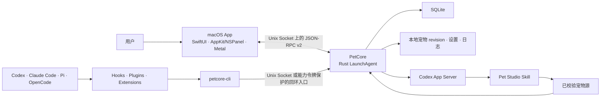

<p align="center">
  
</p>

# Agent Pet Companion

简体中文 | [English](README.md)

Agent Pet Companion 是一款面向编码 Agent 用户的 macOS 原生桌宠 App。你可以离开聊天窗口，让本地桌宠安静地告诉你 Agent 正在工作、需要你处理，还是已有结果可看，并可从气泡直接回到相关会话。

## 核心亮点

- **开箱即用**：内置三只拥有完整动画与克制交互能力的宠物，首次打开即可获得完整桌宠功能体验。
- **AI宠物制作**：支持高自由度、任意风格的宠物制作，可选择标清 192×208 或标准 384×416 运行画质；标准画质默认适合大多数角色，标清适合极简或像素风格。通用宠物包格式、宠物库与运行时还支持由其他具备足够来源分辨率的流程制作的高清 576×624 宠物包；App 内基于 Codex 的制作流程不提供高清选项。生图整图不必精确命中目标像素：完整的 12:13 来源裁片可以大于目标，再由共享的 Alpha 感知流水线一次等比缩小，但绝不放大。所有档位仍需在运行尺寸下检查动作、身份、连续性与逐帧时序。
- **多 Agent 会话支持**：按 Agent 汇总 Codex、Claude Code、Pi Coding Agent 和 OpenCode 在所有项目中的会话，并区分其 App 与 CLI 来源；折叠气泡显示一个优先提醒或最新会话，展开后直接显示本地有界快照中的全部具体会话。每行右侧对齐的 badge 只显示稳定、经过筛选的会话事件：已开始、正在思考、正在规划、正在调用工具、等待你操作、已完成或执行失败；标题下两行展示有界 Agent 消息与归一化语义活动。“已开始”不触发宠物动作，“正在思考”和“正在规划”共用宠物的“思考”动作。通过校验的路由可返回 ChatGPT/Codex 或 Claude App 的精确会话、Warp CLI 会话，或相应 App/终端宿主；不可用会话仍有悬停/焦点反馈，并明确提示没有可用目标。
- **本地优先**：宠物、设置、有界会话上下文与诊断信息都保留在 Mac 上，只有你主动导出时才会生成外部文件；AI 宠物制作仅在你主动开始创建或修改时使用已配置的 Codex 服务。

## 功能

- **宠物库**：使用内置的 `星雾团子`、`Bytebud 字节芽` 与 `桃蕾`，或导入、预览、启用、导出和管理标清 192×208、标准 384×416 或高清 576×624 的 `.petpack` 宠物；本地预览损坏时可从不可变宠物包重新校验并恢复。
- **AI宠物制作**：描述想要的宠物，选择风格、画质和参考图，再通过 Codex 创建或持续调整。
- **宠物配置**：选择桌宠与气泡显示、主题、80–224 pt 桌宠显示宽度和消息提醒预设；来源、逐事件、收起时间、分组与交互控制保留在高级设置中。
- **Agent 连接**：以简洁的单选列表呈现 Codex、Claude Code、Pi Coding Agent 和 OpenCode；选择一个 Agent 后再显示真实任务验证、面向用户的处理提示，检查、测试、设置或修复和受管移除操作，以及 Agent Pet Companion 为该 Agent 安装和维护的插件、连接器或技能；有面向用户的发行版本时会直接展示，版本与当前 App 不匹配时会明确列出当前版本和所需版本。
- **服务与诊断**：确认桌宠是否正常工作，恢复异常服务，并在支持人员确实需要更多信息时导出经过隐私过滤的诊断 ZIP。
- **桌面悬浮层**：宠物本体在启动和状态切换期间也始终可拖动，气泡与菜单会作为同一组合一起移动。单击宠物只会展开或收起一次气泡，只有点击具体会话行才会打开对应 Agent 目标。显示尺寸只在“宠物配置”中调整，因此拖动始终只负责移动桌宠。

App 采用本地优先设计：宠物、设置、归一化 Agent 事件与诊断信息都保留在 Mac 上，只有用户主动导出时才会生成外部文件。AI 宠物制作仅在用户主动开始创建或修改后，使用当前用户已配置的 Codex 服务；App 不读取 Agent 凭据、Token、Cookie 或 API Key。

## 安装

### 从正式 GitHub Release 安装

安装已发布版本：

1. 打开 [GitHub Releases](https://github.com/xjxtree/agent-pet-companion/releases)。
2. 按 Mac 架构下载 ZIP：Apple 芯片选择 `macos-arm64`，Intel Mac 选择 `macos-x86_64`；同时下载该版本的 `SHA256SUMS.txt`。
3. 在下载目录校验所选 ZIP，例如：`grep 'macos-arm64.zip' AgentPetCompanion-*-SHA256SUMS.txt | shasum -a 256 -c -`。
4. 解压归档，并将 `AgentPetCompanion.app` 移到 `/Applications`。
5. 首次启动时，在 Finder 中按住 Control 点击或右键点击 App，选择**打开**，再确认**打开**。也可以先尝试普通打开，然后前往**系统设置 → 隐私与安全性 → 仍要打开**并确认。
6. 按三幕首次设置选择内置桌宠、连接需要使用的 Agent，并观看明确标注的本地演示。

正式归档采用 ad-hoc 签名，没有 Developer ID 签名或 Apple 公证，默认不会受到 Gatekeeper 信任，因此首次打开需要上述用户授权。发布的校验和对应实际下载的 ZIP；安装不需要源码工具链，也不需要运行 `xattr`、关闭 Gatekeeper 或使用其他命令行绕过。

这是通过 GitHub Releases 进行的直接分发，不是发布到 Mac App Store。Apple 芯片 Mac 应直接使用 `arm64`，不要通过 Rosetta 运行 `x86_64` 包。

### 更新已安装的 App

Agent Pet Companion 会在健康启动后安静检查 GitHub 的 latest stable Release，
每 24 小时至多一次。你也可以随时从 App 菜单或“关于”窗口选择**检查更新…**。
App 只接受版本更高、资产清单以及 GitHub 返回的 SHA-256 元数据完全匹配的
`vX.Y.Z` 正式版本；它不会自动下载或安装更新。仓库不要求开启 GitHub
Immutable Releases，因此替换已安装 App 前仍需校验下载的 ZIP。

发现更新后只需三步：

1. 选择**下载适用于此 Mac 的新版**，下载并解压当前架构的精确 ZIP；
2. 退出 Agent Pet Companion，将新版移入 `/Applications`，并选择**替换**；
3. 从“应用程序”打开新版；如果 macOS 要求首次打开授权，使用 Finder 的**打开**
   或**系统设置 → 隐私与安全性 → 仍要打开**。

更新引导会出现在下载动作旁、GitHub Release 顶部，以及正式版 App 从非
“应用程序”位置打开时。新版启动后会保留宠物与设置，并将 PetCore、CLI、此前已
受管的 Agent 连接器、Codex 插件与宠物制作 Skills 收敛到随新版发布的版本。某个
Agent 更新失败只影响该连接。用户自行管理的第三方扩展与技能仍由各 Agent 自带的
管理方式负责；Agent Pet Companion 不会检查、展示或替用户更新这些项目。

### 从源码构建

需要 macOS 14+、包含 Swift 6 与 macOS SDK 的 Apple Command Line Tools、`rust-toolchain.toml` 固定的 Rust 工具链，以及 Python 3。本 SwiftPM 项目不强制安装完整 Xcode。

```bash
git clone https://github.com/xjxtree/agent-pet-companion.git
cd agent-pet-companion
./script/build_app_bundle.sh
```

默认仅将 ad-hoc 签名的开发 App 写入 `dist/`；只有需要单独校验的交接 ZIP 时才添加 `--archive`。开发过程中可使用以下命令：它会明确退出旧 UI Host、重新构建并打开新 App，再等待 App 与 PetCore 的构建标识一致。

```bash
./script/build_and_run.sh --run
```

## 使用

首次启动时，App 会恢复一段简短设置，直到你完成或明确跳过。演示只使用本地界面状态展示思考、工作、需要处理和完成，不会生成 Agent 活动或诊断记录；暂时关闭会保留当前步骤，下次启动可继续。

完成设置后，让 App 保持运行并照常使用 Agent。桌宠会呈现工作、需要处理与已有结果等状态；点击宠物本体会做一次短回应并展开或收起会话气泡，但不会跳转；拖动时只在指针移动宠物期间播放紧凑的左右步态。点击具体会话行后，气泡会在存在已校验路由时返回对应会话，只能安全打开宿主时会明确打开 Agent 宿主，两种目标都无效时不会提供误导性的跳转。

关闭控制中心窗口后，菜单栏 App 与已启用的桌宠会继续运行。只想隐藏桌宠时请使用桌宠显示开关；需要停止整个 UI 时请选择“退出”。

只有在切换或导入宠物、创建或修改宠物、调整桌宠体验、连接 Agent，或恢复服务与导出诊断时，才需要打开五个管理页面。AI 制作需要可用的 Codex App Server 与当前用户已配置的服务访问权限。运行时会直接播放 V3 各动作声明的逐帧制作时序；思考、工具与完成动作只播放有限段数，随后在不改变语义状态和气泡的前提下回到 idle，因此长租约不会把动作定格数分钟；等待与失败保留明确稳定姿势。产品不包含视线追踪帧、悬停跳跃或自主游走，也不提供播放速度档位、不抽帧、不在卡顿后快速补播错过的帧。

内置宠物是只读默认资源：可以预览、启用和导出，但不能原地删除或修改。App 创建和外部导入的标清/标准宠物可以继续修改；没有历史制作会话的导入宠物，会以当前已校验宠物包为基线新建修改会话。高清宠物导入校验完成后即可预览、启用、导出或删除，但修改仍需使用能够提供足够高清来源像素的外部流程。

## 技术架构


```mermaid
flowchart LR
    User["用户"] --> App["macOS App<br/>SwiftUI · AppKit/NSPanel · Metal"]
    App <-->|"Unix Socket 上的 JSON-RPC v2"| Core["PetCore<br/>Rust LaunchAgent"]
    Agents["Codex · Claude Code · Pi · OpenCode"] --> Adapters["Hooks · Plugins · Extensions"]
    Adapters --> CLI["petcore-cli"]
    CLI -->|"Unix Socket 或能力令牌保护的回环入口"| Core
    Core --> DB["SQLite"]
    Core --> Store["本地宠物 revision · 设置 · 日志"]
    Core --> Codex["Codex App Server"]
    Codex --> Skill["Pet Studio Skill"]
    Skill --> Source["已校验宠物源"]
    Source --> Core
```

macOS App 负责控制中心、状态栏入口、桌面悬浮层和渲染；PetCore 负责持久状态、宠物校验与 revision 提交、制作任务、归一化 Agent 事件、连接器操作和诊断。macOS App、PetCore 与 `petcore-cli` 作为同一个带版本的运行时集合发布；执行标准退出会关闭 UI 与桌宠，独立的 PetCore LaunchAgent 可继续维持本地事件与数据连续性。

## 主要文档

| 文档 | 用途 |
|---|---|
| [文档索引](docs/README.md) | 长期技术文档入口与维护规则 |
| [`.petpack` V3 规范](docs/specifications/AgentPetCompanion_Petpack_Whitepaper_V3.md) | 九动作可移植宠物格式、制作时序、本地交互与生产者契约 |
| [参与贡献](CONTRIBUTING.md) | 开发流程与验证入口 |
| [版本变更记录](CHANGELOG.md) | 每个 GitHub Release 对应的用户可见变更 |

## Contributing

欢迎参与贡献。修改功能或架构前，请阅读 [CONTRIBUTING.md](CONTRIBUTING.md) 与 [AGENTS.md](AGENTS.md)。保持改动聚焦、添加最小有效测试、同步负责该契约的长期文档，并将用户可见变化写入 [CHANGELOG.md](CHANGELOG.md) 的 `[Unreleased]`。

## License

Agent Pet Companion 使用 [MIT License](LICENSE)。
