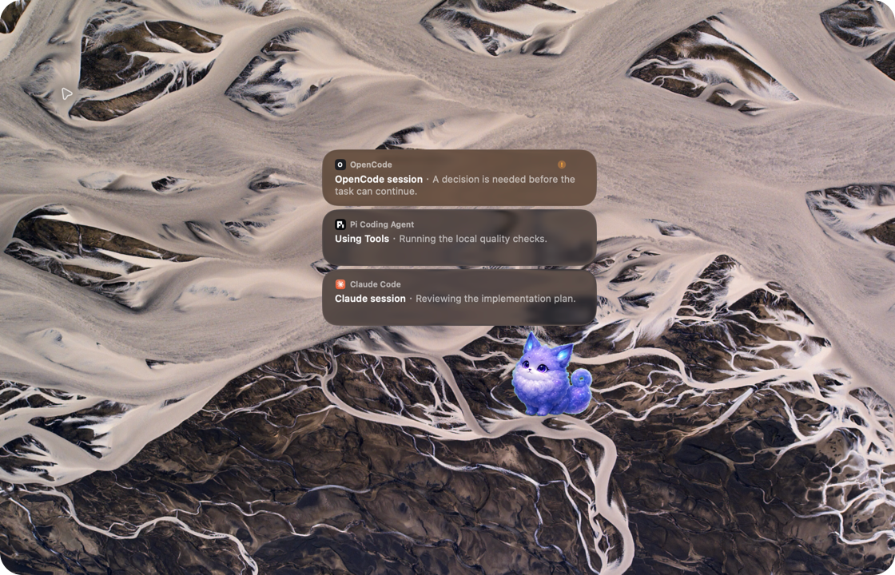
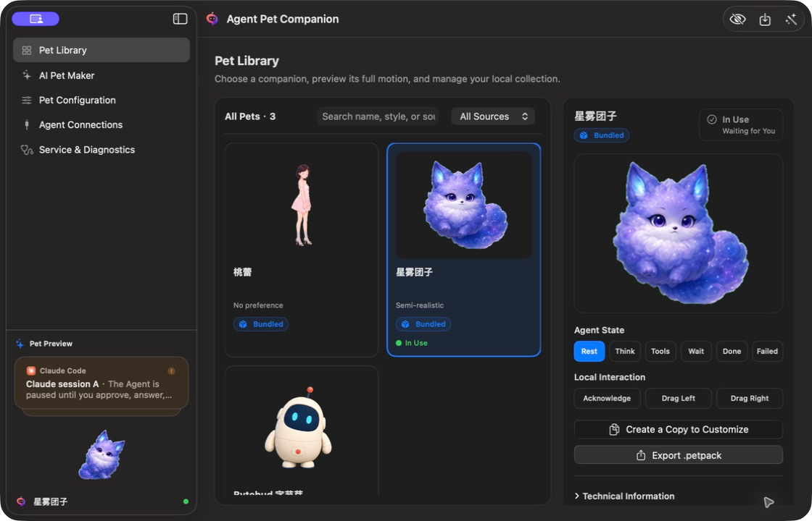
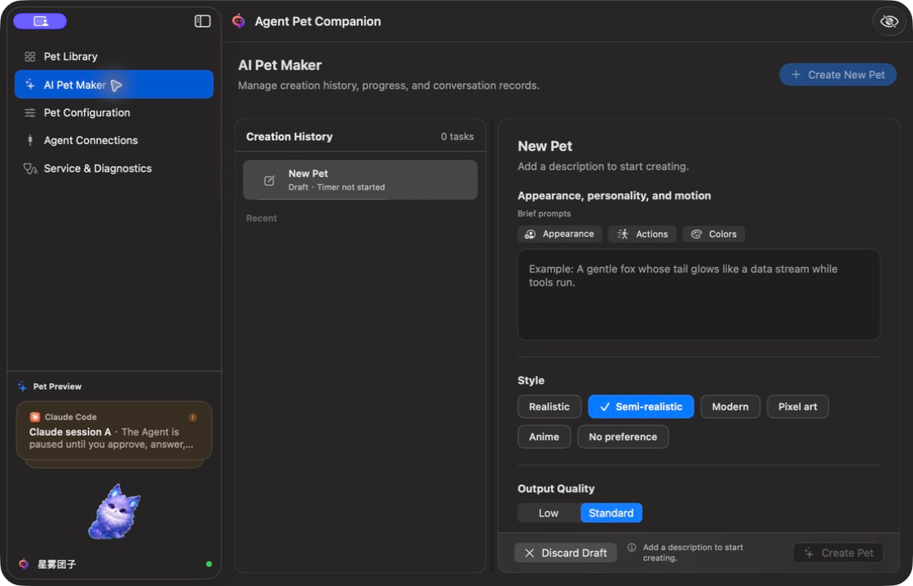

<p align="center">
  
</p>

# Agent Pet Companion

简体中文 | [English](README.md)

**不用一直盯着终端，也能知道 AI 编码助手进行到哪一步。**

Agent Pet Companion 是一款 macOS 原生桌宠 App，适合同时使用一个或多个编码 Agent 的用户。它会用桌宠动作和消息气泡告诉你：Agent 正在思考、使用工具、等待你处理，还是已经完成任务。需要你回来时，可用的会话入口也会直接出现在气泡里。

[下载最新版本](https://github.com/xjxtree/agent-pet-companion/releases) · 支持 macOS 14 及以上版本 · Apple 芯片与 Intel Mac

<p align="center">
  
</p>

## 它能帮你做什么

- **少一些来回切换**：在桌面上直接看到 Agent 的工作状态，不必反复打开终端或 Agent App。
- **不错过需要处理的任务**：等待输入、执行完成或失败时，桌宠会给出清晰反馈。
- **同时关注多个 Agent**：统一查看 Codex、Claude Code、Pi Coding Agent 和 OpenCode 的任务动态。
- **快速回到工作现场**：路由可用时，从气泡打开对应会话、Agent App 或终端。
- **拥有自己的桌宠**：使用三个内置宠物，导入 `.petpack`，或通过 AI 宠物制作创建和修改专属宠物。
- **数据以本机为中心**：宠物、设置、有限的会话摘要和诊断信息保存在 Mac 上；App 不读取 Agent 的凭据、Token、Cookie 或 API Key。

<p align="center">
  
</p>

## 三步开始使用

1. 从 [GitHub Releases](https://github.com/xjxtree/agent-pet-companion/releases) 下载并安装 App。
2. 按首次启动引导选择桌宠，并为你正在使用的 Agent 完成连接设置。
3. 像平常一样在 Agent 中开始任务；桌宠会自动展示任务状态和可用的返回入口。

首次启动时可以选择 `星雾团子`、`Bytebud 字节芽` 或 `桃蕾`。完成设置后，即使关闭控制中心，桌宠也会继续留在桌面上。

## 日常使用

| 你想做什么 | 在哪里操作 |
|---|---|
| 查看任务、展开或收起消息 | 点击桌宠 |
| 移动桌宠和气泡 | 拖动桌宠 |
| 切换、导入或导出宠物 | 宠物库 |
| 创建或修改自己的宠物 | AI 宠物制作 |
| 调整桌宠大小、气泡文字和提醒方式 | 宠物配置 |
| 检查、安装或修复 Agent 集成 | Agent 连接 |
| 查看运行状态或排查问题 | 服务与诊断 |

Agent 连接按 Agent 和会话组织，不要求你逐个配置项目目录。App 只管理自己安装的连接组件，不会改动无法确认归属的自定义配置。

## 创建自己的桌宠

在 **AI 宠物制作** 中描述外形、风格和你希望保留的特征，App 会通过本机可用的 Codex 能力创建新宠物，也可以基于现有宠物进行修改。

<p align="center">
  
</p>

- App 内支持低分辨率和标准分辨率制作。
- 制作任务会保留进度；遇到需要确认的问题时，可以直接在 App 内回复。
- 也可以导入符合 `.petpack` V3 规范的宠物包，包括由外部流程制作的高清宠物包。
- 三个内置宠物是只读默认资源；修改它们时会创建一个新的自定义宠物，不会覆盖原版。

## 安装正式版本

1. 打开 [GitHub Releases](https://github.com/xjxtree/agent-pet-companion/releases)。
2. 下载适合你的 ZIP：
   - Apple 芯片 Mac：`macos-arm64`
   - Intel Mac：`macos-x86_64`
3. 解压 ZIP，并将 App 移入 `/Applications`。
4. 首次启动时，在 Finder 中按住 Control 点击或右键点击 App，选择 **打开**；也可以前往 **系统设置 → 隐私与安全性 → 仍要打开**。

正式版本目前采用 ad-hoc 签名，没有 Developer ID 签名或 Apple 公证，因此 macOS 会要求你确认首次打开。这不需要关闭 Gatekeeper，也不需要运行命令移除 quarantine。

<details>
<summary>可选：校验下载文件</summary>

同时下载对应版本的 `SHA256SUMS.txt`，然后运行：

```bash
grep 'macos-arm64.zip' AgentPetCompanion-*-SHA256SUMS.txt | shasum -a 256 -c -
```

Intel 版本请将命令中的 `macos-arm64.zip` 改为 `macos-x86_64.zip`。

</details>

App 在健康启动后每天最多检查一次最新稳定版本。发现更新时只会提醒，不会自动下载或安装；退出旧版并替换 `/Applications` 中的 App 即可更新。

## 隐私说明

日常状态展示只接收经过限制的任务状态、标题和消息摘要，不会复制完整对话或读取 Agent 的登录凭据。使用 AI 宠物制作时，你提交的描述和参考图会交给本机可用的 Codex 流程完成生成；普通 Agent 状态展示和 AI 制作是两条独立流程。

## 面向开发者

从源码构建需要 macOS 14+、包含 Swift 6 与 macOS SDK 的 Apple Command Line Tools、`rust-toolchain.toml` 固定的 Rust 工具链，以及 Python 3。完整 Xcode 可选。

```bash
git clone https://github.com/xjxtree/agent-pet-companion.git
cd agent-pet-companion
./script/build_app_bundle.sh
```

开发 App 会写入 `dist/`。重新构建并启动 App：

```bash
./script/build_and_run.sh --run
```

SwiftUI/AppKit App 负责控制中心、菜单栏、桌面悬浮层与渲染；Rust PetCore 负责宠物、设置、Agent 事件、连接、制作任务和诊断。两者通过本地 JSON-RPC 通信。

- [文档索引](docs/README.md)
- [`.petpack` V3 规范](docs/specifications/AgentPetCompanion_Petpack_Whitepaper_V3.md)
- [参与贡献](CONTRIBUTING.md)
- [版本变更记录](CHANGELOG.md)

## License

Agent Pet Companion 使用 [MIT License](LICENSE)。
