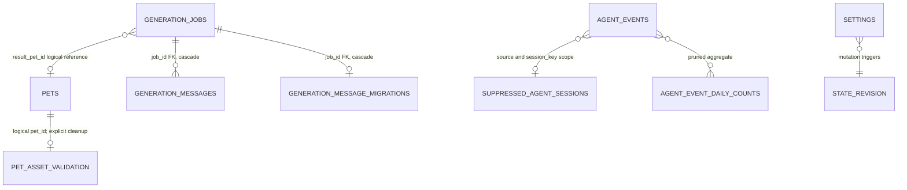

# Data Model

PetCore's Rust types, SQLite schema, runtime manifest, and JSON Schemas are the canonical data contracts. Swift models are consumer projections for the App and validators; they intentionally decode only fields needed by the UI. Server-persisted values win over Swift decoding defaults.

## Storage boundary

The default root is `~/Library/Application Support/AgentPetCompanion`; tests and explicit maintenance can override it with `APC_HOME`. Runtime directories are private (`0700`), and locks, tokens, sockets, and other private files use restrictive permissions.

```text
AgentPetCompanion/
├── agent-pet.sqlite
├── run/                       instance locks, socket, runtime identity, HTTP token/port
├── runtime/
│   ├── versions/<build-id>/   petcore, petcore-cli, runtime-manifest.json
│   ├── current -> versions/<build-id>
│   ├── current.json
│   └── last-known-good.json
├── pets/<pet-id>/
│   ├── active.json
│   └── revisions/<revision-id>/
├── generation-jobs/<job-id>/
├── connectors/
├── logs/
└── diagnostic-exports/
```

Path authority: [PetCore paths](../../crates/petcore/src/paths.rs), [Swift runtime store](../../apps/macos/Sources/AgentPetCompanion/App/RuntimeReleaseManifest.swift), and [App diagnostics paths](../../apps/macos/Sources/AgentPetCompanion/App/Diagnostics.swift).

## SQLite schema

The current database schema is version 5. PetCore enables WAL, foreign keys, and secure deletion, runs a quick integrity check, backs up a recoverably corrupt database before rebuilding, and refuses to open a database newer than it supports.



| Table | Key data and invariant |
|---|---|
| `pets` | Manifest ID primary key; display metadata; render size; owned package/cover paths; origin/generator/provenance; active flag; creation time. PetCore transactions maintain a single active pet, and the first pet becomes active. |
| `generation_jobs` | Form, status, private job directory, App Server session, result pet, retry lineage, owner instance, heartbeat, timestamps. PetCore admission permits at most one active job (`pending`, `running`, or `waiting_for_user`). |
| `generation_messages` | Per-job ordered conversation/progress records. `(job_id, sequence)` is unique; the job foreign key cascades. Terminal message kinds and job terminal states cannot be reversed. |
| `generation_message_migrations` | Marks a legacy job message stream as imported into SQLite so migration is idempotent. |
| `agent_events` | Internal sequence, external event ID, source, normalized session identity, fixed event type/title, privacy-filtered payload, timestamp. `(source, session_key, external_event_id)` deduplicates ingest. |
| `agent_event_daily_counts` | Day/source/type aggregate for events removed by retention. It contains counts, not event content. |
| `suppressed_agent_sessions` | Source/session keys that must not appear in activity projections, with a bounded retention timestamp and reason. |
| `privacy_migrations` | Recoverable phase marker for privacy scrubs and secure vacuum; it is migration state, not product history. |
| `pet_asset_validation` | Cached package/frame fingerprint and valid/error result. It has no foreign key; pet deletion explicitly removes it. |
| `settings` | JSON value by key, update time, and per-setting revision. Durable keys include behavior, overlay placement, and connector status data. Behavior writes use an expected revision. |
| `state_revision` | Singleton monotonic revision. Triggers increment it when persisted state changes so snapshots and long-polls never combine two revisions. |

The authoritative schema and migration logic are in [db.rs](../../crates/petcore/src/db.rs). Do not reproduce SQL in another document.

## Pet identity and immutable revisions

Pet identity is `PetManifest.id` with the pattern `pet_[a-z0-9]+`; the name is display-only and is not unique. Same-name/different-ID pets coexist.

Each local write is serialized by `pets/.pet-store.lock` and staged under a new immutable revision:

```text
pets/<pet-id>/
├── active.json                         apc.pet-active-revision.v1
└── revisions/<revision-id>/
    ├── <pet-id>.petpack
    ├── <pet-id>-cover.png
    └── <pet-id>-frames/
```

Commit order is: write staging files, sync them, rename the immutable revision, atomically replace `active.json`, then update SQLite. A failed database commit restores the previous pointer and removes only the candidate revision. Late generation cancellation reverts only if SQLite still points at that exact revision.

`pet.list` and `state.snapshot` enrich each `PetSummary` with derived `revision_id` and `revision_count` metadata while holding the shared pet-store lock. These fields are not persisted in SQLite: the current ID is accepted only when the database package path resolves to a structurally owned immutable revision, and the count includes only bounded, direct, non-symlink revision directories containing the expected package. External packages report no revision ID and a zero count; zero also represents an unavailable count when the bounded directory scan cannot safely provide a complete value.

`pet.history` is the separate, bounded read API for the native library history sheet. It revalidates at most 32 direct owned revision archives, marks the active head explicitly, and exposes only validated revisions as selectable edit baselines. The pet row and revision tree are read under the shared pet-store lock so a concurrent immutable import cannot make an old revision appear current. Its newest-first job projection contains job ID, status, create/modify operation, the safe baseline revision identity for an explicit edit, durable result revision/validation summary when present, and timestamps. It deliberately excludes job directories, forms, prompts, instructions, messages, App Server/provider session metadata, owner identities, and retry internals; the projection is never written into exported `.petpack` metadata. A missing or invalid historical cover remains an explicit unavailable preview rather than falling back to the current head's cover.

Bundled identity requires a fixed manifest ID plus PetCore-assigned origin/generator/provenance. A package cannot self-declare itself bundled. Seeding preserves an existing same-ID pet byte-for-byte, permits same-name/different-ID entries, and does not replace an existing active choice. Bundled pets are read-only; other pets may append a same-ID edit revision.

Primary source: [pet revision transaction](../../crates/petcore/src/pet_revision.rs) and [petpack library logic](../../crates/petcore/src/petpack.rs).

## Generation model

`GenerationForm` contains description, style, quality, and bounded reference-image paths. Job status is one of `pending`, `running`, `waiting_for_user`, `failed`, `completed`, or `canceled`. SQLite is the message authority; any job-local JSONL message file is a compatibility/migration artifact.

`generation-jobs/<job-id>/` is private working state and may contain the normalized form, copied reference inputs, App Server session metadata, a generated `petpack-source`, and—during editing—a validated read-only baseline plus `edit-context.json`. Recovery projections never reuse `generation_jobs.form_json` reference paths directly. A staged form is read through a bounded, no-follow, descriptor-bound file; its non-reference fields and reference count must match the persisted form, and every returned path must name the expected sequential PNG/WebP copy under that job's descriptor-pinned `input/references` directory. Unsafe or incomplete staging degrades to no returned paths and a `reference_reselection_count` capped by the four-image input limit. A successfully completed job also has a bounded, atomically written `result.json` containing only its result pet ID, the exact owned immutable revision ID committed by that job, and compact validation counts (state, frame, and warning counts). PetCore accepts this result only as a private, non-symlink regular file whose identity matches the completed database job; legacy completed jobs without the file remain readable with absent revision and validation fields rather than inferred current values. Generation session identifiers, transcripts, provider payloads, and other private metadata are excluded from this result and must not leak into exported pet metadata.

An `apc.pet-edit-context.v2` edit context separates two immutable facts. The selected baseline pins the pet ID, baseline revision ID when owned, package digest, schema, quality, render size, FPS profiles, state set, and creation time used to generate the candidate. Independently, the active-head path and digest at confirmation time are pinned as the stale-write precondition. Before commit, PetCore verifies that active head is still exact, while allowing a validated older owned revision to be the creative baseline. Thus an old revision may produce a new head without overwriting a concurrent import or edit. The safe baseline revision ID—not the context path or instruction—is projected through edit/retry receipts, active-generation recovery, latest-job recovery, and library history so the App can restore the exact submitted preview. Global latest-job recovery orders by persisted `updated_at` and stable job ID, includes terminal create jobs without a result pet, and remains a private App projection rather than pet metadata. Legacy v1 contexts remain readable by treating their base digest as the expected active-head digest.

Primary sources: [generation service](../../crates/petcore/src/generation.rs), [App Server integration](../../crates/petcore/src/app_server.rs), and [shared types](../../crates/petcore-types/src/lib.rs).

## Agent event model

Supported sources are `codex`, `claude_code`, `pi`, and `opencode`. Persisted event types are `start`, `tool`, `waiting`, `review`, `done`, and `failed`; they map to the corresponding pet state, with `idle` as the default state.

The `apc.agent-event.v1` envelope contains only allowlisted, bounded fields needed for identity, ordering, activity, navigation, and internal session-message sequencing. Command arguments, tool results, hidden reasoning, complete transcripts, credentials, and full process environments are outside the model. External title/detail strings are accepted only for compatibility and are not persisted as arbitrary display text.

The desktop App consumes a separate content-free projection serialized by PetCore. In `state.snapshot`, `events`, `recent_events`, `active_agent_state`, and `active_agent_sessions` all expose only opaque domain-separated hashes for event/session identity, fixed state metadata, and timestamps; active rows additionally carry a closed `summary_kind`, an opaque animation identity, and allowlisted session navigation. A Codex session may expose its original identity only as the separate `routable_session_id`, and only when it is a canonical 36-character UUID; every other open action falls back to activating the Agent application. Prompts, user/assistant text, external title/detail, activity detail, project labels and paths, file content, command arguments, and credentials never cross this App snapshot boundary, and Swift does not fall back to persisted event text. The explicit bounded `events.recent` audit RPC remains the separate stored-event interface. The closed summary vocabulary is `running`, `thinking`, `plan`, `command`, `file`, `file_change`, `tool`, `subagent`, `search`, `network`, `image`, `compaction`, `needs_input`, `review`, `done`, and `failed`.

Ingest returns inserted, duplicate, or suppressed. Activity is derived rather than stored. The canonical pet state uses bounded activity leases for ordinary `start`, `tool`, and `done` activity (30 seconds for ordinary activity and 5 seconds for terminal activity, with explicit active-session/provider exceptions). `waiting`, `review`, and `failed` are persistent attention states with no advertised expiry; they remain canonical and visible until a newer event advances that session. Independently, the bubble projection contains at most eight concrete session rows and publishes an `active_agent_sessions_omitted_count` when additional sessions exist, so the App can expose a bounded Control Center summary instead of silently dropping them. The ordinary `behavior.session_message_timeout_minutes` window (15 minutes by default) applies only to start, tool, and done events. These protocol arbitration, suppression, and priority rules are rebuilt by PetCore after restart. Local group disclosure and per-session dismissal are App-only presentation state: dismissing/viewing an attention row makes the pet fall back to the next undismissed projected session or idle without writing Agent lifecycle state, and a newer reopen identity makes the session visible again. Retained diagnostic history for ordinary or superseded events does not imply a visible session.

Primary sources: [event envelope](../../crates/petcore/src/event_envelope.rs), [state projection](../../crates/petcore/src/agent_state.rs), [persisted event schema](../../schemas/agent-event.schema.json), and [Swift UI projection](../../apps/macos/Sources/AgentPetCompanionCore/AppModels.swift).

## Versioned contracts

| Contract | Current identity | Authority |
|---|---|---|
| Runtime release set | `apc.runtime-manifest.v1` | [Rust manifest](../../crates/petcore/src/runtime_manifest.rs) and [Swift mirror](../../apps/macos/Sources/AgentPetCompanion/App/RuntimeReleaseManifest.swift) |
| PetCore RPC | `apc.petcore-rpc.v2` | [RPC server](../../crates/petcore/src/rpc.rs) and [Swift client](../../apps/macos/Sources/AgentPetCompanionCore/PetCoreClient.swift) |
| SQLite | schema `5` | [database](../../crates/petcore/src/db.rs) |
| Persisted Agent event | `apc.agent-event.v1` | [event envelope](../../crates/petcore/src/event_envelope.rs) and [schema](../../schemas/agent-event.schema.json) |
| Portable pet | `apc.petpack.v1` | [shared manifest type](../../crates/petcore-types/src/lib.rs), [schema](../../schemas/petpack.schema.json), and [format specification](../specifications/AgentPetCompanion_Petpack_Whitepaper_V1.md) |
| Active pet pointer | `apc.pet-active-revision.v1` | [pet revision](../../crates/petcore/src/pet_revision.rs) |
| Diagnostic record/export | `apc.diagnostic-log.v1`, `apc.diagnostics-bundle.v1` | [PetCore diagnostics](../../crates/petcore/src/diagnostics.rs) and [App diagnostics](../../apps/macos/Sources/AgentPetCompanion/App/Diagnostics.swift) |

Do not change a version string without an explicit compatibility or migration design. Keep Rust authority types, Swift mirrors, schemas, fixtures, runtime manifest, and tests synchronized.

## Retention and bounds

- Agent events default to at most 10,000 rows and 30 days; pruned rows contribute only to daily counts.
- Suppressed sessions retain at most 10,000 entries and 30 days.
- `events.recent` returns at most 200 records; snapshots expose smaller bounded projections.
- `.petpack` validation bounds archive size, entry count, individual entry size, expanded size, frame count, decoded pixels, and path types. The [format specification](../specifications/AgentPetCompanion_Petpack_Whitepaper_V1.md) owns exact package limits.
- Diagnostic log and export bounds are defined in [Runtime and IPC](runtime-and-ipc.md).

## Change checklist

For a data-model change, update the owning Rust type and storage logic first, then compatible migrations, runtime version/range, JSON Schema and fixtures, Swift projection, and tests. Preserve privacy filtering, stable IDs, state revision semantics, atomic pet publication, downgrade protection, and explicit retention. Update this document only with the resulting durable contract—not migration progress or validation logs.
