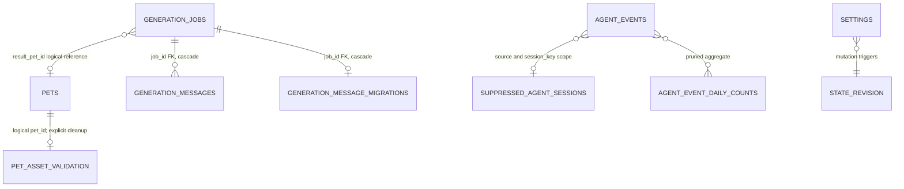

# Data Model

PetCore's Rust types, SQLite schema, runtime manifest, and JSON Schemas are the canonical current data contracts. Swift models are consumer projections for the App and validators; they intentionally decode only fields needed by the UI. Server-persisted values win over Swift decoding defaults. The [Product Experience Contract](../product/experience-contract.md) defines target presentation semantics; [task R02](../development/product-refactor-execution.md#r02--make-session-identity-and-navigation-truthful) owns any future session/navigation contract change.

## Storage boundary

The default root is `~/Library/Application Support/AgentPetCompanion`; tests and explicit maintenance can override it with `APC_HOME`. Runtime directories are private (`0700`), and locks, tokens, sockets, and other private files use restrictive permissions.

```text
AgentPetCompanion/
├── agent-pet.sqlite
├── run/                       instance locks, socket, runtime identity, HTTP token/port
├── runtime/
│   ├── versions/<build-id>/   petcore, petcore-cli, runtime-manifest.json
│   ├── current -> versions/<build-id>
│   ├── current.json
│   └── last-known-good.json
├── pets/<pet-id>/
│   ├── active.json
│   └── revisions/<revision-id>/
├── generation-jobs/<job-id>/
├── connectors/
├── logs/
└── diagnostic-exports/
```

Path authority: [PetCore paths](../../crates/petcore/src/paths.rs), [Swift runtime store](../../apps/macos/Sources/AgentPetCompanion/App/RuntimeReleaseManifest.swift), and [App diagnostics paths](../../apps/macos/Sources/AgentPetCompanion/App/Diagnostics.swift).

## SQLite schema

The current database schema is version 5. PetCore enables WAL, foreign keys, and secure deletion, runs a quick integrity check, backs up a recoverably corrupt database before rebuilding, and refuses to open a database newer than it supports.



| Table | Key data and invariant |
|---|---|
| `pets` | Manifest ID primary key; display metadata; render size; native animation FPS and fixed per-state durations; owned package/cover paths; origin/generator/provenance; active flag; creation time. PetCore transactions maintain a single active pet, and the first pet becomes active. |
| `generation_jobs` | Form, status, private job directory, App Server session, result pet, retry lineage, owner instance, heartbeat, timestamps. PetCore admission permits at most one active job (`pending`, `running`, or `waiting_for_user`). |
| `generation_messages` | Per-job ordered conversation/progress records. `(job_id, sequence)` is unique; the job foreign key cascades. Terminal message kinds and job terminal states cannot be reversed. |
| `generation_message_migrations` | Marks a legacy job message stream as imported into SQLite so migration is idempotent. |
| `agent_events` | Internal sequence, external event ID, source, normalized session identity, fixed event type/title, typed size-bounded payload, timestamp. `(source, session_key, external_event_id)` deduplicates ingest. |
| `agent_event_daily_counts` | Day/source/type aggregate for events removed by retention. It contains counts, not event content. |
| `suppressed_agent_sessions` | Source/session keys that must not appear in activity projections, with a bounded retention timestamp and reason. |
| `privacy_migrations` | Recoverable phase marker for privacy scrubs and secure vacuum; it is migration state, not product history. |
| `pet_asset_validation` | Cached package/frame fingerprint and valid/error result. It has no foreign key; pet deletion explicitly removes it. |
| `settings` | JSON value by key, update time, and per-setting revision. Durable keys include behavior, overlay placement, and connector status data. Behavior writes use an expected revision. |
| `state_revision` | Singleton monotonic revision. Triggers increment it when persisted state changes so snapshots and long-polls never combine two revisions. |

The authoritative schema and migration logic are in [db.rs](../../crates/petcore/src/db.rs). Do not reproduce SQL in another document.

## Pet identity and immutable revisions

Pet identity is `PetManifest.id` with the pattern `pet_[a-z0-9]+`; the name is display-only and is not unique. Same-name/different-ID pets coexist.

Each local write is serialized by `pets/.pet-store.lock` and staged under a new immutable revision:

```text
pets/<pet-id>/
├── active.json                         apc.pet-active-revision.v1
└── revisions/<revision-id>/
    ├── <pet-id>.petpack
    ├── <pet-id>-cover.png
    └── <pet-id>-frames/
```

Commit order is: write staging files, sync them, rename the immutable revision, atomically replace `active.json`, then update SQLite. A failed database commit restores the previous pointer and removes only the candidate revision. Late generation cancellation reverts only if SQLite still points at that exact revision.

`pet.list` and `state.snapshot` expose the validated package-wide `native_fps` plus all seven fixed state durations so the App can derive the supported playback profiles without opening package archives. They also enrich each `PetSummary` with derived `revision_id` and `revision_count` metadata while holding the shared pet-store lock. Revision fields are not persisted in SQLite: the current ID is accepted only when the database package path resolves to a structurally owned immutable revision, and the count includes only bounded, direct, non-symlink revision directories containing the expected package. External packages report no revision ID and a zero count; zero also represents an unavailable count when the bounded directory scan cannot safely provide a complete value.

`pet.history` is the bounded read API for the library history sheet. Under the shared pet-store lock it revalidates at most 32 direct owned revisions, marks the active head, and exposes only validated revisions as edit baselines. Its newest-first job projection contains the job ID, status, operation, selected baseline revision, result revision/validation summary, and timestamps. It excludes forms, prompts, messages, private paths, provider sessions, ownership internals, and retry internals, and is never exported as pet metadata. An unavailable revision preview stays unavailable instead of borrowing the current cover.

Bundled identity requires a fixed manifest ID plus PetCore-assigned origin/generator/provenance. A package cannot self-declare itself bundled. Seeding preserves an existing same-ID pet byte-for-byte, permits same-name/different-ID entries, and does not replace an existing active choice. Bundled pets are read-only; other pets may append a same-ID edit revision.

Primary source: [pet revision transaction](../../crates/petcore/src/pet_revision.rs) and [petpack library logic](../../crates/petcore/src/petpack.rs).

## Generation model

`GenerationForm` contains description, style, quality, bounded reference-image paths, a package-wide `native_fps` of 10 or 20, and the exact 1,000/2,000 ms duration for all seven states. The creation brief exposes those closed timing choices in a compact disclosure section; defaults are 10 FPS, one second for `start`/`done`, and two seconds for the other states. The complete form is persisted and projected through active-session, history, restart-recovery, and create-retry paths so a non-default authored timing cannot silently revert. Modification jobs initialize timing from the validated baseline; only an explicit AI edit with `timing_changed` may replace it, and the generated manifest remains the final package authority. Job status is one of `pending`, `running`, `waiting_for_user`, `failed`, `completed`, or `canceled`. SQLite is the message authority; any job-local JSONL message file is a compatibility/migration artifact.

`generation-jobs/<job-id>/` is private working state containing the normalized form, copied references, App Server session data, generated source, and an optional validated edit baseline. Recovery reads only bounded, no-follow files whose fields match the persisted form and whose references are sequential PNG/WebP copies inside that job's pinned `input/references` directory. Unsafe or incomplete staging returns no paths and a `reference_reselection_count` capped by the four-image input limit.

A completed job may write a bounded atomic `result.json` containing only its result pet ID, exact owned revision ID, and compact state/frame/warning counts. PetCore accepts it only as a private regular file matching that database job. Missing result data stays absent; PetCore does not infer it from the current pet. Provider sessions, transcripts, payloads, and other private job metadata never enter the result or exported pet metadata.

An `apc.pet-edit-context.v2` edit context pins both the selected immutable baseline and the active-head digest confirmed by the user. The baseline may be an older validated owned revision, but commit succeeds only if the active head still matches the confirmation-time precondition. This allows revision-based editing without overwriting a concurrent import or edit. A timing edit may change only the closed 10/20 FPS native rate and 1,000/2,000 ms state durations; it must regenerate every affected state and still publishes a new immutable revision. A 10→20 conversion preserves the runtime Standard sample poses and supplies real intermediate frames, a 20→10 conversion equals the deterministic runtime sample, and a duration change rejects padding, truncation, or sampling of the old action. The edit receipt projects the accepted baseline revision ID and its timing but never the context path or instruction. Global latest-job recovery is ordered by persisted `updated_at` plus stable job ID and remains private App state rather than pet metadata.

Primary sources: [generation service](../../crates/petcore/src/generation.rs), [App Server integration](../../crates/petcore/src/app_server.rs), and [shared types](../../crates/petcore-types/src/lib.rs).

## Agent event model

Supported sources are `codex`, `claude_code`, `pi`, and `opencode`. Persisted event types are `start`, `tool`, `waiting`, `review`, `done`, and `failed`; they map to the corresponding pet state, with `idle` as the default state.

The `apc.agent-event.v1` envelope contains allowlisted, bounded fields needed for identity, ordering, activity, navigation, and session display. Explicit bounded session titles and latest user/assistant messages are retained for the local bubble. Arbitrary command/tool payloads, hidden reasoning, complete transcript archives, credential stores, and full process environments are outside the model. External title/detail strings are accepted only for compatibility and are not substituted for the explicit display fields.

The desktop App consumes a separate type-allowlisted projection serialized by PetCore. In `state.snapshot`, `events`, `recent_events`, and every active row's embedded `event` expose opaque domain-separated hashes for event/session identity, fixed state metadata, and timestamps. `active_agent_state` and `active_agent_sessions` additionally carry the hydrated, bounded `session_title`, `session_user_message`, and current-turn `session_message` display fields, plus a closed `summary_kind`, an opaque animation identity, and allowlisted session navigation. These explicit display fields intentionally preserve useful user/Agent conversation text for the local desktop bubble. PetCore filters an assistant message that predates the latest user activation so a new turn cannot redisplay an old reply; Swift does not substitute unrelated raw event text or activity detail. Arbitrary host payloads and separate structured event fields are not duplicated into the App projection. A Codex session may expose its original identity only as the separate `routable_session_id`, and only when it is a canonical 36-character UUID; every other open action falls back to activating the Agent application. The explicit bounded `events.recent` audit RPC remains the separate stored-event interface. The closed summary vocabulary is `running`, `thinking`, `plan`, `command`, `file`, `file_change`, `tool`, `subagent`, `search`, `network`, `image`, `compaction`, `needs_input`, `review`, `done`, and `failed`.

The target presentation preserves those bounded title/message fields rather than replacing useful context with synthetic numbering. When the same Agent has multiple sessions without title or user context, the target requires a stable content-free fallback that is independent of current display order. It also requires typed distinction between exact-session navigation, Agent-host activation, and unavailable navigation. Those fields are not current schema claims until task `R02` updates Rust authority, storage/migration if required, Swift decoding, tests, and this document together.

Ingest returns inserted, duplicate, or suppressed. Activity is derived rather than stored. The canonical pet state uses bounded activity leases for ordinary `start`, `tool`, and `done` activity (30 seconds for ordinary activity and 5 seconds for terminal activity, with explicit active-session/provider exceptions). `waiting`, `review`, and `failed` are persistent attention states with no advertised expiry; they remain canonical and visible until a newer event advances that session. Independently, the bubble projection contains at most eight concrete session rows and publishes an `active_agent_sessions_omitted_count` when additional sessions exist, so the App can expose a bounded Control Center summary instead of silently dropping them. The ordinary `behavior.session_message_timeout_minutes` window (15 minutes by default) applies only to start, tool, and done events. These protocol arbitration, suppression, and priority rules are rebuilt by PetCore after restart. Local group disclosure and per-session dismissal are App-only presentation state: dismissing/viewing an attention row makes the pet fall back to the next undismissed projected session or idle without writing Agent lifecycle state, and a newer reopen identity makes the session visible again. Retained diagnostic history for ordinary or superseded events does not imply a visible session.

Primary sources: [event envelope](../../crates/petcore/src/event_envelope.rs), [state projection](../../crates/petcore/src/agent_state.rs), [persisted event schema](../../schemas/agent-event.schema.json), and [Swift UI projection](../../apps/macos/Sources/AgentPetCompanionCore/AppModels.swift).

## Versioned contracts

| Contract | Current identity | Authority |
|---|---|---|
| Runtime release set | `apc.runtime-manifest.v1` | [Rust manifest](../../crates/petcore/src/runtime_manifest.rs) and [Swift mirror](../../apps/macos/Sources/AgentPetCompanion/App/RuntimeReleaseManifest.swift) |
| PetCore RPC | `apc.petcore-rpc.v2` | [RPC server](../../crates/petcore/src/rpc.rs) and [Swift client](../../apps/macos/Sources/AgentPetCompanionCore/PetCoreClient.swift) |
| SQLite | schema `5` | [database](../../crates/petcore/src/db.rs) |
| Persisted Agent event | `apc.agent-event.v1` | [event envelope](../../crates/petcore/src/event_envelope.rs) and [schema](../../schemas/agent-event.schema.json) |
| Portable pet | `apc.petpack.v1` | [shared manifest type](../../crates/petcore-types/src/lib.rs), [schema](../../schemas/petpack.schema.json), and [format specification](../specifications/AgentPetCompanion_Petpack_Whitepaper_V1.md) |
| Active pet pointer | `apc.pet-active-revision.v1` | [pet revision](../../crates/petcore/src/pet_revision.rs) |
| Diagnostic record/export | `apc.diagnostic-log.v1`, `apc.diagnostics-bundle.v1` | [PetCore diagnostics](../../crates/petcore/src/diagnostics.rs) and [App diagnostics](../../apps/macos/Sources/AgentPetCompanion/App/Diagnostics.swift) |

Do not change a version string without an explicit compatibility or migration design. Keep Rust authority types, Swift mirrors, schemas, fixtures, runtime manifest, and tests synchronized.

## Retention and bounds

- Agent events default to at most 10,000 rows and 30 days; pruned rows contribute only to daily counts.
- Suppressed sessions retain at most 10,000 entries and 30 days.
- `events.recent` returns at most 200 records; snapshots expose smaller bounded projections.
- `.petpack` validation bounds archive size, entry count, individual entry size, expanded size, frame count, decoded pixels, and path types. The [format specification](../specifications/AgentPetCompanion_Petpack_Whitepaper_V1.md) owns exact package limits.
- Diagnostic log and export bounds are defined in [Runtime and IPC](runtime-and-ipc.md).

## Change checklist

For a data-model change, update the owning Rust type and storage logic first, then compatible migrations, runtime version/range, JSON Schema and fixtures, Swift projection, and tests. Preserve explicit session-display fields, stable IDs, state revision semantics, atomic pet publication, downgrade protection, and explicit retention. Update this document only with the resulting durable current contract—not task progress, migration progress, or validation logs.
