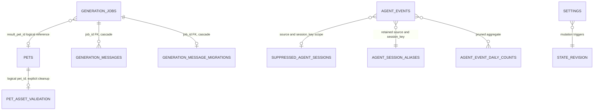

# Data Model

PetCore's Rust types, SQLite schema, runtime manifest, and JSON Schemas are the canonical current data contracts. Swift models are consumer projections for the App and validators; they intentionally decode only fields needed by the UI. Server-persisted values win over Swift decoding defaults.

## Storage boundary

The default root is `~/Library/Application Support/AgentPetCompanion`; tests and explicit maintenance can override it with `APC_HOME`. Runtime directories are private (`0700`), and locks, tokens, sockets, and other private files use restrictive permissions.

```text
AgentPetCompanion/
├── agent-pet.sqlite
├── run/                       instance locks, socket, runtime identity, HTTP token/port
├── runtime/
│   ├── versions/<build-id>/   petcore, petcore-cli, runtime-manifest.json
│   ├── rollback-checkpoint/   private crash-consistent SQLite rollback authority
│   ├── current -> versions/<build-id>
│   ├── current.json
│   └── last-known-good.json
├── pets/<pet-id>/
│   ├── active.json
│   └── revisions/<revision-id>/
├── generation-jobs/<job-id>/
├── connectors/
├── logs/
└── diagnostic-exports/
```

Path authority: [PetCore paths](../../crates/petcore/src/paths.rs), [Swift runtime store](../../apps/macos/Sources/AgentPetCompanion/App/RuntimeReleaseManifest.swift), and [App diagnostics paths](../../apps/macos/Sources/AgentPetCompanion/App/Diagnostics.swift).

## SQLite schema

The current database schema remains version 6. V2 pet state metadata and the
retired-record table are additive, rollback-compatible extensions of that
released schema, so a failed runtime candidate can still reopen the database
with the published last-known-good runtime. PetCore enables WAL, foreign keys,
and secure deletion, runs a quick integrity check, backs up a recoverably
corrupt database before rebuilding, and refuses to open a database newer than
it supports.

Before a managed runtime candidate can initialize, PetCore stores an online
SQLite backup plus a closed state record under
`runtime/rollback-checkpoint/`. The record binds one exact source build to one
candidate build and progresses through `creating`, `ready`, and `restored`.
Only a `ready` record is rollback authority. Restore verifies the backup
digest and SQLite integrity before replacing the live database, then marks the
record `restored` so an App crash cannot replay stale data over writes accepted
by the recovered runtime. Unknown files, symlinks, malformed state, mismatched
build IDs, or incomplete snapshots fail closed.


```mermaid
erDiagram
    PETS ||--o| PET_ASSET_VALIDATION : "logical pet_id; explicit cleanup"
    GENERATION_JOBS ||--o{ GENERATION_MESSAGES : "job_id FK, cascade"
    GENERATION_JOBS ||--o| GENERATION_MESSAGE_MIGRATIONS : "job_id FK, cascade"
    GENERATION_JOBS }o--o| PETS : "result_pet_id logical reference"
    AGENT_EVENTS }o--o| SUPPRESSED_AGENT_SESSIONS : "source and session_key scope"
    AGENT_EVENTS }o--|| AGENT_SESSION_ALIASES : "retained source and session_key"
    AGENT_EVENTS }o--o{ AGENT_EVENT_DAILY_COUNTS : "pruned aggregate"
    SETTINGS }o--|| STATE_REVISION : "mutation triggers"
```

| Table | Key data and invariant |
|---|---|
| `pets` | Manifest ID primary key; display metadata; one of the two exact render sizes; serialized V2 state timing/playback contracts; owned package/cover paths; origin/generator/provenance; active flag; creation time. PetCore transactions maintain a single active pet, and the first pet becomes active. |
| `retired_pet_records` | Additive, rollback-compatible quarantine for every row originating in a structurally pre-V2 `pets` table and for any later row that does not match one exact V2 quality/render pair (`low` 192×208 or `standard` 384×416). This includes the legacy `standard` 192×208 name collision as well as retired `high`/`ultra`/`original` values. PetCore removes those rows from the live projection before typed decoding, retains their original metadata and active flag with the fixed `unsupported_quality` reason, preserves a structurally V1 row's exact `native_fps` and `state_durations_json` in dedicated legacy fields, and leaves owned package/rendered assets untouched. The next valid V2 pet becomes active when quarantine leaves no active live pet. |
| `generation_jobs` | Form, status, private job directory, App Server session, result pet, retry lineage, owner instance, heartbeat, timestamps. PetCore admission permits at most one active job (`pending`, `running`, or `waiting_for_user`). |
| `generation_messages` | Per-job ordered conversation/progress records. `(job_id, sequence)` is unique; the job foreign key cascades. Terminal message kinds and job terminal states cannot be reversed. |
| `generation_message_migrations` | Marks a legacy job message stream as imported into SQLite so migration is idempotent. |
| `agent_events` | Internal sequence, external event ID, source, normalized session identity, fixed event type/title, typed size-bounded payload, timestamp. `(source, session_key, external_event_id)` deduplicates ingest. |
| `agent_event_daily_counts` | Day/source/type aggregate for events removed by retention. It contains counts, not event content. |
| `suppressed_agent_sessions` | Source/session keys that must not appear in activity projections, with a bounded retention timestamp and reason. |
| `agent_session_aliases` | PetCore-owned, content-free sequence for a retained source/session key. It supplies stable anonymous-session fallback identity, is removed when the session has no retained event, and is never reused. |
| `privacy_migrations` | Recoverable phase marker for privacy scrubs and secure vacuum; it is migration state, not product history. |
| `pet_asset_validation` | Cached package/frame fingerprint and valid/error result used by ordinary snapshots. It has no foreign key; pet deletion explicitly removes it. Explicit `pet.assets.repair` bypasses this cache and rewrites it only after the forced archive/cover/frame validation result is known. |
| `settings` | JSON value by key, update time, and per-setting revision. Durable keys include behavior, onboarding progress, overlay placement and its closed explicit intent projection, bounded opaque Agent-session acknowledgement identities, and connector status data. Connector status may retain bounded App-owned `managed_components` evidence—kind, name, ownership, expected/active version, status, and content-match boolean—but never a path or digest. Behavior defaults the interface language and appearance to Follow System and keeps every supported Agent source enabled; the App derives the three exact attention presets or `Custom` from the event map. Serialized behavior and onboarding writes use an expected revision; conflicts restore the authoritative PetCore projection instead of creating an App-local durable copy. |
| `product_convergence_receipt` | Singleton `apc.product-convergence-receipt.v1` receipt for the exact App/runtime build after all managed connectors complete. It stores a server timestamp, bounded source counts, the complete typed-report digest, and optional verified Codex Skills/content digests. It is independent of generic settings and diagnostic history. |
| `state_revision` | Singleton monotonic revision. Triggers increment it when persisted state changes so snapshots and long-polls never combine two revisions. |

The authoritative schema and migration logic are in [db.rs](../../crates/petcore/src/db.rs). Do not reproduce SQL in another document.

## First-run progress

The `settings.onboarding_progress` value uses the closed `apc.onboarding-progress.v1` schema and the stages `choose_pet`, `connect_agents`, `demo`, `completed`, and `skipped`. A missing row derives `choose_pet` at revision `0`; it does not require a synthetic migration row or another database table. Updates use decimal-string `expected_revision` compare-and-swap and allow only the ordered forward transitions or an explicit skip. `completed` and `skipped` are terminal.

Completing onboarding and enabling `behavior.enabled` share one database transaction, so a completed first run cannot durably leave the desktop pet disabled. The App projects the progress and revision through `state.snapshot`, but the four demo phases are pure View-local presentation state. Demo phases never enter Agent events, session aliases, suppression, receipts, retention counts, or diagnostics.

Included-companion choice is an ordered stable-ID presentation rule, not a
stored origin mutation. If upgrade seeding preserves an existing pet with one
of the two included manifest IDs, onboarding may select it through the normal
activation operation, while bundled read-only authority still requires the
PetCore-assigned origin, generator, and provenance markers.

`settings.overlay_placement` stores the final hard-clamped absolute pet center,
display identity, and `display_width_pt`. Width is a logical point value in the
closed 80–224 range, defaults to 112, and determines height from the fixed
208/192 canvas ratio. It is changed only by Pet Configuration → Appearance;
the overlay has no resize state or resize surface. During upgrade, the one exact
legacy `{x, y, scale, display_id}` record is rewritten once to preserve its
center/display while replacing the retired multiplier with the 112 pt default.
The ordinary V2 decoder remains closed: malformed, out-of-range, or extended
legacy shapes are not accepted as current placement data.

`settings.overlay_placement_intent` is the independent closed projection
`external_reposition` or `reset`. PetCore writes it in the same immediate
transaction as the corresponding `settings.overlay_placement` value, so a
snapshot cannot observe a placement without its intended authority signal.
The signal survives App and PetCore restart until the App's ordinary
`overlay.placement.update` commit acknowledgement writes the accepted placement
and clears the intent in one transaction. The intent is a short-lived explicit
instruction to the App authority; it neither stores another position nor
creates a second placement model.

The `settings.overlay_placement` row revision is the placement-specific CAS
authority and is projected as the decimal-string
`overlay_placement_revision` by both `state.snapshot` and the typed
`overlay.placement.get` result; it is independent of the global state revision.
Its wire encoding is canonical unsigned decimal (`0` or a nonzero ASCII digit
followed only by ASCII digits, within the `u64` range); signed, padded, empty,
and overflowing values are rejected.
Each unconditional external `reposition` or `reset` increments it. An ordinary
App update must supply that exact value as `expected_revision`; a mismatch
returns the current placement, revision, and intent without writing either row.
This prevents a late acknowledgement from clearing a newer explicit intent.

`OverlayPlacementAuthority` owns the App's presented placement. Its
`localRevision`, latest applied setting revision, and optional pending commit
separate local interaction ordering from the persisted setting revision. A drag
captures one absolute pointer and presented-anchor pair, derives every proposed
center from that pair, hard-clamps it, and commits the final presented center
once. A pending local commit blocks snapshots; an old acknowledgement cannot
confirm a newer commit; a failed save preserves the presented center; only an
explicit external `reposition` or `reset` intent may reposition after
bootstrap. These App-side ordering fields are not a second persisted model.

## Pet identity and immutable revisions

Pet identity is `PetManifest.id` with the pattern `pet_[a-z0-9]+`; the name is display-only and is not unique. Same-name/different-ID pets coexist.

Each committed local mutation is serialized by `pets/.pet-store.lock` and
published as a new immutable revision. External import validation, archive
inspection, and runtime-frame preparation happen first in a private
`.staging-*` revision directory without the exclusive lock; shared readers
ignore that incomplete directory. The importer acquires the exclusive lock
only for the final existing-ID policy check, immutable revision publication,
active-pointer replacement, and SQLite commit. This keeps `pet.list` and
`state.snapshot` responsive while a large package is being
prepared.

```text
pets/<pet-id>/
├── active.json                         apc.pet-active-revision.v1
└── revisions/<revision-id>/
    ├── <pet-id>.petpack
    ├── <pet-id>-cover.png
    └── <pet-id>-frames/
```

Commit order is: prepare and sync staging files, acquire the exclusive mutation
lock, recheck identity policy, rename the immutable revision, atomically replace
`active.json`, then update SQLite. A failed database commit restores the previous
pointer and removes only the candidate revision. Late generation cancellation
reverts only if SQLite still points at that exact revision. App-owned generation
and bundled seeding may retain one exclusive lock across their already-serialized
workflow; the lock-free preparation rule above applies to ordinary external
imports.

`pet.list` and `state.snapshot` expose all seven validated V2 `PetState`
objects: fixed state identity and frame directory, `frame_durations_ms`,
playback mode and mode-specific fields, and
`reduced_motion_frame_index`. The App therefore renders the package contract
without opening archives or deriving an FPS profile. The projections also
enrich each `PetSummary` with derived `revision_id` and `revision_count`
metadata while holding the shared pet-store lock. Revision fields are not
persisted in SQLite: the current ID is accepted only when the database package
path resolves to a structurally owned immutable revision, and the count includes
only bounded, direct, non-symlink revision directories containing the expected
package. External packages report no revision ID and a zero count; zero also
represents an unavailable count when the bounded directory scan cannot safely
provide a complete value.

`pet.history` is the bounded read API for the library history sheet. Under the shared pet-store lock it revalidates at most 32 direct owned revisions, marks the active head, and exposes only validated revisions as edit baselines. Its newest-first job projection contains the job ID, status, operation, selected baseline revision, result revision/validation summary, and timestamps. It excludes forms, prompts, messages, private paths, provider sessions, ownership internals, and retry internals, and is never exported as pet metadata. An unavailable revision preview stays unavailable instead of borrowing the current cover.

Bundled identity requires a fixed manifest ID plus PetCore-assigned origin/generator/provenance. A package cannot self-declare itself bundled. Seeding preserves an ordinary existing same-ID pet byte-for-byte and permits same-name/different-ID entries. When an already trusted bundled identity has an active archive digest different from the current content-pinned release resource, seeding appends the resource as a new immutable revision and advances only that pet's active revision pointer; it preserves the library's active-pet selection, original creation time, and older revisions. Bundled pets remain read-only to ordinary import, deletion, and editing; other pets may append a same-ID edit revision.

Each owned active revision keeps the package, canonical cover, and a sibling
runtime-frame directory with a closed completion marker and direct PNG files
for `idle`, `start`, `tool`, `waiting`, `review`, `done`, and `failed`.
Ordinary snapshot validation may reuse the matching
`pet_asset_validation` fingerprint. Explicit repair instead revalidates the
immutable archive, stages both cover and frame directory, atomically replaces
them, validates the committed marker/counts/dimensions, and publishes the
resulting warning or refreshed summary.

Primary source: [pet revision transaction](../../crates/petcore/src/pet_revision.rs) and [petpack library logic](../../crates/petcore/src/petpack.rs).

## Generation model

`GenerationForm` contains only description, style, either `low` or `standard`,
and bounded reference-image paths. The visual producer authors each
state's durations, playback behavior, and reduced-motion pose; timing never
becomes an App form control or recovery field. The complete form remains
private Maker state and is preserved through active-session projection,
restart recovery, and create-retry paths; it never enters the bounded
`pet.history` projection. For an edit, the validated baseline manifest is the
timing authority until the producer deliberately changes and fully reauthors a
state. Job status is one of `pending`, `running`, `waiting_for_user`, `failed`,
`completed`, or `canceled`. SQLite is the message authority; any job-local
JSONL message file is a compatibility artifact.

`generation-jobs/<job-id>/` is private working state containing the normalized
form, copied references, App Server session data, generated source,
incremental/final motion-QA previews and review, and an optional validated edit
baseline. Strict generation requires the final QA report and per-state review
to cover exactly all created states or the decoded states changed from the
pinned baseline. Each report includes one actual-duration `authored_timing`
preview per audited state and a `timing_digest` for the complete manifest
states; report hashes, decoded frame digests, and timing digests make evidence
stale after either a frame or timing edit. The public
`apc.pet-visual-production-verification.v1` result is recomputed rather than
stored as package identity: Maker finalization, Studio, and strict PetCore
import call the same verifier for changed-state derivation,
evidence freshness and coverage, keyframe and authored-timing preview presence,
registration, interpolation, and timing revision. Optional `motion-lock` output
and its moving-mask report stay outside `petpack-source` until a reviewer
accepts the complete composited row, copies only its PNG frames, and reruns QA.
These artifacts remain job-local and never enter the closed `.petpack` tree or
library projection. Recovery reads only bounded, no-follow files whose fields
match the persisted form and whose references are sequential PNG/WebP copies
inside that job's pinned `input/references` directory. Unsafe or incomplete
staging returns no paths and a `reference_reselection_count` capped by the
four-image input limit.

A completed job may write a bounded atomic `result.json` containing only its result pet ID, exact owned revision ID, and compact state/frame/warning counts. PetCore accepts it only as a private regular file matching that database job. Missing result data stays absent; PetCore does not infer it from the current pet. Provider sessions, transcripts, payloads, and other private job metadata never enter the result or exported pet metadata.

An `apc.pet-edit-context.v2` edit context pins both the selected immutable
baseline and the active-head digest confirmed by the user. The baseline may be
an older validated owned revision, but commit succeeds only if the active head
still matches the confirmation-time precondition. This allows revision-based
editing without overwriting a concurrent import or edit. Changing a state's
durations, playback mode or mode-specific data, or reduced-motion index is an
authored state change: it requires a complete fresh sequence with an exact frame
inventory and fresh QA, and publishes a new immutable revision. Sampling,
subsampling, retiming, padding, truncating, duplicating, or interpolating the
old action is rejected. The edit receipt projects the accepted baseline
revision ID, not timing controls, context paths, or instructions. Global
latest-job recovery is ordered by persisted `updated_at` plus stable job ID and
remains private App state rather than pet metadata.

Primary sources: [generation service](../../crates/petcore/src/generation.rs), [App Server integration](../../crates/petcore/src/app_server.rs), and [shared types](../../crates/petcore-types/src/lib.rs).

## Agent event model

Supported sources are `codex`, `claude_code`, `pi`, and `opencode`. Persisted event types are `start`, `tool`, `waiting`, `review`, `done`, and `failed`; they map to the corresponding pet state, with `idle` as the default state. The persisted event `title` remains a closed canonical vocabulary for normalization, schema validation, and audit records; it is not localized UI copy. Swift maps `AgentEventKind` to `ProductLifecycleState`, and one lifecycle-title authority supplies every user-visible status label in Pet Configuration, attention summaries/previews, the menu bar, Pet Library, and desktop bubbles.

The `apc.agent-event.v1` envelope contains allowlisted, bounded fields needed for identity, ordering, activity, navigation, and session display. Explicit bounded session titles, first/latest user and latest assistant messages, plus host-exposed reasoning, commands, tool input/output, errors, and semantically selected scalar activity details are retained for the local bubble. Every activity source is normalized into one bounded `activity_content` string; arbitrary host objects and arrays are never serialized as display copy, JSON-encoded structured strings re-enter the same bounded normalizer, and credential-shaped containers or non-command header/environment dumps are discarded before semantic selection. The projected title is the latest explicit session title, or the bounded first user message until one arrives; later user messages update context without silently renaming the session. Complete transcript archives, credential stores, auth headers, and full process environments remain outside the model. External title/detail strings are accepted only for compatibility and are not substituted for the explicit display fields.

Agent-event string ceilings are UTF-8 byte limits, not Unicode character counts. The event schemas retain standard `maxLength` constraints and add the executable `x-maxUtf8Bytes` keyword; the in-repository JSON Schema validator registers that keyword, and PetCore enforces the same byte values at ingest. Event-ID aliases are independently nonblank and byte-bounded even when another alias supplies the persisted identity. Session-open URLs must already be canonical allowlisted values without surrounding whitespace.

The desktop App consumes a separate type-allowlisted projection serialized by PetCore. In `state.snapshot`, `events`, `recent_events`, and every active row's embedded `event` expose opaque domain-separated hashes for event/session identity, fixed state metadata, and timestamps. `active_agent_state` and `active_agent_sessions` additionally carry the hydrated, bounded `session_title`, `session_user_message`, current-turn `session_message`, and `session_activity` display fields, plus a closed `summary_kind`, an opaque animation identity, an opaque `acknowledgement_id`, and allowlisted session navigation. PetCore resolves `session_title` from the newest explicit title event or, while none exists, the first persisted user message; `session_user_message` remains the latest user context. The bounded `session_activity.content` may contain normalized reasoning, commands, tool input/output, errors, or another semantically selected scalar detail; when it is absent for a tool event, the App may derive a localized detail only from the closed tool category. PetCore filters an assistant message that predates the latest user activation so a new turn cannot redisplay an old reply. Swift consumes only the hydrated `session_activity` projection and never reparses an embedded host payload as display copy. Arbitrary host envelopes and separate unbounded structured fields are not duplicated into the App projection. A Codex or Claude Code session may expose its original identity only as the separate `routable_session_id`, and only when the source-specific App surface is valid and the identity is a canonical 36-character UUID.

Navigation records one closed session surface: `chatgpt_app`, `claude_app`, `opencode_app`, `cli_terminal`, or `unknown`, and publishes the required closed `capability`: `exact_session`, `agent_host`, or `unavailable`. Exact-session requires either a validated Warp URL on the CLI surface or a canonical UUID on the matching ChatGPT/Codex App or Claude App surface. OpenCode App has no audited existing-session route and therefore exposes host activation only. Agent-host requires a source-matching App target or a known terminal target; Pi has no App surface. Source/surface mismatches, malformed IDs or URLs, unknown terminal hosts, explicitly closed sessions, and ambiguous historical rows fail closed rather than being guessed from content, project data, or display order. A later event may supply accurate surface metadata without rewriting retained audit records. When the same Agent has two or more sessions with neither title nor user context, PetCore adds `anonymous_session_alias` from the durable `agent_session_aliases` sequence. The alias is independent of activity/display order and contains no raw session ID or project data; the App converts it to localized human-facing labels rather than displaying the token. The explicit bounded `events.recent` audit RPC remains the separate stored-event interface. The closed summary vocabulary is `running`, `thinking`, `plan`, `command`, `file`, `file_change`, `tool`, `subagent`, `search`, `network`, `image`, `compaction`, `needs_input`, `review`, `done`, and `failed`.

Ingest returns inserted, duplicate, or suppressed. Activity is derived rather than stored. The canonical pet state uses bounded activity leases for ordinary `start`, `tool`, and `done` activity (30 seconds for ordinary activity and 5 seconds for terminal activity, with explicit active-session/provider exceptions). `waiting`, `review`, and `failed` are persistent attention states with no advertised expiry; they remain canonical and visible until a newer event advances that session. Independently, the PetCore projection contains at most eight concrete session rows and publishes an `active_agent_sessions_omitted_count` when additional sessions exist. A collapsed Agent group exposes one attention-prioritized/latest row; expanding it exposes every concrete session for that Agent already present in the bounded snapshot. Any sessions beyond the PetCore projection remain represented by the separate global omitted summary rather than an additional App-only row limit. The App keeps the six non-idle fixed states distinct in every visible row so its badge and row background match the authored pet action. The two detail lines show the distinct bounded current activity detail and current-turn Agent message when present; they do not insert a duplicate generic lifecycle sentence. A collapsed multi-session group retains an aggregate status tint with `failed` above `waiting`/`review`, those attention states above `done`, and `done` above active running work. The ordinary `behavior.session_message_timeout_minutes` window (15 minutes by default) applies only to start, tool, and done events. These protocol arbitration, suppression, and priority rules are rebuilt by PetCore after restart. A completed or review-ready row calls `agent.session.acknowledge` with its opaque event-derived identity only after the declared exact-session or host-level target opens successfully. A rejected exact deep link may activate the same App as a recovery aid, but this degraded outcome keeps the row and exposes a localized retryable error instead of acknowledging it. PetCore stores a bounded acknowledgement set in the existing versioned settings model and excludes matching rows before canonical-state arbitration, ordering, and the eight-row projection limit; relaunch therefore cannot revive consumed work. A later event for the same Agent session has a different identity and becomes visible normally. Group disclosure, manual row hiding, closing the whole bubble, and transient navigation errors remain App-only presentation state. Retained diagnostic history for acknowledged, ordinary, or superseded events does not imply a visible session.

Primary sources: [event envelope](../../crates/petcore/src/event_envelope.rs), [state projection](../../crates/petcore/src/agent_state.rs), [persisted event schema](../../schemas/agent-event.schema.json), and [Swift UI projection](../../apps/macos/Sources/AgentPetCompanionCore/AppModels.swift).

## Versioned contracts

| Contract | Current identity | Authority |
|---|---|---|
| Runtime release set | `apc.runtime-manifest.v1` | [Rust manifest](../../crates/petcore/src/runtime_manifest.rs) and [Swift mirror](../../apps/macos/Sources/AgentPetCompanion/App/RuntimeReleaseManifest.swift) |
| PetCore RPC | `apc.petcore-rpc.v2` | [RPC server](../../crates/petcore/src/rpc.rs) and [Swift client](../../apps/macos/Sources/AgentPetCompanionCore/PetCoreClient.swift) |
| SQLite | schema `6` with additive V2 columns/table | [database](../../crates/petcore/src/db.rs) |
| Product convergence receipt | `apc.product-convergence-receipt.v1` | [database](../../crates/petcore/src/db.rs) and [RPC server](../../crates/petcore/src/rpc.rs) |
| Onboarding progress | `apc.onboarding-progress.v1` | [Rust type](../../crates/petcore-types/src/lib.rs) and [Swift mirror](../../apps/macos/Sources/AgentPetCompanionCore/OnboardingModels.swift) |
| Persisted Agent event | `apc.agent-event.v1` | [event envelope](../../crates/petcore/src/event_envelope.rs) and [schema](../../schemas/agent-event.schema.json) |
| Portable pet | `apc.petpack.v2` | [shared manifest type](../../crates/petcore-types/src/lib.rs), [schema](../../schemas/petpack.schema.json), and [format specification](../specifications/AgentPetCompanion_Petpack_Whitepaper_V2.md) |
| Active pet pointer | `apc.pet-active-revision.v1` | [pet revision](../../crates/petcore/src/pet_revision.rs) |
| Diagnostic record/export | `apc.diagnostic-log.v1`, `apc.diagnostics-bundle.v1` | [PetCore diagnostics](../../crates/petcore/src/diagnostics.rs) and [App diagnostics](../../apps/macos/Sources/AgentPetCompanion/App/Diagnostics.swift) |

Do not change a version string without an explicit compatibility or migration design. Keep Rust authority types, Swift mirrors, schemas, fixtures, runtime manifest, and tests synchronized.

## Retention and bounds

- Agent events default to at most 10,000 rows and 30 days; pruned rows contribute only to daily counts.
- Suppressed sessions retain at most 10,000 entries and 30 days.
- Anonymous-session aliases exist only while their session has a retained event; their sequence values are never reused.
- `events.recent` returns at most 200 records; snapshots expose smaller bounded projections.
- `.petpack` validation bounds archive size, entry count, individual entry size, expanded size, frame count, decoded pixels, and path types. The [format specification](../specifications/AgentPetCompanion_Petpack_Whitepaper_V2.md) owns exact package limits.
- Diagnostic log and export bounds are defined in [Runtime and IPC](runtime-and-ipc.md).

## Change checklist

For a data-model change, update the owning Rust type and storage logic first, then compatible migrations, runtime version/range, JSON Schema and fixtures, Swift projection, and tests. Preserve explicit session-display fields, stable IDs, state revision semantics, atomic pet publication, downgrade protection, and explicit retention. Update this document only with the resulting durable current contract—not task progress, migration progress, or validation logs.
