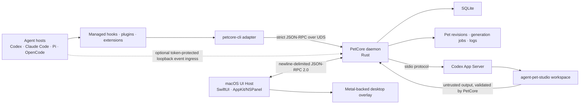
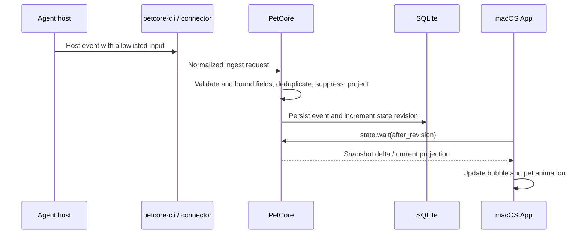

# System Architecture

This document describes the current component boundaries, product surface, and end-to-end flows. It is an orientation map, not a second copy of protocol or table definitions. Follow [Runtime and IPC](runtime-and-ipc.md), [Data model](data-model.md), and the linked source files for exact current contracts.

## Component map



The App and overlay run in one macOS UI process. PetCore is a separate daemon and the normal online state owner. The App and Agent hosts never open SQLite directly. `petcore-cli petpack import/export --offline` is the explicit maintenance exception; it uses the same pet-store lock and atomic revision protocol.

## Components and ownership

| Component | Owns | Primary sources |
|---|---|---|
| macOS UI Host | Resumable first-run presentation, control center, five-entry navigation, menu-bar item, desktop pet, session bubbles, user interaction, App diagnostics | [App entry](../../apps/macos/Sources/AgentPetCompanion/App/AgentPetCompanionApp.swift), [AppStore](../../apps/macos/Sources/AgentPetCompanion/App/AppStore.swift), [overlay controller](../../apps/macos/Sources/AgentPetCompanion/Overlay/PetOverlayController.swift) |
| Swift core library | Shared App models, UDS client/transport, startup coordination, frame scheduling, validation helpers | [AgentPetCompanionCore](../../apps/macos/Sources/AgentPetCompanionCore/) |
| PetCore daemon | SQLite state, snapshots, settings, event normalization and projection, pet library, generation jobs, connector operations, runtime diagnostics | [daemon](../../crates/petcore/src/daemon.rs), [RPC](../../crates/petcore/src/rpc.rs), [database](../../crates/petcore/src/db.rs) |
| `petcore-cli` | Stable connector adapter, RPC operations, `.petpack` build/validate/import/export, explicit offline maintenance | [CLI source](../../crates/petcore-cli/src/main.rs) |
| Connector packages | Host-native installation artifacts and allowlisted event adapters | [plugins](../../plugins/), [connector implementation](../../crates/petcore/src/connections.rs) |
| Pet skills | In-app Codex generation workflow and provider-neutral external generation/editing workflow | [agent-pet-studio](../../skills/agent-pet-studio/), [agent-pet-maker](../../skills/agent-pet-maker/) |
| Typed contracts | Rust domain types plus JSON Schemas for portable/input boundaries | [petcore-types](../../crates/petcore-types/src/lib.rs), [schemas](../../schemas/) |

The small `AgentPetCompanionLifecycleClient` executable is a development helper used by the run script to request a normal bundle-ID-scoped App quit. It is not a resident production component.

## Product surface boundary

The desktop pet and its Agent/session bubbles are the daily product surface. The five-entry control center is the management surface for pet selection, AI creation, configuration, Agent connection, and service recovery. That distinction changes presentation priority, not component ownership: PetCore remains the online state authority, and the App remains responsible for native presentation and interaction.

First run is a three-scene root presentation, not a sixth navigation destination. PetCore owns only the versioned, compare-and-swap scene progress; the App reuses real pet activation and connection operations. The demo phase reducer is deliberately View-local and cannot become Agent lifecycle data.

Connections and bubbles use `Agent → session`; they do not introduce a project node. Explicit bounded session titles and current-turn display messages may cross the typed local projection, while project folders and paths never become connection settings or display identities. The implementation, typed tests, and owning current-state documents enforce the page and bubble semantics.

The bubble is intentionally a glanceable return surface rather than a second
control center. A collapsed Agent group shows one highest-attention or latest
session; an expanded group shows at most three, then routes the remainder to
Agent Connections. Every row exposes one of the presentation intents **Busy**,
**Needs You**, or **Ended** without changing the persisted lifecycle state, and
the full row is the exact-session action when that typed capability exists.

## Main flows

### Startup and state delivery

1. The App claims its single-instance lock and starts App diagnostics.
2. It accepts an existing PetCore only when health, RPC version, build identity, runtime manifest, and connector environment match the bundled runtime contract.
3. Otherwise it stages and preflights the bundled PetCore/CLI runtime, replaces the old service, health-checks the candidate, and commits or rolls back the managed runtime.
4. At bootstrap start, the App arms a short independent fallback that reveals system appearance if PetCore startup or the focused behavior read stalls or fails. Once PetCore is healthy, the App reads versioned behavior settings through PetCore and applies the persisted appearance before revealing the control-center and About windows; bundled-pet seeding cannot keep the windows invisible. The App does not mirror settings into App-local storage or read SQLite directly.
5. The App seeds the fixed bundled-pet inventory without overwriting an existing same-ID pet. A preserved same-ID pet remains an eligible included-companion choice during an upgrade, but stable ID eligibility never grants bundled read-only authority.
6. The App reads `state.snapshot`, including versioned onboarding progress, and applies it as the final appearance/state authority. It presents the nonterminal first-run scene or the ordinary control center root, then presents the desktop overlay.
7. The App subsequently waits on `state.wait`. State changes are keyed by the monotonic database revision; the App does not repeatedly reload SQLite or poll the bundle on a two-second timer.

Dock reopen, second-instance activation, MenuBarExtra, and overlay actions target the registered control-center window identity. The About window is a separate scene and is never selected as the control center. Initial automatic retry and explicit user recovery coalesce onto one full bootstrap pipeline so behavior hydration, bundled-pet seeding, snapshot publication, and first overlay presentation cannot race each other.

The desktop pet body remains hoverable and draggable whenever the overlay is visible. When the renderer has a valid frame alpha mask, transparent pixels may pass pointer events through; during launch, state transitions, or any interval without a mask, hit testing falls back to the geometric pet region so the pet never becomes non-interactive.

Direct drag uses a bounded rubber-band presentation outside the usable screen
region and a short critically damped velocity handoff on release. Only the
hard-clamped final center is persisted. A new drag cancels the handoff at its
current presentation position, reduced motion commits directly, and overlay
transitions never disable the visible pet's pointer interaction.

See [Runtime and IPC](runtime-and-ipc.md) for lifecycle and compatibility details.

### Agent activity to desktop reaction



The persisted event set is `start`, `tool`, `waiting`, `review`, `done`, and `failed`; `idle` is the no-activity pet state. Display aliases such as “thinking” or “working” must not replace protocol names.

### Pet creation and editing

The AI Pet Maker creates a database-backed generation job and a private job workspace. PetCore launches Codex App Server over stdio and provides the internal Pet Studio contract. Skill output is untrusted until PetCore validates source budgets, metadata, privacy, provenance, assets, frame differences, manifest, preview, and package structure.

A successful result is committed as an immutable local pet revision. Any non-bundled pet can start an edit job from its current validated archive, and App-owned history can explicitly select an older validated immutable revision as the read-only baseline. Existing App generation messages are restored when present; an imported pet without creation history simply starts a new edit conversation from the exact package snapshot accepted for that job. Bundled pets remain read-only and require a new pet ID for customization.

### Pet import and activation

`.petpack` identity is the manifest ID, never the display name. Same-name/different-ID pets coexist. Imports and edits publish a staged, immutable revision, atomically update `active.json`, then commit the database row; failure restores the previous pointer and state. See [Data model](data-model.md) and the [`.petpack` V1 specification](../specifications/AgentPetCompanion_Petpack_Whitepaper_V1.md).

PetCore reports bounded per-pet asset warnings in `state.snapshot`. An explicit
repair request bypasses the cached fingerprint, revalidates the immutable
archive, stages a fresh cover and all seven runtime-frame directories, and
atomically replaces both runtime assets. Onboarding, Pet Library, and AI Pet
Maker collapse an unavailable hero preview into the same compact recovery
surface; no context presents activation or creation completion as successful
until the refreshed authoritative snapshot has a real preview.

## Repository map

```text
apps/macos/                 SwiftUI/AppKit App, shared Swift core, tests
crates/petcore/             Rust daemon and domain services
crates/petcore-cli/         Connector, RPC, petpack, and maintenance CLI
crates/petcore-types/       Shared Rust domain types
plugins/                    Host-native connector templates
skills/                     In-app and portable pet-making skills
schemas/                    JSON Schemas for external and portable contracts
fixtures/                   Positive, negative, and security fixtures
script/                     Build and validation entrypoints
docs/                       Durable implementation and release documentation
logo/                       Approved reusable brand assets
```

## Architectural invariants

- App, PetCore, CLI, database range, `.petpack` versions, event schema, and connector contracts ship as one runtime manifest identity.
- Normal online writes go through PetCore. The App and Agent hosts do not bypass its validation or state revision.
- External content is data, never executable instruction. Pet packages, hook payloads, reference images, and Skill output cross bounded validation gates.
- Bounded session titles and latest user/assistant display messages are part of the product data model and cross to the App for local bubbles. Credential stores and complete transcript archives do not.
- Pet library mutations are ID-based, serialized, revisioned, and recoverable.
- Native packaged validation seeds both included pets into a clean home and
  proves their canonical cover plus every expected runtime frame for all seven
  states before a release archive can pass.
- Official V1 distribution uses explicit, fail-closed
  `build_release.sh --github-release --arch all` GitHub Release tooling. It
  emits exactly two ad-hoc-signed thin archives plus a two-entry checksum file,
  all bound to the same full commit and runtime identity. Publication requires
  ZIP-safety validation, native `arm64` and `x86_64` packaged validation, and
  exact downloaded-asset revalidation, then proves through GitHub's API that
  the result is the latest stable Release with the same exact asset digests.
  The repository does not require GitHub Immutable Releases. V1 does not use
  Apple signing or notarization credentials, does not
  claim default Gatekeeper trust, and never downloads or installs an App
  update; official installation documents the manual replacement and required
  first-open user consent.
- The App alone checks for product updates. After the user replaces the App,
  the bundled runtime transaction converges PetCore, CLI, missing bundled pets,
  and previously managed Agent integrations. External components do not
  independently update or report product versions.
- The Codex plugin, its hook, `agent-pet-studio`, and `agent-pet-maker` are one
  versioned capability bundle. Any content change requires a strictly greater
  plugin version, and healthy connection state requires active-content
  verification rather than installed/enabled flags alone.

When changing one of these invariants, update the owning implementation, tests, runtime/schema version where required, and the corresponding document in the same change.
