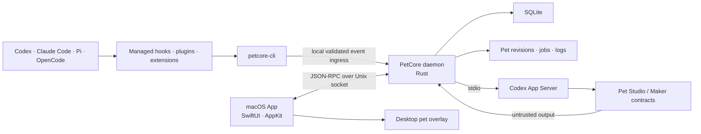
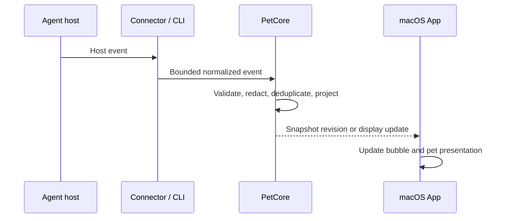

# System Architecture

This document is the orientation map for component ownership and end-to-end flows. [Runtime and IPC](runtime-and-ipc.md), [Data model](data-model.md), [Agent connectors](../integrations/agent-connectors.md), and the [`.petpack` V3 specification](../specifications/AgentPetCompanion_Petpack_Whitepaper_V3.md) own the detailed contracts.

## Component map


```mermaid
flowchart LR
    Hosts["Codex · Claude Code · Pi · OpenCode"] --> Adapters["Managed hooks · plugins · extensions"]
    Adapters --> CLI["petcore-cli"]
    CLI -->|"local validated event ingress"| Core["PetCore daemon<br/>Rust"]
    App["macOS App<br/>SwiftUI · AppKit"] <-->|"JSON-RPC over Unix socket"| Core
    App --> Overlay["Desktop pet overlay"]
    Core --> DB["SQLite"]
    Core --> Files["Pet revisions · jobs · logs"]
    Core -->|"stdio"| Server["Codex App Server"]
    Server --> Skills["Pet Studio / Maker contracts"]
    Skills -->|"untrusted output"| Core
```

The App and overlay share one UI process. PetCore is a separate per-user service and the normal online state owner. The App and Agent hosts never open SQLite directly. Explicit offline `petcore-cli petpack` maintenance is the only exception and uses the same locks and publication rules.

## Ownership

| Component | Responsibility | Primary source |
|---|---|---|
| macOS App | First run, five-page control center, menu bar, desktop pet, bubbles, native interaction, App diagnostics | [App](../../apps/macos/Sources/AgentPetCompanion/) |
| Swift core | Shared models, PetCore transport, startup coordination, frame scheduling | [AgentPetCompanionCore](../../apps/macos/Sources/AgentPetCompanionCore/) |
| PetCore | Durable state, snapshots, settings, Agent projection, pet library, generation, connectors, diagnostics | [petcore](../../crates/petcore/src/) |
| `petcore-cli` | Connector adapter, RPC client, package tooling, explicit offline maintenance | [CLI](../../crates/petcore-cli/src/main.rs) |
| Connector packages | Host-native managed integration artifacts | [plugins](../../plugins/) |
| Pet Skills | In-App Studio and provider-neutral portable production workflows | [skills](../../skills/) |
| Typed contracts | Rust authority types and schemas for external boundaries | [petcore-types](../../crates/petcore-types/src/lib.rs), [schemas](../../schemas/) |

`AgentPetCompanionLifecycleClient` is a development helper for bundle-scoped normal App shutdown; it is not a resident production process.

## Product boundaries

- The desktop pet and session bubble are the daily surface. Pet Library, AI Pet Maker, Pet Configuration, Agent Connections, and Service & Diagnostics are the management surface.
- First run is a resumable three-scene root presentation. Pet choice and Agent setup reuse normal product operations; the demo remains View-local and never creates Agent events or diagnostics.
- Connections and bubbles use `Agent → session`, never project directories as user-facing identity.
- A session title, latest user message, current-turn Agent message, and normalized activity detail are separate bounded fields. PetCore supplies them; Swift does not reconstruct host payloads.
- Bubbles can group sessions per Agent or show one cross-Agent card list. The flat list keeps stable slots while a turn alternates between thinking, planning, and tools; only a new activation or attention-state transition may move a card.
- Clicking the pet toggles the bubble. Only a concrete session row can open a validated exact-session or host-level destination.
- On macOS 26, session bubbles use one untinted native Regular Liquid Glass surface. Compact floating controls may use Clear glass. Older systems use the system material fallback; accessibility settings can replace or strengthen the optical treatment.
- Bundled pets are read-only defaults. Same-name pets coexist because identity is the manifest ID, not the display name.

## Main flows

### Startup and state delivery

1. The App claims its single-instance identity and checks the exact bundled runtime contract.
2. A compatible PetCore is reused. Otherwise the App stages, preflights, replaces, verifies, and either commits or rolls back the managed runtime.
3. The App hydrates behavior settings, converges bundled pets by stable ID, reads one authoritative `state.snapshot`, presents first run or the control center, then presents the overlay.
4. Subsequent state arrives through revision-based `state.wait`; the App does not read SQLite or poll bundle files.

Closing the control center leaves the menu bar and enabled pet running. Reopen targets the registered control-center window rather than whichever App window happens to be visible. Standard Quit closes the UI host and overlay; the LaunchAgent-hosted PetCore may remain available.

The pet, bubble, and menu form one AppKit composition. A drag has one presentation owner, uses absolute screen coordinates from a captured anchor, and commits one final hard-clamped position without momentum. Display size is a separate Pet Configuration setting; the overlay exposes no resize interaction. See [Runtime and IPC](runtime-and-ipc.md) for lifecycle and persistence.

### Agent activity


```mermaid
sequenceDiagram
    participant H as Agent host
    participant C as Connector / CLI
    participant P as PetCore
    participant A as macOS App
    H->>C: Host event
    C->>P: Bounded normalized event
    P->>P: Validate, redact, deduplicate, project
    P-->>A: Snapshot revision or display update
    A->>A: Update bubble and pet presentation
```

Persisted events are `start`, `thinking`, `plan`, `tool`, `waiting`, `done`, and `failed`. `start` leaves the pet idle; `thinking` and `plan` share the package `thinking` action; the other reactive events use their namesake action. Local `acknowledge`, `drag_left`, and `drag_right` animations never enter Agent state. Exact host mappings and routing live in [Agent connectors](../integrations/agent-connectors.md).

### Pet creation, import, and activation

AI Pet Maker creates a PetCore generation job and private workspace, then drives Codex App Server with the internal Studio contract. App creation supports `low` and `standard`; portable workflows may produce `high` when the untouched source pixels satisfy the V3 contract. Generated output is untrusted until the shared package and production validators pass.

Imports and successful jobs stage a new immutable revision, atomically update the active revision pointer, and commit the database row. Failure restores the previous pointer. A damaged local runtime projection can be rebuilt from the immutable package. Exact package, timing, production, and privacy requirements live in the [V3 specification](../specifications/AgentPetCompanion_Petpack_Whitepaper_V3.md).

## Repository map

```text
apps/macos/           SwiftUI/AppKit App, Swift core, tests
crates/petcore/       Rust daemon and domain services
crates/petcore-cli/   Connector, RPC, package, and maintenance CLI
crates/petcore-types/ Shared Rust domain types
plugins/              Managed Agent integration templates
skills/               In-App and portable pet-making Skills
schemas/              External and portable JSON Schemas
fixtures/             Positive, negative, and security fixtures
script/               Build and validation entrypoints
docs/                 Durable technical and release documentation
```

## Invariants

- App, PetCore, CLI, runtime manifest, database range, event schema, package versions, and connector contracts ship as one compatible runtime set.
- Normal online writes go through PetCore and advance typed revisioned state.
- External packages, host events, references, and Skill output remain bounded untrusted data; no package content is executed.
- Credentials, auth stores, arbitrary host objects, complete transcripts, and raw user paths do not enter ordinary App projections or diagnostics.
- Session projections contain only bounded display context and validated navigation capabilities. Closed sessions leave the active bubble immediately; acknowledged open completions stay hidden until a genuine new activity epoch.
- Pet mutations are ID-based, serialized, immutable, and recoverable.
- Official V1 distribution is two architecture-specific ad-hoc-signed GitHub Release archives plus one checksum file. The App reports updates but does not download or install them.
- Managed integrations are attributable to Agent Pet Companion. User-managed extensions and Skills are neither listed nor modified.

When an invariant changes, update its implementation, tests, typed version or schema when required, and the single owning document in the same change.
