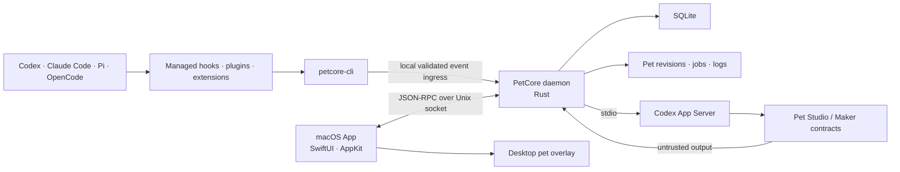
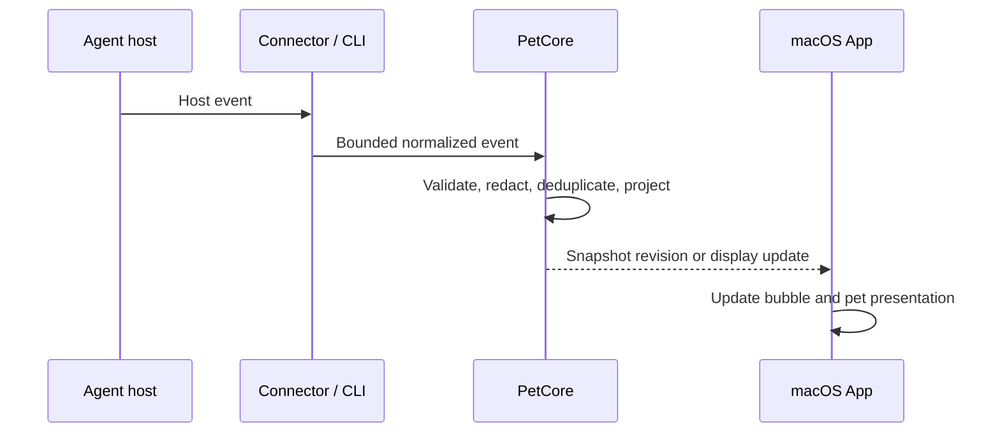

# System Architecture

This document is the orientation map for component ownership and end-to-end flows. [Runtime and IPC](runtime-and-ipc.md), [Data model](data-model.md), [Agent connectors](../integrations/agent-connectors.md), and the [`.petpack` V3 specification](../specifications/AgentPetCompanion_Petpack_Whitepaper_V3.md) own the detailed contracts.

## Component map


```mermaid
flowchart LR
    Hosts["Codex · Claude Code · Pi · OpenCode"] --> Adapters["Managed hooks · plugins · extensions"]
    Adapters --> CLI["petcore-cli"]
    CLI -->|"local validated event ingress"| Core["PetCore daemon<br/>Rust"]
    App["macOS App<br/>SwiftUI · AppKit"] <-->|"JSON-RPC over Unix socket"| Core
    App --> Overlay["Desktop pet overlay"]
    Core --> DB["SQLite"]
    Core --> Files["Pet revisions · jobs · logs"]
    Core -->|"stdio"| Server["Codex App Server"]
    Server --> Skills["Pet Studio / Maker contracts"]
    Skills -->|"untrusted output"| Core
```

The App and overlay share one UI process. PetCore is a separate per-user service and the normal online state owner. The App and Agent hosts never open SQLite directly. Explicit offline `petcore-cli petpack` maintenance is the only exception and uses the same locks and publication rules.

The App composition root retains cross-feature orchestration in `AppStore`, while feature-owned observable state moves behind focused models. `ConnectionsModel` owns Agent connection snapshots and serialized check/repair/test/uninstall operations; `AgentConnectionsView` depends on that model rather than the whole store. User-facing strings are owned by seven feature tables (`Common`, `PetLibrary`, `Maker`, `Connections`, `Overlay`, `Settings`, and `Diagnostics`) with typed keys carrying their table identity. Runtime lookup, catalogs, and both locale files must contain the same key set; a global `Localizable` table is not supported.

## Ownership

| Component | Responsibility | Primary source |
|---|---|---|
| macOS App | First run, five-page control center, menu bar, desktop pet, bubbles, native interaction, App diagnostics | [App](../../apps/macos/Sources/AgentPetCompanion/) |
| Swift core | Domain-split wire contracts, PetCore transport, startup coordination, frame scheduling | [AgentPetCompanionCore](../../apps/macos/Sources/AgentPetCompanionCore/) |
| PetCore | Durable state, snapshots, settings, Agent projection, pet library, generation, connectors, diagnostics | [petcore](../../crates/petcore/src/) |
| `petcore-cli` | Connector adapter, RPC client, package tooling, explicit offline maintenance | [CLI](../../crates/petcore-cli/src/main.rs) |
| Connector packages | Host-native managed integration artifacts | [plugins](../../plugins/) |
| Pet Skills | In-App Studio and provider-neutral portable production workflows | [skills](../../skills/) |
| Typed contracts | Domain-split Rust authority types and schemas for external boundaries | [petcore-types](../../crates/petcore-types/src/), [schemas](../../schemas/) |

`AgentPetCompanionLifecycleClient` is a development helper for bundle-scoped normal App shutdown; it is not a resident production process.

## Product boundaries

- The desktop pet and session bubble are the daily surface. Pet Library, AI Pet Maker, Pet Configuration, Agent Connections, and Service & Diagnostics are the management surface.
- First run is a resumable three-scene root presentation. Pet choice and Agent setup reuse normal product operations; the demo remains View-local and never creates Agent events or diagnostics.
- Connections and bubbles use `Agent → session`, never project directories as user-facing identity.
- A session title and latest user message remain separate bounded context. PetCore selects exactly one retained bubble-body message from the session's Agent replies and explicit thinking/plan text, ordered by persisted event sequence; user, tool, and lifecycle activity update their own context or the separate status indicator without entering or replacing that message. Grouped and flat Swift presentations consume the same selected body, render it in at most two lines, and do not reconstruct host payloads. Navigation notices keep their existing priority over ordinary body copy.
- Bubbles default to one cross-Agent session-card list; users may opt into grouping sessions per Agent. The flat list keeps stable slots while a turn alternates between thinking, planning, and tools; only a new activation or attention-state transition may move a card.
- Clicking the pet toggles the bubble. Only a concrete session row can open a validated exact-session or host-level destination.
- On macOS 26, session bubbles use one untinted native Regular Liquid Glass surface plus a paired sub-point light/dark optical rim that preserves the rounded boundary across mixed bright and dark backdrops without adding a fill, tint, shadow, or second material. Compact floating controls may use Clear glass. Older systems use the system material fallback; accessibility settings can replace or strengthen the optical treatment.
- Bundled pets are read-only defaults. Same-name pets coexist because identity is the manifest ID, not the display name.
- Pet Library previews are local-only and bind fallback readiness to the exact pet revision and selected action. Metal remains eligible to present during a change, while an opaque fallback masks any retained drawable until the exact new render identity reaches the display; stale callbacks are ignored. Finite `burst_then_idle` or `once_then_return` previews return visually to `idle` after their authored playback completes.

## Main flows

### Startup and state delivery

1. The App claims its single-instance identity and checks the exact bundled runtime contract.
2. A compatible PetCore is reused. Otherwise the App stages, preflights, replaces, verifies, and either commits or rolls back the managed runtime.
3. The App hydrates behavior settings, converges bundled pets by stable ID, reads one authoritative `state.snapshot`, presents first run or the control center, then presents the overlay.
4. After the launch-critical snapshot path and any release connector convergence complete, the App runs one full check of all five Agent connections and projects actionable failures into a control-center-wide notice that opens Agent Connections. An Agent App or CLI that is not installed remains informational on Agent Connections and never enters this global notice.
5. Subsequent state arrives through revision-based `state.wait`; the App does not read SQLite or poll bundle files.

Cold launch, Dock reopen, secondary-instance activation, menu/overlay actions, and update recovery all enter one control-center presentation coordinator. It owns the desired visibility, application activation, exact registered window, and key-window transition regardless of whether SwiftUI installs its presenter or registers the `NSWindow` first. Overlay panels are passive and cannot take keyboard focus during ordering or state updates; only the session bubble's explicit keyboard command grants a focus lease, which ends when that panel resigns key. Closing the control center leaves the menu bar and enabled pet running. Standard Quit closes the UI host and overlay; the LaunchAgent-hosted PetCore may remain available.

The pet, bubble, and menu form one AppKit composition. A drag has one presentation owner, uses absolute screen coordinates from a captured anchor, and commits one final hard-clamped position without momentum. Pointer ownership is exact and non-configurable: opaque pet pixels and rendered bubble/menu surfaces are interactive, while transparent pet and panel regions pass through to lower apps; missing or stale masks retain a geometric pet fallback. Display size is a separate Pet Configuration setting; the overlay exposes no resize interaction. See [Runtime and IPC](runtime-and-ipc.md) for lifecycle and persistence.

### Agent activity


```mermaid
sequenceDiagram
    participant H as Agent host
    participant C as Connector / CLI
    participant P as PetCore
    participant A as macOS App
    H->>C: Host event
    C->>P: Bounded normalized event
    P->>P: Validate, redact, deduplicate, project
    P-->>A: Snapshot revision or display update
    A->>A: Update bubble and pet presentation
```

Persisted events are `start`, `thinking`, `plan`, `tool`, `waiting`, `done`, and `failed`. `start` leaves the pet idle; `thinking` and `plan` share the package `thinking` action; the other reactive events use their namesake action. Local `acknowledge`, `drag_left`, and `drag_right` animations never enter Agent state. Exact host mappings and routing live in [Agent connectors](../integrations/agent-connectors.md).

### Pet creation, import, and activation

AI Pet Maker is a permanent split workspace: the left column lists every retained creation or edit task and the right column shows either an in-memory draft or that task's user-visible timeline. Submitting a draft replaces it in place with the exact PetCore job ID returned by the create/edit/retry RPC; that authoritative selection does not wait for the asynchronously refreshed history list to catch up. The database admits exactly one unfinished task across pending, running, waiting for input, recoverable failure, and cancellation cleanup; the App disables its new-task action under the same contract. The unfinished task is listed first and terminal tasks follow newest-first.

PetCore, not ChatGPT, owns the product session. It persists bounded user messages, Agent replies, business-level phases, checkpoint summaries, native App Server `requestUserInput` questions, recoverable errors, validation evidence, and results. The page supports upward message pagination and only follows new messages when the user is already near the bottom. Hidden reasoning, raw tool arguments, complete commands, and complete tool results are never copied into this timeline. A verified live Codex deep link is an auxiliary terminal-task action only: pending, running, waiting, recoverable-failed, and cancellation-cleanup tasks never expose it, even if App Server can still list their thread. ChatGPT sidebar visibility, rendering, or availability is not a creation, input, or recovery dependency.

External-source work continues across checkpoint turns while its bounded workspace fingerprint advances; three consecutive no-progress turns become a recoverable failure and a separate twelve-hour continuous-run bound becomes a recoverable pause. Waiting releases its worker while retaining the task, request, workspace, and thread identity. After sleep or restart, waiting remains waiting; a running task whose owner disappeared becomes recoverable and resumes the same thread when available, otherwise it starts a replacement thread in the same job and workspace. Accepted assets and QA evidence remain in place.

Task duration is derived only from PetCore's `started_at` and `ended_at`. Waiting, sleep gaps, and recoverable failures continue to accrue time. A cancel request freezes `ended_at` immediately, fences every later message and artifact commit, interrupts the exact turn, synchronously stops the owned worker/App Server process group, and completes an exact archive handoff before the task becomes `canceled`; an archive failure remains a non-recoverable cancellation-cleanup state with bounded retries. PetCore then re-releases the stopped thread for external viewing when App Server supports it, with bounded best-effort retries that never hold cancellation open. Canceled tasks expose no reply, resume, or retry capability, but an available released thread may offer the same verified terminal-only ChatGPT transcript action as completed and terminal-failed tasks.

The App accepts bounded, content-verified PNG, JPG/JPEG, and WebP references. User messages and bounded visible Codex `agentMessage` text are written to the private per-job message stream so the creation page can refresh and scroll the live conversation; tool payloads, hidden reasoning, credentials, and arbitrary server objects do not enter that stream. App creation supports `low` and `standard`; portable workflows may produce `high` when the untouched source pixels satisfy the V3 contract. Generated output is untrusted until the shared package and production validators pass.

The AI Pet Maker header also exposes the provider-neutral `agent-pet-maker` Skill manager. PetCore installs the complete bundled Skill only at `~/agent/skills/agent-pet-maker`; the App does not probe whether any Agent discovers that directory. Explicit install establishes an App-private ownership receipt. Once owned, an explicit update, reinstall, or uninstall replaces or removes the complete managed target, including local changes inside it. A same-name external directory without that receipt remains untouched unless its complete contents exactly match the bundled Skill and the user explicitly adopts it.

Imports and successful jobs stage a new immutable revision, atomically update the active revision pointer, and commit the database row. Failure restores the previous pointer. A damaged local runtime projection can be rebuilt from the immutable package. Exact package, timing, production, and privacy requirements live in the [V3 specification](../specifications/AgentPetCompanion_Petpack_Whitepaper_V3.md).

## Repository map

```text
apps/macos/           SwiftUI/AppKit App, Swift core, tests
crates/petcore/       Rust daemon and domain services
crates/petcore-cli/   Connector, RPC, package, and maintenance CLI
crates/petcore-types/ Shared Rust domain types
plugins/              Managed Agent integration templates
skills/               In-App and portable pet-making Skills
schemas/              External and portable JSON Schemas
fixtures/             Positive, negative, and security fixtures
script/               Build and validation entrypoints
docs/                 Durable technical and release documentation
```

## Invariants

- App, PetCore, CLI, runtime manifest, database range, event schema, package versions, and connector contracts ship as one compatible runtime set.
- Normal online writes go through PetCore and advance typed revisioned state.
- External packages, host events, references, and Skill output remain bounded untrusted data; no package content is executed.
- Credentials, auth stores, arbitrary host objects, complete transcripts, and raw user paths do not enter ordinary App projections or diagnostics.
- Session projections contain only bounded display context and validated navigation capabilities. Closed sessions leave the active bubble immediately; acknowledged open completions stay hidden until a genuine new activity epoch.
- Pet mutations are ID-based, serialized, immutable, and recoverable.
- Official V1 distribution is two architecture-specific ad-hoc-signed GitHub Release archives plus one checksum file. The App reports updates but does not download or install them.
- Managed integrations are attributable to Agent Pet Companion. User-managed extensions and Skills are neither listed nor modified. The portable Maker Skill is the explicit exception: it has one fixed external target and an App-private ownership receipt, and user-triggered operations may replace or delete that complete App-managed target. Unrelated Agent Skill locations and unowned content are never scanned or modified.

When an invariant changes, update its implementation, tests, typed version or schema when required, and the single owning document in the same change.
