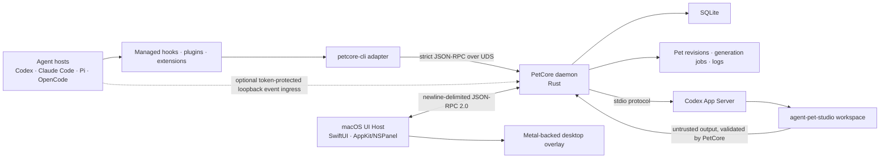
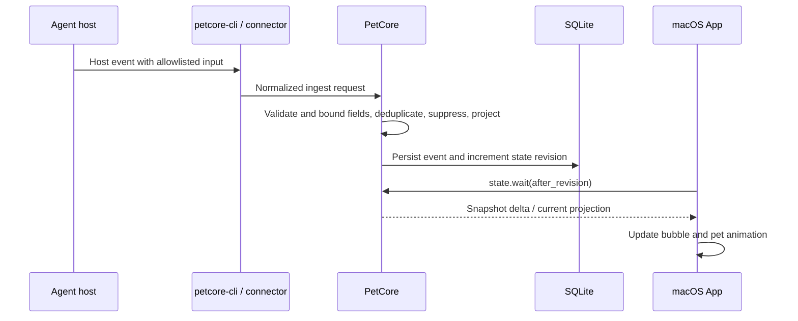

# System Architecture

This document describes the current component boundaries, product surface, and end-to-end flows. It is an orientation map, not a second copy of protocol or table definitions. Follow [Runtime and IPC](runtime-and-ipc.md), [Data model](data-model.md), and the linked source files for exact current contracts.

## Component map


```mermaid
flowchart LR
    Hosts["Agent hosts<br/>Codex · Claude Code · Pi · OpenCode"] --> Adapter["Managed hooks · plugins · extensions"]
    Adapter --> CLI["petcore-cli adapter"]
    CLI -->|"strict JSON-RPC over UDS"| Core["PetCore daemon<br/>Rust"]
    Hosts -.->|"optional token-protected loopback event ingress"| Core
    App["macOS UI Host<br/>SwiftUI · AppKit/NSPanel"] <-->|"newline-delimited JSON-RPC 2.0"| Core
    App --> Overlay["Metal-backed desktop overlay"]
    Core --> DB["SQLite"]
    Core --> Files["Pet revisions · generation jobs · logs"]
    Core -->|"stdio protocol"| Server["Codex App Server"]
    Server --> Studio["agent-pet-studio workspace"]
    Studio -->|"untrusted output, validated by PetCore"| Core
```

The App and overlay run in one macOS UI process. PetCore is a separate daemon and the normal online state owner. The App and Agent hosts never open SQLite directly. `petcore-cli petpack import/export --offline` is the explicit maintenance exception; it uses the same pet-store lock and atomic revision protocol.

## Components and ownership

| Component | Owns | Primary sources |
|---|---|---|
| macOS UI Host | Resumable first-run presentation, control center, five-entry navigation, menu-bar item, desktop pet, session bubbles, user interaction, App diagnostics | [App entry](../../apps/macos/Sources/AgentPetCompanion/App/AgentPetCompanionApp.swift), [AppStore](../../apps/macos/Sources/AgentPetCompanion/App/AppStore.swift), [overlay controller](../../apps/macos/Sources/AgentPetCompanion/Overlay/PetOverlayController.swift) |
| Swift core library | Shared App models, UDS client/transport, startup coordination, frame scheduling, validation helpers | [AgentPetCompanionCore](../../apps/macos/Sources/AgentPetCompanionCore/) |
| PetCore daemon | SQLite state, snapshots, settings, event normalization and projection, pet library, generation jobs, connector operations, runtime diagnostics | [daemon](../../crates/petcore/src/daemon.rs), [RPC](../../crates/petcore/src/rpc.rs), [database](../../crates/petcore/src/db.rs) |
| `petcore-cli` | Stable connector adapter, RPC operations, `.petpack` build/validate/import/export, explicit offline maintenance | [CLI source](../../crates/petcore-cli/src/main.rs) |
| Connector packages | Host-native installation artifacts and allowlisted event adapters | [plugins](../../plugins/), [connector implementation](../../crates/petcore/src/connections.rs) |
| Pet skills | In-app Codex generation workflow and provider-neutral external generation/editing workflow | [agent-pet-studio](../../skills/agent-pet-studio/), [agent-pet-maker](../../skills/agent-pet-maker/) |
| Typed contracts | Rust domain types plus JSON Schemas for portable/input boundaries | [petcore-types](../../crates/petcore-types/src/lib.rs), [schemas](../../schemas/) |

The small `AgentPetCompanionLifecycleClient` executable is a development helper used by the run script to request a normal bundle-ID-scoped App quit. It is not a resident production component.

## Product surface boundary

The desktop pet and its Agent/session bubbles are the daily product surface. The five-entry control center is the management surface for pet selection, AI creation, configuration, Agent connection, and service recovery. That distinction changes presentation priority, not component ownership: PetCore remains the online state authority, and the App remains responsible for native presentation and interaction.

First run is a three-scene root presentation, not a sixth navigation destination. PetCore owns only the versioned, compare-and-swap scene progress; the App reuses real pet activation and connection operations. The demo phase reducer is deliberately View-local and cannot become Agent lifecycle data.

Connections and bubbles use `Agent → session`; they do not introduce a project node. The latest explicit bounded session title crosses the typed local projection; before one exists, the first user message is the bounded title fallback while the latest user and current-turn Agent messages remain separate context. Project folders and paths never become connection settings or display identities. The implementation, typed tests, and owning current-state documents enforce the page and bubble semantics.

The bubble is intentionally a glanceable return surface rather than a second
control center. A collapsed Agent group shows one highest-attention or latest
session; an expanded group shows every concrete session already present in the
bounded PetCore snapshot. Every row labels the exact authored pet action for
its fixed lifecycle state in the badge and identifies its App or CLI origin,
while its two detail lines render
distinct bounded Agent messages, host-exposed reasoning, commands, tool
input/output, errors, or another normalized semantic scalar detail when available. The full row is
the exact-session action when that typed capability exists; otherwise it names
and opens only a validated Agent App or terminal host, or exposes no action.
A completed or review-ready row is acknowledged through PetCore only after its
declared exact-session or host-level destination opens successfully. If an
exact deep link is rejected, opening the same App as a recovery aid is not
treated as reaching that session: the row remains visible with a retryable,
localized navigation error. A successful acknowledgement survives App and PetCore relaunch,
while a later event for the same Agent session creates a new activity identity
and returns the row to the bubble. Pet Configuration response events,
attention-preset summaries and previews, menu-bar recent activity, Pet Library
current state, and bubble badges all map the fixed event through
`ProductLifecycleState` and use one localized lifecycle label. Protocol names
and persisted event titles remain data identities rather than independent
UI-copy authorities.

## Main flows

### Startup and state delivery

1. The App claims its single-instance lock and starts App diagnostics.
2. It accepts an existing PetCore only when health, RPC version, build identity, runtime manifest, and connector environment match the bundled runtime contract.
3. Otherwise it stages and preflights the bundled PetCore/CLI runtime, replaces the old service, health-checks the candidate, and commits or rolls back the managed runtime.
4. At bootstrap start, the App arms a short independent fallback that reveals the system language and appearance if PetCore startup or the focused behavior read stalls or fails. Once PetCore is healthy, the App reads versioned behavior settings through PetCore and applies the persisted interface language and appearance before revealing the control-center and About windows; bundled-pet seeding cannot keep the windows invisible. The App does not mirror settings into App-local storage or read SQLite directly.
5. The App converges the fixed bundled-pet inventory by stable ID and pinned package digest. A missing ID is installed; an ordinary same-ID pet is preserved byte-for-byte and remains an eligible included-companion choice without gaining bundled authority. Only an identity already marked as trusted bundled inventory may advance to the current package as a new immutable revision, preserving the active pet selection and every older revision.
6. The App reads `state.snapshot`, including versioned onboarding progress, and applies it as the final presentation/state authority. It presents the nonterminal first-run scene or the ordinary control center root, then presents the desktop overlay.
7. The App subsequently waits on `state.wait`. State changes are keyed by the monotonic database revision; the App does not repeatedly reload SQLite or poll the bundle on a two-second timer.

Dock reopen, second-instance activation, MenuBarExtra, and overlay actions target the registered control-center window identity. The About window is a separate scene and is never selected as the control center. Initial automatic retry and explicit user recovery coalesce onto one full bootstrap pipeline so behavior hydration, bundled-pet seeding, snapshot publication, and first overlay presentation cannot race each other.

Closing the control center leaves the resident menu-bar and desktop-pet
surfaces running. Its explicit close lifecycle keeps an enabled pet visible
even when no regular application window remains, rather than treating that
ordinary resident state as a request to hide every window for Show Desktop.

The desktop pet body remains hoverable and draggable whenever the overlay is visible. When the renderer has a valid frame alpha mask, transparent pixels may pass pointer events through; during launch, state transitions, or any interval without a mask, hit testing falls back to the geometric pet region so the pet never becomes non-interactive.

`OverlayPlacementAuthority` is the only presentation owner for desktop-pet
position. A drag captures the presented anchor and pointer in absolute screen
coordinates, then derives every sample from that fixed pair; it never
accumulates event deltas. The presented center is hard-clamped to the current
display and the release commits exactly that center once, with no momentum,
projection, rubber-band, or settling phase. Pending local commits, stale remote
snapshots, late acknowledgements, and failed saves cannot move the presented
pet. Bubble and menu panels are child windows of the pet panel, so the complete
composition moves from one root rather than by independently publishing model
updates for several windows.

Pet display size is a separate persisted `display_width_pt` value. Pet
Configuration → Appearance owns the 80–224 pt slider (112 pt default, 1 pt
step, numeric value, restore-default, keyboard, and VoiceOver adjustment);
height derives from the fixed 208/192 canvas ratio. The overlay has no resize
panel, handle, hover target, pointer mode, or resizing state. Dragging the pet
only changes position.

See [Runtime and IPC](runtime-and-ipc.md) for lifecycle and compatibility details.

### Agent activity to desktop reaction


```mermaid
sequenceDiagram
    participant H as Agent host
    participant C as petcore-cli / connector
    participant P as PetCore
    participant D as SQLite
    participant A as macOS App
    H->>C: Host event with allowlisted input
    C->>P: Normalized ingest request
    P->>P: Validate and bound fields, deduplicate, suppress, project
    P->>D: Persist event and increment state revision
    A->>P: state.wait(after_revision)
    P-->>A: Snapshot delta / current projection
    A->>A: Update bubble and pet animation
```

The persisted event set is `start`, `tool`, `waiting`, `review`, `done`, and
`failed`; `idle` is the no-activity pet state. Every user-visible status surface
uses the same lifecycle labels: **Thinking / 正在思考**, **Using Tools /
正在调用工具**, **Needs You / 等你处理**, **Ready to Review / 可以查看**,
**Completed / 已完成**, and **Needs Attention / 需要处理**. This presentation
mapping does not change the stored protocol names or closed persisted titles.

The App uses each state's V2 `frame_durations_ms` and closed playback contract
directly. It exposes no global FPS or Standard/Smooth profile and never
resamples or retimes authored frames. `loop`, `once_hold`, `periodic`, and
`burst_then_settle` determine the state-lifetime presentation; an unchanged
semantic state does not restart, a stall resumes at the currently due frame
without catch-up playback, and Reduce Motion uses the declared representative
frame.

### Pet creation and editing

The AI Pet Maker creates a database-backed generation job and a private job workspace. Its App form contains description, style, either low or standard native quality, and bounded references; timing is authored by the visual producer rather than exposed as form input. PetCore launches Codex App Server over stdio and provides the internal Pet Studio contract. Studio and the portable Maker Skill reference one shared visual-production and native-resolution contract and use the same Maker helper for incremental/final motion evidence. The Skill locks one canonical production base at the package's exact low 192×208 or standard 384×416 tier; isolates and serializes one complete state per ordinary image batch; directs a readable state intent without prescribing a fixed action or layer count; and requires the exact `frame_durations_ms` count to consist of distinct authored sprite cells rather than crossfade, morph, optical-flow, transformed-duplicate, or procedural interpolation filler. A larger tier is not synthesized through upscaling or multiple batches when the image path cannot supply the required native cell size. The Skill extracts every sheet with fixed cell bounds and runs incremental plus final private QA outside the package source, including one actual-duration `authored_timing` preview per state and a digest of the complete timing contract. Intentional whole-character translation, rotation, bounce, recoil, squash/stretch, scale, or baseline change is allowed; displacement, silhouette, scale, baseline, and playback-boundary metrics remain human-review evidence instead of amplitude-based hard failures. Objective edge clipping and synthetic interpolation still fail automatically, while visible identity/anatomy drift, accidental popping or jitter, broken props, and bad loop/final settles fail visual review. Explicit moving masks may preserve truly unchanged pixels in localized actions, but full-character actions remain free to move. Maker finalization and Studio both call `petpack verify-production`, whose PetCore implementation derives changed states and verifies timing and frame digests, QA/review freshness and coverage, authored-timing previews, objective frame integrity, interpolation, revision structure, and timing transitions. Strict Studio import reruns that exact implementation as the final trust boundary. Workspace safety, source/metadata identity, output policy, and commit conflict remain responsibilities of the calling host.

A successful result is committed as an immutable local pet revision. Any non-bundled pet can start an edit job from its current validated archive, and App-owned history can explicitly select an older validated immutable revision as the read-only baseline. Existing App generation messages are restored when present; an imported pet without creation history simply starts a new edit conversation from the exact package snapshot accepted for that job. Bundled pets remain read-only and require a new pet ID for customization.

### Pet import and activation

`.petpack` identity is the manifest ID, never the display name. Same-name/different-ID pets coexist. Imports and edits publish a staged, immutable revision, atomically update `active.json`, then commit the database row; failure restores the previous pointer and state. PetCore reads and writes only V2; a V1 archive is rejected and must be recreated with a V2 maker. See [Data model](data-model.md) and the [`.petpack` V2 specification](../specifications/AgentPetCompanion_Petpack_Whitepaper_V2.md).

PetCore reports bounded per-pet asset warnings in `state.snapshot`. An explicit
repair request bypasses the cached fingerprint, revalidates the immutable
archive, stages a fresh cover and all seven runtime-frame directories, and
atomically replaces both runtime assets. Onboarding, Pet Library, and AI Pet
Maker collapse an unavailable hero preview into the same compact recovery
surface; no context presents activation or creation completion as successful
until the refreshed authoritative snapshot has a real preview.

## Repository map

```text
apps/macos/                 SwiftUI/AppKit App, shared Swift core, tests
crates/petcore/             Rust daemon and domain services
crates/petcore-cli/         Connector, RPC, petpack, and maintenance CLI
crates/petcore-types/       Shared Rust domain types
plugins/                    Host-native connector templates
skills/                     In-app and portable pet-making skills
schemas/                    JSON Schemas for external and portable contracts
fixtures/                   Positive, negative, and security fixtures
script/                     Build and validation entrypoints
docs/                       Durable implementation and release documentation
logo/                       Approved reusable brand assets
```

## Architectural invariants

- App, PetCore, CLI, database range, `.petpack` versions, event schema, and connector contracts ship as one runtime manifest identity.
- Normal online writes go through PetCore. The App and Agent hosts do not bypass its validation or state revision.
- External content is data, never executable instruction. Pet packages, hook payloads, reference images, and Skill output cross bounded validation gates.
- Bounded session titles, latest user/assistant display messages, and normalized session-scoped reasoning, command, tool, error, or other semantic scalar details are part of the product data model and cross to the App for local bubbles. Arbitrary host objects, credential stores, auth headers, environment dumps, and complete transcript archives do not.
- Pet library mutations are ID-based, serialized, revisioned, and recoverable.
- Native packaged validation seeds both included pets into a clean home and
  proves their canonical cover plus every expected runtime frame for all seven
  states before a release archive can pass.
- Official V1 distribution uses explicit, fail-closed
  `build_release.sh --github-release --arch all` GitHub Release tooling. It
  emits exactly two ad-hoc-signed thin archives plus a two-entry checksum file,
  all bound to the same full commit and runtime identity. Publication requires
  ZIP-safety validation, native `arm64` and `x86_64` packaged validation, and
  exact downloaded-asset revalidation, then proves through GitHub's API that
  the result is the latest stable Release with the same exact asset digests.
  The repository does not require GitHub Immutable Releases. V1 does not use
  Apple signing or notarization credentials, does not
  claim default Gatekeeper trust, and never downloads or installs an App
  update; official installation documents the manual replacement and required
  first-open user consent.
- The App alone checks for product updates. After the user replaces the App,
  the bundled runtime transaction converges PetCore, CLI, missing bundled pets,
  and previously managed Agent integrations. External components do not
  independently update or report product versions.
- Agent Connections projects only bounded component identities owned by Agent
  Pet Companion under their corresponding Agent. It does not scan or list
  user-owned extensions and Skills. Claude Code, Pi, and OpenCode managed
  artifacts carry the App/PetCore release that installed them; Codex keeps its
  independent plugin-bundle version. PetCore projects the verified active and
  required release versions without exposing the internal connector contract.
- The Codex plugin, its hook, `agent-pet-studio`, and `agent-pet-maker` are one
  versioned capability bundle. Any content change requires a strictly greater
  plugin version, and healthy connection state requires active-content
  verification rather than installed/enabled flags alone.

When changing one of these invariants, update the owning implementation, tests, runtime/schema version where required, and the corresponding document in the same change.
