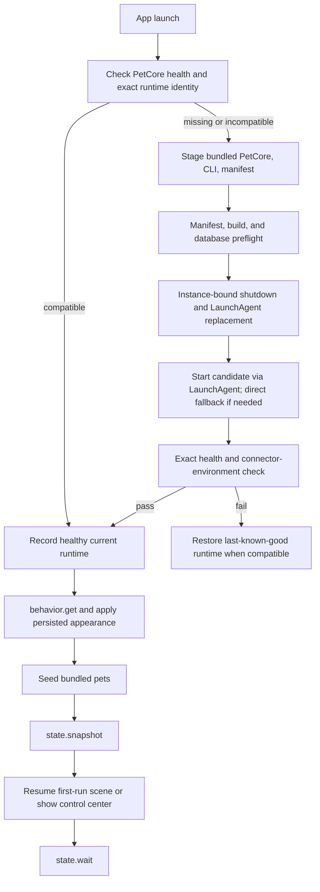

# Runtime and IPC

This document defines the current process lifecycle, compatibility contract, transport boundaries, update behavior, and diagnostics behavior. Exact method and field allowlists remain in source.

## Process topology

| Process | Lifetime | Responsibility |
|---|---|---|
| `AgentPetCompanion` | Single macOS UI host | Control center, menu bar, overlay, rendering, App-side diagnostics |
| `petcore` | Preferentially a per-user KeepAlive LaunchAgent | Durable state, RPC, event ingress, generation, pet library, connectors, diagnostics |
| `petcore-cli` | One command or connector event | Stable adapter/RPC/petpack entrypoint; explicit offline maintenance only when requested |
| `codex app-server --stdio` | Private child process group for a generation session | Codex thread/turn protocol used by the in-app Pet Studio |

The App uses `run/app-instance.lock`; a second instance sends an activation request containing its bundle path and build ID, then exits. PetCore uses `run/petcore.lock`, `runtime.json`, and a live health identity. Shutdown requires the expected PetCore instance ID.

Closing the control-center window does not terminate the UI host because the menu-bar and overlay surfaces remain active. Reopen requests resolve the registered control-center window identifier, so an already-open About window cannot intercept them. Standard **Quit** terminates the App and overlay. The normal LaunchAgent-hosted PetCore remains available; a direct child fallback is tied to the App process.

The runtime topology does not make PetCore health a permanent product headline. The toolbar is quiet while the service is healthy and exposes only typed attention or recovery states. Service & Diagnostics leads with one aggregate state and one contextual action; PetCore, RPC, event-channel, renderer, retention, and archive details remain available behind disclosure. Presentation never changes PetCore operational states or recovery authority.

## Startup and runtime replacement



The packaged `runtime-manifest.json` uses `apc.runtime-manifest.v1` and binds:

- release channel, App semantic version, App build, and shared build ID;
- PetCore RPC protocol and PetCore/CLI build IDs;
- supported SQLite schema range;
- Agent event schema;
- readable and writable `.petpack` versions;
- Codex, Claude Code, Pi, and OpenCode connector contract versions.

The App accepts health only when the runtime protocol, build IDs, manifest, and service connector environment match. A database newer than the candidate supports is rejected before replacement. Candidate failure restores the last-known-good runtime when its manifest and database range remain compatible.

At bootstrap, the App applies the persisted `behavior` projection before presenting its windows. An independent 500 ms fallback reveals system appearance if startup stalls. The first complete `state.snapshot` is the final authority for behavior, onboarding progress, pets, placement, connections, and active sessions; the desktop overlay is not presented before that snapshot. A nonterminal onboarding projection presents the three first-run scenes at the content root, outside the five-entry navigation. Explicit close is launch-local and resumes the same durable scene later; explicit skip is a terminal PetCore write.

Initial startup, automatic retry, and explicit recovery coalesce onto one behavior → seed → snapshot → overlay pipeline so partial bootstrap work cannot race.

The App publishes service lifecycle independently from human-readable status copy as the closed operational states `checking`, `recovering`, `online`, `offline`, `runtimeMismatch`, and `error`. Transport failures explicitly become `offline`; candidate compatibility and rollback failures become `runtimeMismatch`; other startup failures map from the typed failure code. Service & Diagnostics projects one aggregate state from these values, the toolbar appears only for attention or recovery, and the local RPC and event-channel rows stay in Technical Details. Desktop-pet rendering remains an independent App-side status. No presentation infers recovery authority from localized text.

There is no periodic disk or bundle updater and V1 never downloads or installs
an App update. Bundle identity is re-evaluated only on lifecycle events such as
activation, opening the control center, or a second-instance request. A
different valid development bundle may request the existing explicit handoff
path. A release-channel bundle outside canonical
`/Applications/AgentPetCompanion.app` is never a handoff candidate: the
canonical running App presents the manual-installation guide, while a primary
noncanonical launch presents the same guide without starting or replacing
PetCore.

Primary sources: [App runtime lifecycle](../../apps/macos/Sources/AgentPetCompanion/App/AppRuntimeLifecycle.swift), [GitHub Release update checker](../../apps/macos/Sources/AgentPetCompanion/App/GitHubReleaseUpdateChecker.swift), [manual installation policy](../../apps/macos/Sources/AgentPetCompanion/App/AppManualInstallation.swift), [PetCore process manager](../../apps/macos/Sources/AgentPetCompanion/App/PetCoreProcessManager.swift), [Swift runtime manifest and store](../../apps/macos/Sources/AgentPetCompanion/App/RuntimeReleaseManifest.swift), [Rust runtime manifest](../../crates/petcore/src/runtime_manifest.rs), and [development run script](../../script/build_and_run.sh).

## Update discovery and convergence

The App is the only update coordinator. PetCore, `petcore-cli`, connector
templates, plugins, and Skills never check the network or advertise independent
updates.

Automatic and manual checks call GitHub's public
`/repos/xjxtree/agent-pet-companion/releases/latest` endpoint. The decoder is
closed over a strict stable `vX.Y.Z` tag, `draft == false`,
`prerelease == false`, the exact three-asset inventory, and one uploaded,
nonempty architecture ZIP with a GitHub-provided SHA-256 digest and exact
official download URL. GitHub Release immutability is not required. The client
sends an ETag when one has
been cached. Only a successful response changes update availability; automatic
transport or validation failures are not PetCore operational failures.

The App-facing coordinator owns the automatic 24-hour throttle and manual
bypass. It starts automatic work only after healthy bootstrap and may repeat an
expired check on activation. The App menu and About window call the same
coordinator for manual checks. Download and release-note actions open only URLs
already accepted by the closed decoder; the App never downloads or executes
the asset. If macOS cannot hand the validated asset URL to the browser, the
verified release remains available and the manual surface offers both a retry
and the matching Release page instead of pretending that a download started.

Release-channel installation identity is derived only from the running or
candidate bundle's own `Info.plist` and
`Contents/Resources/runtime-manifest.json`. Test-only environment overrides
used by runtime development cannot make a release handoff candidate valid. The
primary release bundle must have the official bundle identifier and be the
real, non-symlinked canonical `/Applications/AgentPetCompanion.app`.

A copied replacement is validated when discovered and revalidated immediately
before the old App schedules its quit-and-relaunch helper. The handoff waits
while product convergence, an RPC mutation, a queued behavior write, or an
overlay drag, resize, or debounced placement save still owns user work. If the
candidate changes, becomes invalid, or cannot be scheduled, the old App stays
open and presents the manual recovery guide; it never quits on stale evidence.

Opening a replaced App whose bundled build differs from the last converged
build first calls the read-only `product.convergence.preflight`. That query
reads only the active-generation row and the in-process connection-operation
flag; it never waits for or acquires the Agent-host mutex. An active operation
defers replacement instead of interrupting user work. A safe result starts the
ordinary runtime-replacement transaction, then refreshes only previously
managed integration artifacts. For a legacy managed runtime whose snapshot
predates the connection-operation flag, the App performs one bounded
compatibility probe through the legacy connection admission gate. A conflict
is protected work and any ambiguous result defers replacement; absence is
never assumed safe. Core convergence is:

```text
validate bundled manifest and database range
→ stage PetCore and petcore-cli
→ instance-bound shutdown
→ start and verify the exact candidate
→ atomically commit runtime/current
→ seed missing bundled pets
→ refresh and verify previously managed integrations
→ record the converged build
```

Core failure restores the compatible last-known-good runtime. Connector
refresh has typed per-Agent results: one failed external integration does not
roll back an otherwise healthy App/runtime commit, but it cannot remain
`connected`. The affected Agent becomes repairable until its managed source,
installed version, and active runtime evidence match. A failed or incomplete
report is never recorded as convergence, so a later launch retries it safely.
`product.convergence.update` accepts only the active runtime's exact build ID
and App version plus the complete four-source typed report. It stores the
server-generated completion time, report digest, and verified Codex
Skills/content digests in the dedicated singleton receipt table; it does not
reuse generic diagnostic settings.

Bundled-pet seeding is also fail-closed: the App accepts only a typed response
whose outcome count and unique pet IDs exactly match the closed bundled
inventory, with every returned pet matching its requested ID. A malformed,
partial, duplicate, or mismatched result leaves convergence unrecorded and
retryable.

For Codex, the App-managed plugin source, `plugin.json` version, internal
`agent-pet-studio`, portable `agent-pet-maker`, and the actual active Codex
cache form one verified capability bundle. Content changes require a strict
plugin version increase. Refresh rewrites the complete owned source, activates
that version through Codex, and checks the active manifest and content digests;
installed/enabled flags alone are insufficient. A running Maker job retains
the capability it started with, while later jobs use the newly verified
bundle.

## Transports

### App and CLI JSON-RPC

The primary endpoint is `run/petcore.sock`, a private `0600` Unix domain socket. Messages use newline-delimited JSON-RPC 2.0. The daemon bounds frames and responses to 256 KiB, batches to 64 requests, and concurrent client work to 32 connections. Swift applies short default timeouts and longer bounded timeouts for package, diagnostics, and connector operations.

RPC capabilities are grouped as follows; [the RPC implementation](../../crates/petcore/src/rpc.rs) owns the exact method allowlist and parameters.

| Capability | Method families |
|---|---|
| Runtime | health, instance-bound shutdown |
| Projection | snapshot, revision-based long-poll wait |
| Configuration | behavior, versioned onboarding progress, overlay placement, client settings |
| Events | normalized ingest, bounded recent events |
| Pet library | list with validated native FPS, fixed state durations, and derived current revision metadata; bounded typed revision/job history; activate, delete, validate/import/seed/export `.petpack`; forced runtime-asset repair |
| Generation | create, edit from a validated current or older owned revision, retry, messages/wait/reply, cancel, latest private Maker-session recovery globally and by pet |
| Connections | check, receipts, repair, refresh, test, uninstall |
| Product convergence | optional receipt get, current-build receipt update, read-only replacement preflight |
| Support | renderer budget, Codex App Server probe, diagnostics export |

`state_revision` is serialized as a decimal string. A client reads a consistent snapshot, then calls `state.wait(after_revision, timeout_ms)`. Timeouts are bounded long-polls and do not indicate a state change or a disk-version poll.

`onboarding.get` returns the closed `apc.onboarding-progress.v1` progress object plus its decimal-string revision. `onboarding.update(expected_revision, progress)` performs a compare-and-swap and accepts only the ordered next scene or explicit skip. Swift decodes the schema, fields, stage, and revision as a closed contract; malformed or future values fail closed. The choose scene awaits the existing `pet.activate` path before advancing. Its included-companion candidates use the fixed ordered manifest IDs, so an upgrade-preserved same-ID pet remains selectable without acquiring bundled origin/generator/provenance or read-only permissions. An empty inventory offers the ordinary bundled-seed retry and diagnostics; an asset-warning candidate offers forced repair and cannot advance until the authoritative warning clears. Connection actions consume the same typed presentation and AppStore operations as Agent Connections. Agent detection may continue in the background and never blocks the local demo; connection mutations retain their typed capability and explicit-confirmation requirements. Completing onboarding is published only with the authoritative snapshot that shows the desktop pet enabled.

`pet.assets.repair(id)` is the explicit online recovery path for a library row
already owned by PetCore. It ignores a previously cached invalid fingerprint,
revalidates the exact immutable `.petpack`, verifies the manifest ID, stages
the canonical cover and all seven runtime-frame states, atomically replaces
both asset targets, validates the committed result, and then updates the
database/cache. The typed result returns the refreshed `PetSummary` plus an
optional bounded warning. Swift treats mismatched or malformed results as
failure and refreshes `state.snapshot` before enabling preview-dependent
actions.

`pet.history(pet_id, limit)` accepts 1–32 records (16 by default), revalidates bounded `.petpack` archives, and uses the 120-second package-operation deadline. It is a privacy-minimized library projection, separate from private Maker recovery: `generation.for_pet` returns the newest job for a result pet, while `generation.latest` also covers terminal create jobs without a result pet.

Maker recovery returns only validated reference copies under the matching private job directory. Missing or unsafe staging becomes an empty reference list plus bounded `reference_reselection_count`; it does not expose the original selected paths. An edit-start receipt exposes the accepted baseline revision ID plus that baseline's native FPS and fixed state durations so the App can immediately reconcile a historical selection; recovery responses carry the same timing in the bounded form projection. Neither path exposes private context paths or instructions. The App resolves the revision ID through `pet.history` and does not substitute the current cover for an unavailable revision preview.

Within `state.snapshot`, `onboarding` is the versioned durable first-run projection. `events`, `recent_events`, `active_agent_state`, and `active_agent_sessions` are typed App projections rather than event-history records. Active rows deliberately include the bounded `session_title`, latest user `session_user_message`, and current-turn Agent `session_message` so desktop bubbles show the conversation context users need; these display fields are first-class local UI data. External title/detail aliases, arbitrary raw payloads, activity detail, and separate structured command/file fields are not copied into the projection. Stable domain-separated opaque IDs preserve UI grouping. Ambiguous same-Agent sessions may carry a PetCore-owned content-free `anonymous_session_alias`; it is stable across activity reordering and restart while the session is retained.

The local onboarding demo is not an RPC or event source. Its thinking, working, needs-attention, and done phases live in a View-local reducer and select only pet animation assets. They cannot call Agent ingest or write event history, receipts, aliases, suppression, retention counts, or diagnostics.

Allowlisted navigation includes the closed `capability` value `exact_session`, `agent_host`, or `unavailable`, plus only the target fields needed to prove that capability. Validated terminal URLs and a canonical 36-character Codex UUID in the dedicated `routable_session_id` may provide exact routing; a known host target may provide host-only activation. Malformed, unknown, or closed targets fail closed. Active rows also carry a closed summary kind and opaque animation identity. At most eight concrete sessions are returned, with `active_agent_sessions_omitted_count` representing the bounded remainder. The App applies a tighter daily-surface bound per Agent: collapsed shows one row, expanded shows at most three, and any remainder opens Agent Connections. It derives only the presentation intents **Busy** (`start`/`tool`), **Needs You** (`waiting`/`review`), and **Ended** (`done`/`failed`); the stored protocol names do not change. The explicit `events.recent` RPC remains the bounded audit-history interface and is not reused by the App snapshot.

### Capability-token loopback ingress

PetCore also binds a random port on `127.0.0.1` and accepts only `POST /agent-events`. The current port is published under `run/`; authorization requires the project-owned capability token via `Authorization: Bearer` or `X-Agent-Pet-Token`. The token and endpoint files are private, inputs are bounded, and accepted data enters the same normalization and persistence path as UDS ingest. This endpoint is never exposed to the LAN or internet.

Primary sources: [daemon transport](../../crates/petcore/src/daemon.rs), [instance ownership](../../crates/petcore/src/instance_lock.rs), [Swift transport](../../apps/macos/Sources/AgentPetCompanionCore/PetCoreTransport.swift), and [Swift client](../../apps/macos/Sources/AgentPetCompanionCore/PetCoreClient.swift).

## Diagnostics

App and PetCore diagnostics use the `apc.diagnostic-log.v1` JSONL format. Each component keeps a 2 MiB current log, four backups, and at most 14 days. The direct-start compatibility log is separately bounded to a 1 MiB current file and two backups. Logging degrades without preventing the service from starting.

**Service & Diagnostics → Diagnostic Download** first requests `diagnostics.export`; if PetCore is unavailable, the App creates an offline fallback with the same `apc.diagnostics-bundle.v1` manifest shape. Service recovery and diagnostics export have independent operation state, so one does not disable the other. Export staging expires after 24 hours and retains at most three archives with a 128 MiB combined cap.

The ZIP is allowlist-only. It contains a manifest, bounded environment summary, explanatory README, and sanitized/truncated logs. It excludes SQLite, pet assets, generation workspaces, connector configuration, runtime tokens, prompts, full messages, commands, tool input/output, credentials, raw identifiers, and user paths.

Diagnostic export and service recovery remain independent. PetCore, RPC, event-channel, and renderer rows are collapsed by default; this presentation does not remove their typed status or reduce the support archive contract.

Primary sources: [App diagnostics](../../apps/macos/Sources/AgentPetCompanion/App/Diagnostics.swift) and [PetCore diagnostics](../../crates/petcore/src/diagnostics.rs).

## Change checklist

When changing lifecycle or IPC:

1. update Rust and Swift manifest mirrors together;
2. update RPC method/parameter validation and both client/server tests;
3. preserve bounded framing, permissions, instance-bound shutdown, and rollback;
4. test older/newer database compatibility before changing the supported range;
5. keep connector installs pointed at the managed `runtime/current/petcore-cli` path;
6. update this document and the release acceptance gate when user-visible lifecycle behavior changes.
