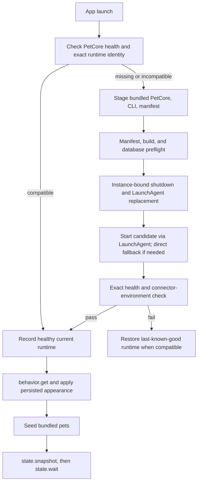

# Runtime and IPC

This document defines the current process lifecycle, compatibility contract, transport boundaries, and diagnostics behavior. Exact method and field allowlists remain in source.

## Process topology

| Process | Lifetime | Responsibility |
|---|---|---|
| `AgentPetCompanion` | Single macOS UI host | Control center, menu bar, overlay, rendering, App-side diagnostics |
| `petcore` | Preferentially a per-user KeepAlive LaunchAgent | Durable state, RPC, event ingress, generation, pet library, connectors, diagnostics |
| `petcore-cli` | One command or connector event | Stable adapter/RPC/petpack entrypoint; explicit offline maintenance only when requested |
| `codex app-server --stdio` | Private child process group for a generation session | Codex thread/turn protocol used by the in-app Pet Studio |

The App uses `run/app-instance.lock`; a second instance sends an activation request containing its bundle path and build ID, then exits. PetCore uses `run/petcore.lock`, `runtime.json`, and a live health identity. Shutdown requires the expected PetCore instance ID.

Closing the control-center window does not terminate the UI host because the menu-bar and overlay surfaces remain active. Reopen requests resolve the registered control-center window identifier, so an already-open About window cannot intercept them. Standard **Quit** terminates the App and overlay. The normal LaunchAgent-hosted PetCore remains available; a direct child fallback is tied to the App process.

## Startup and runtime replacement

The packaged `runtime-manifest.json` uses `apc.runtime-manifest.v1` and binds:

- release channel, App semantic version, App build, and shared build ID;
- PetCore RPC protocol and PetCore/CLI build IDs;
- supported SQLite schema range;
- Agent event schema;
- readable and writable `.petpack` versions;
- Codex, Claude Code, Pi, and OpenCode connector contract versions.

The App accepts health only when the runtime protocol, build IDs, manifest, and service connector environment match. A database newer than the candidate supports is rejected before replacement. Candidate failure restores the last-known-good runtime when its manifest and database range remain compatible.

At bootstrap start, the App arms an independent 500 ms gate deadline so a stalled PetCore startup cannot leave its windows invisible. Once the accepted PetCore is healthy, the App reads the versioned `behavior` projection before bundled-pet seeding and the first full snapshot. Main and About window chrome remain concealed and non-interactive until that persisted appearance has been applied or the deadline reveals system appearance; a subsequent authoritative snapshot can still apply the current persisted appearance. `state.snapshot` remains the final authority and can supersede an older in-flight behavior read. The desktop overlay is first presented only after the complete bootstrap pipeline has published a snapshot containing behavior, pets, placement, connections, and active sessions.

Automatic startup retries, Service & Diagnostics recovery, and an in-flight initial bootstrap share one coalesced bootstrap task until the first complete pipeline succeeds. A user recovery during that period cancels the scheduled retry and joins the same behavior → seed → snapshot → overlay sequence instead of running a partial snapshot path in parallel.

The App publishes service lifecycle independently from human-readable status copy as the closed operational states `checking`, `recovering`, `online`, `offline`, `runtimeMismatch`, and `error`. Transport failures explicitly become `offline`; candidate compatibility and rollback failures become `runtimeMismatch`; other startup failures map from the typed failure code. The Service & Diagnostics page, toolbar, local RPC row, and event-channel row render this typed state, while desktop-pet rendering remains an independent App-side status.

There is no periodic two-second disk or bundle updater. Bundle identity is re-evaluated only on lifecycle events such as activation, opening the control center, or a second-instance request. If a different valid bundle is explicitly opened, the current App can perform a normal handoff. This mechanism is not a background update service.

For development, `script/build_and_run.sh --run` builds the lifecycle client, asks the old bundle ID to quit normally, waits for the instance lock, builds and validates the new bundle, opens it, then waits for App/PetCore/CLI build identities to match.

Primary sources: [App runtime lifecycle](../../apps/macos/Sources/AgentPetCompanion/App/AppRuntimeLifecycle.swift), [PetCore process manager](../../apps/macos/Sources/AgentPetCompanion/App/PetCoreProcessManager.swift), [Swift runtime manifest and store](../../apps/macos/Sources/AgentPetCompanion/App/RuntimeReleaseManifest.swift), [Rust runtime manifest](../../crates/petcore/src/runtime_manifest.rs), and [development run script](../../script/build_and_run.sh).

## Transports

### App and CLI JSON-RPC

The primary endpoint is `run/petcore.sock`, a private `0600` Unix domain socket. Messages use newline-delimited JSON-RPC 2.0. The daemon bounds frames and responses to 256 KiB, batches to 64 requests, and concurrent client work to 32 connections. Swift applies short default timeouts and longer bounded timeouts for package, diagnostics, and connector operations.

RPC capabilities are grouped as follows; [the RPC implementation](../../crates/petcore/src/rpc.rs) owns the exact method allowlist and parameters.

| Capability | Method families |
|---|---|
| Runtime | health, instance-bound shutdown |
| Projection | snapshot, revision-based long-poll wait |
| Configuration | behavior, overlay placement, client settings |
| Events | normalized ingest, bounded recent events |
| Pet library | list with derived current revision metadata; bounded typed revision/job history; activate, delete, validate/import/seed/export `.petpack` |
| Generation | create, edit from a validated current or older owned revision, retry, messages/wait/reply, cancel, latest private Maker-session recovery globally and by pet |
| Connections | check, receipts, repair, refresh, test, uninstall |
| Support | renderer budget, Codex App Server probe, diagnostics export |

`state_revision` is serialized as a decimal string. A client reads a consistent snapshot, then calls `state.wait(after_revision, timeout_ms)`. Timeouts are bounded long-polls and do not indicate a state change or a disk-version poll.

`pet.history(pet_id, limit)` accepts 1–32 records (16 by default). Because it may revalidate several bounded `.petpack` archives, both the daemon-side UDS client and Swift client use the same 120-second package-operation deadline. The response is a privacy-minimized library projection and does not reuse the private Maker recovery endpoints: `generation.for_pet` returns the newest job for a result pet, while `generation.latest` returns the newest job even when a failed or canceled create has no result pet ID. After each successful full snapshot, the App retries `generation.latest` until it receives a valid empty response or applies a valid session; concurrent callers share one in-flight request, while a dedicated user-mutation revision permanently invalidates automatic recovery even when the draft is changed and then returned to its defaults. An authoritative active-generation snapshot always wins. Active, latest, and per-pet recovery forms never echo the original user-selected reference paths stored in SQLite: they return only strictly located, current-user-owned, single-link copies from that job's private `input/references` directory. The App additionally requires the exact job-ID-bound `generation-jobs/<job-id>/input/references/reference-NN.(png|webp)` shape and validates the complete image before displaying it. Missing, incomplete, or unsafe staging instead returns an empty reference list plus the bounded typed `reference_reselection_count`, without failing the rest of the session snapshot; retry stays visible but disabled until the missing references are selected again. For an explicit edit baseline, only its validated owned `baseline_revision_id` crosses the edit/retry, active-generation, latest-job, and history responses; private edit-context paths and instructions do not. The App resolves that identity back through `pet.history` and never substitutes the current head's cover for a missing historical preview.

Within `state.snapshot`, `events`, `recent_events`, `active_agent_state`, and `active_agent_sessions` are App-safe typed projections rather than event-history records. They exclude external title/detail, payload/message/activity content, project paths and labels, command arguments, file contents, credentials, and raw event/session IDs. Stable domain-separated opaque IDs preserve UI grouping; allowlisted navigation preserves only validated terminal URLs plus a canonical 36-character Codex UUID in the dedicated `routable_session_id`. Active rows also carry a closed summary kind and opaque animation identity. At most eight concrete sessions are returned, with `active_agent_sessions_omitted_count` representing the bounded remainder. The explicit `events.recent` RPC remains the bounded audit-history interface and is not reused by the App snapshot.

### Capability-token loopback ingress

PetCore also binds a random port on `127.0.0.1` and accepts only `POST /agent-events`. The current port is published under `run/`; authorization requires the project-owned capability token via `Authorization: Bearer` or `X-Agent-Pet-Token`. The token and endpoint files are private, inputs are bounded, and accepted data enters the same normalization and persistence path as UDS ingest. This endpoint is never exposed to the LAN or internet.

Primary sources: [daemon transport](../../crates/petcore/src/daemon.rs), [instance ownership](../../crates/petcore/src/instance_lock.rs), [Swift transport](../../apps/macos/Sources/AgentPetCompanionCore/PetCoreTransport.swift), and [Swift client](../../apps/macos/Sources/AgentPetCompanionCore/PetCoreClient.swift).

## Diagnostics

App and PetCore diagnostics use the `apc.diagnostic-log.v1` JSONL format. Each component keeps a 2 MiB current log, four backups, and at most 14 days. The direct-start compatibility log is separately bounded to a 1 MiB current file and two backups. Logging degrades without preventing the service from starting.

**Service & Diagnostics → Diagnostic Download** first requests `diagnostics.export`; if PetCore is unavailable, the App creates an offline fallback with the same `apc.diagnostics-bundle.v1` manifest shape. Service recovery and diagnostics export have independent operation state, so one does not disable the other. Export staging expires after 24 hours and retains at most three archives with a 128 MiB combined cap.

The ZIP is allowlist-only. It contains a manifest, bounded environment summary, explanatory README, and sanitized/truncated logs. It excludes SQLite, pet assets, generation workspaces, connector configuration, runtime tokens, prompts, full messages, commands, tool input/output, credentials, raw identifiers, and user paths.

Primary sources: [App diagnostics](../../apps/macos/Sources/AgentPetCompanion/App/Diagnostics.swift) and [PetCore diagnostics](../../crates/petcore/src/diagnostics.rs).

## Change checklist

When changing lifecycle or IPC:

1. update Rust and Swift manifest mirrors together;
2. update RPC method/parameter validation and both client/server tests;
3. preserve bounded framing, permissions, instance-bound shutdown, and rollback;
4. test older/newer database compatibility before changing the supported range;
5. keep connector installs pointed at the managed `runtime/current/petcore-cli` path;
6. update this document and the release acceptance gate when user-visible lifecycle behavior changes.
