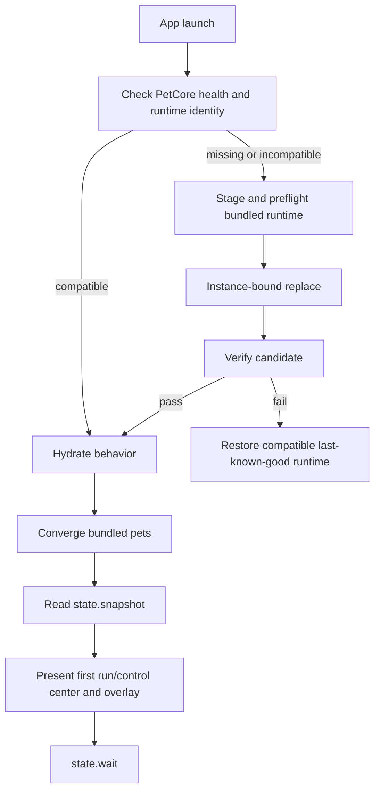

# Runtime and IPC

This document owns process lifetime, runtime compatibility, local transport, update convergence, and diagnostics. Exact RPC methods and field allowlists remain in source.

## Processes

| Process | Lifetime | Responsibility |
|---|---|---|
| `AgentPetCompanion` | Single UI host | Control center, menu bar, overlay, rendering, App diagnostics |
| `petcore` | Per-user KeepAlive LaunchAgent when available | Durable state, RPC, event ingress, pet library, generation, connectors, diagnostics |
| `petcore-cli` | One command/event | Stable connector, RPC, package, and explicit offline-maintenance entrypoint |
| `codex app-server --stdio` | Private generation child group | Codex thread/turn protocol for in-App Pet Studio |

The App and PetCore each hold a private instance lock. A second App instance requests activation from the existing UI host and exits. Shutdown and replacement target an expected instance ID rather than a process name.

Closing the control-center window leaves the menu bar and enabled overlay active. Reopen targets the registered control-center scene; About cannot intercept it. Standard Quit closes the App and overlay. A LaunchAgent-hosted PetCore remains available, while a direct-child fallback is tied to the App process.

## Startup and managed runtime

```mermaid
flowchart TD
    Launch["App launch"] --> Health["Check PetCore health and runtime identity"]
    Health -->|"compatible"| Ready["Hydrate behavior"]
    Health -->|"missing or incompatible"| Stage["Stage and preflight bundled runtime"]
    Stage --> Replace["Instance-bound replace"]
    Replace --> Verify["Verify candidate"]
    Verify -->|"pass"| Ready
    Verify -->|"fail"| Rollback["Restore compatible last-known-good runtime"]
    Ready --> Seed["Converge bundled pets"]
    Seed --> Snapshot["Read state.snapshot"]
    Snapshot --> UI["Present first run/control center and overlay"]
    UI --> Wait["state.wait"]
```

`runtime-manifest.json` (`apc.runtime-manifest.v1`) binds the App version/build, shared build ID, PetCore/CLI IDs, RPC protocol, supported SQLite range, Agent event schema, readable/writable package versions, and connector contract versions. Health is accepted only when those identities and the connector environment agree. Connector roots and CLI overrides are forwarded only as normalized absolute paths; the all-Agent `APC_AGENT_CONFIG_HOME` isolation root is included in both child-process inheritance and health identity, so an isolated App cannot silently fall back to the user's live Agent configuration. A database newer than the candidate supports is rejected before replacement.

Every current managed runtime also carries the build-bound `interaction-attestation.json` produced by the native overlay interaction suites. The App stages a candidate, verifies its manifest and database compatibility, performs an instance-bound replacement, and commits `runtime/current` only after exact health succeeds. Before that boundary, failure restores the verified checkpoint and compatible last-known-good runtime; ambiguous or malformed rollback state fails closed.

After the healthy commit boundary, the runtime store retains the exact current build, the compatible last-known-good build, and any source/candidate builds named by a live rollback checkpoint. It prunes only unreferenced version directories whose private ownership, closed file inventory, regular-file identity, and manifest build ID prove that they are App-managed runtimes. Unknown, malformed, linked, or foreign entries remain untouched; pruning failure never reverses a healthy runtime commit. This retention does not affect SQLite, pets, generation workspaces, connectors, logs, or settings.

At bootstrap, the App applies persisted interface language and appearance before showing ordinary windows. A short system-default fallback prevents a stalled PetCore read from leaving them invisible. The appearance gate is owned once per NSWindow: transient SwiftUI host removal, replacement, or duplication cannot recapture a concealed state or cancel the deferred reveal, and dismantling the final host fails open. Initial launch and recovery coalesce onto one behavior → seed → snapshot → overlay pipeline. PetCore's first complete snapshot is the final authority for settings, onboarding, pets, placement, connections, and active sessions.

## Overlay and state delivery

The App reads a consistent `state.snapshot`, then waits with `state.wait(after_revision, timeout_ms)`. `state_revision` is a decimal string and changes only with committed durable state. A process-local display epoch can also wake a wait when bounded host display hydration changes without inventing a database revision.

`OverlayPlacementAuthority` is the only owner of presented pet position. A drag derives every frame from one captured absolute-screen anchor, moves the pet plus attached bubble/menu composition, and commits one final hard-clamped placement. Persistence uses a latest-generation journal with bounded retry; stale snapshots, late acknowledgements, superseded responses, and failed saves cannot move the presented pet. Explicit external reset/reposition intent is revisioned and remains pending until the App acknowledges it.

Overlay pointer ownership is permission-free: a main-run-loop 120 Hz sampler reads each overlay panel's window-local cursor position and updates whole-window passthrough, while App-local mouse monitors immediately reconcile events already delivered to the App. The implementation never reads global cursor, button, or modifier-key state; creates a system event tap; registers a cross-application event monitor; or installs a keyboard event monitor, so desktop-pet interaction does not require Input Monitoring access. The current frame's Alpha mask owns only opaque pet pixels; the bubble owns only its rendered rounded cards, and all surrounding transparent panel area remains available to lower applications. A finite playback substate has its own render identity but not a second semantic owner: when `burst_then_idle` presents its settled idle frame, that frame publishes its real visible envelope and Alpha mask under the originating Agent event's entry ID. The App therefore accepts the current settled geometry while continuing to reject callbacks owned by an earlier semantic state. Missing or stale pet masks deliberately fall back to the geometric pet region so launch and frame transitions never disable dragging. The same policy is reapplied in AppKit hit testing as a defensive boundary. No enlarged proximity region may take ownership on behalf of pet or bubble content.

Display width is stored separately and changed only through Pet Configuration. Bubble and menu geometry stays App-local and does not cross RPC. A temporarily concealed Control Center is never classified as the system Show Desktop gesture, so appearance hydration cannot hide the desktop pet as a secondary effect. Interaction telemetry is aggregate-only and excludes coordinates, display/session identifiers, paths, payloads, and user text.

The App exposes typed service states (`checking`, `recovering`, `online`, `offline`, `runtimeMismatch`, `error`). Human-readable copy never grants recovery authority. Service & Diagnostics projects one aggregate state while preserving typed component and renderer detail.

## Update discovery and convergence

The App is the only update coordinator. PetCore, CLI, connectors, plugins, and Skills do not independently check the network or advertise product versions.

Automatic and manual checks use GitHub's public latest-Release endpoint. A response is accepted only for a newer stable `vX.Y.Z` release with the exact official asset inventory, architecture ZIP, digest metadata, and official URLs. Automatic checks begin after healthy bootstrap, honor ETag, and run at most once per 24 hours; manual checks bypass the interval. The App opens validated browser destinations but never downloads or installs an update.

Release handoff accepts only the real canonical `/Applications/AgentPetCompanion.app` identity. A replacement is revalidated immediately before quit/relaunch and waits for protected user mutations, connector work, generation work, or placement persistence. If safety cannot be established, the old App stays open and presents manual recovery.

After replacement, the runtime transaction converges PetCore, CLI, missing or updated trusted bundled-pet revisions, and only integrations already managed by Agent Pet Companion. Core failure rolls back the runtime. A connector failure is isolated to that Agent and remains repairable. A completed convergence receipt is written only for the exact runtime build and complete typed four-Agent result.

The Codex plugin plus bundled Studio and Maker Skills form one versioned capability bundle. Content changes require a greater plugin version; Studio upgrades additionally preserve the previous shipped Skill digest in the append-only retired ownership history.

The separately exposed portable Maker Skill is managed through closed no-parameter PetCore RPCs for status, install/reinstall/update, and uninstall. Those mutations share the Agent-capability operation gate, target only `~/agent/skills/agent-pet-maker`, and never inspect Agent configuration or discovery behavior. App update convergence does not silently install this target; the management sheet compares its explicit installation with the bundled version and waits for a user action.

## Local transports

### Unix-socket JSON-RPC

The primary endpoint is private `run/petcore.sock` (`0600`). Messages are newline-delimited JSON-RPC 2.0. PetCore bounds frames/responses to 256 KiB, batches to 64 requests, and concurrent work to 32 connections. Swift uses short default timeouts and longer bounded package, diagnostics, connector, and generation budgets.

Method families are:

| Area | Capabilities |
|---|---|
| Runtime | health and instance-bound shutdown |
| Projection | snapshot and revision-based wait |
| Configuration | behavior, onboarding, placement, client settings |
| Events | normalized ingest, bounded history, completion acknowledgement |
| Pets | list/history, activate/delete, validate/import/seed/export, runtime-asset repair |
| Generation | create/edit, in-place resume or explicit new-job retry, revision-based live message wait, reply/cancel, private recovery, bounded Maker history/detail, terminal history delete |
| Connections | check, repair, refresh, test, uninstall, managed-component evidence |
| Convergence | receipt and read-only replacement preflight |
| Support | renderer budget, App Server probe, diagnostics export |

[rpc.rs](../../crates/petcore/src/rpc.rs) and the Swift client own the exact method and parameter contract. The Maker page uses the bounded App Server probe before enabling creation. `generation.history.list` returns only task-row metadata, including title, progress, lifecycle timestamps, recovery/cancellation facts, and PetCore-authoritative `capabilities`. `generation.history.detail` returns the selected task and performs an exact live session-navigation check only for released terminal work; unfinished tasks fail closed even when their thread remains listed. `generation.messages.list(job_id, before_sequence, limit)` pages older visible messages; `generation.messages.wait` streams revision-based changes without duplicating rows. `generation.history.delete` is an irreversible terminal-only mutation with a typed receipt: it retains a completed task's published pet, advances `state_revision`, repairs direct retry links without changing child ordering, and removes the exact owned private workspace through descriptor-bound no-follow traversal.

Persistent Studio threads receive a bounded user-facing name through `thread/name/set`. Studio turns use App Server `plan` collaboration mode so the native `request_user_input` tool is available; the Studio developer instruction asks for one concise question with two or three options, while the bounded decoder remains tolerant of the broader protocol envelope. The App consumes `item/tool/requestUserInput`, stores at most three bounded questions and eight options per question, interrupts and releases the current turn/process, and moves the job to `waiting_for_user`. `generation.reply` accepts only that state, persists the user message and request ID before starting a continuation turn, and uses `thread/resume` when the stored thread is available. `generation.resume` similarly accepts an optional instruction only for interrupted or recoverable failures. Repeated request IDs are idempotent and a reused ID with different content fails closed. Automatic ChatGPT-sidebar discovery and ChatGPT's presentation of App Server events are not protocol or recovery guarantees.

Connection status inside `state.snapshot` has two independent cache layers. The
five-minute light layer owns filesystem and host inspection; event-derived
connector evidence is cached per Agent source. An inserted event marks only its
source dirty, and snapshot reads coalesce that dirty projection for at most five
seconds so a busy hook stream cannot repeatedly scan the retained 10,000-event
history. A cold scan decodes only the six bounded fields used by connector
verification and skips unrelated nested tool metadata. An explicit connection
check, repair, uninstall, artifact revision, or changed base status invalidates
the relevant projection immediately.

During a job, `generation.messages.wait` carries ordered typed phase/activity records, continuation markers, the current durable heartbeat timestamp, structured input requests, and bounded visible Codex message chunks; it does not transport tool input/output or hidden reasoning. Periodic App Server liveness signals advance the job heartbeat and wait revision without appending unbounded timeline rows. Waiting jobs are excluded from interrupted-owner recovery. A stale running owner becomes `failed + recoverable` with `owner_interrupted`, retains no `ended_at`, and continues to occupy the single unfinished-task slot.

`generation.cancel` first atomically records irreversible `cancel_requested_at`, freezes duration, and installs a database/write-path fence. It then signals the registered job worker, sends `turn/interrupt` for the exact active thread/turn, waits briefly for the corresponding terminal turn event, terminates only that session's private App Server process group on timeout, and waits for worker stop acknowledgement. PetCore writes `execution_stopped_at`, executes an exact `thread/archive`, attempts `thread/unarchive` to release the stopped transcript for external viewing, writes `thread_archived_at`, and only then commits the `canceled` terminal message/status. An archive failure keeps the task fenced in cancellation cleanup and receives bounded retries; an unarchive failure does not hold cancellation open and instead receives separate bounded best-effort retries. Cancellation cleanup never exposes recovery or session-open authority. Once terminal, canceled, completed, and non-recoverable failed jobs may expose a route only after an exact unarchived workspace match. `thread/unsubscribe` is not a cancellation primitive. Long-running App Server turns distinguish retryable transport errors from terminal protocol failure. External full-source checkpointing is progress-aware rather than turn-count-based: durable workspace change resets the consecutive-stall counter, three unchanged continuation turns pause with a resumable cause, and twelve hours bounds one uninterrupted continuation run. The shared production verifier remains the final package trust boundary.

### Capability-token loopback

PetCore may publish a random `127.0.0.1` port for `POST /agent-events`. Requests require the private project-owned bearer token and enter the same validation and persistence path as UDS ingest. The endpoint is never exposed to the LAN or internet.

## Diagnostics

App and PetCore logs use bounded `apc.diagnostic-log.v1` JSONL rotation. Export produces `apc.diagnostics-bundle.v1`; if PetCore is unavailable, the App creates an offline bundle with the same manifest shape. Recovery and export have independent operation state. Connector parsing failures are recorded as structured Agent/field/failure categories only; rejected values and host content never enter the log.

The ZIP is allowlist-only: manifest, bounded environment summary, explanatory README, and sanitized/truncated logs. It excludes SQLite, pet assets, generation workspaces, connector configuration, runtime tokens, prompts, complete messages, commands/tool data, credentials, raw identifiers, and user paths. Export staging expires and is size/count bounded.

## Primary sources

- [App lifecycle](../../apps/macos/Sources/AgentPetCompanion/App/AgentPetCompanionApp.swift)
- [PetCore process manager](../../apps/macos/Sources/AgentPetCompanion/App/PetCoreProcessManager.swift)
- [Swift transport](../../apps/macos/Sources/AgentPetCompanionCore/PetCoreTransport.swift)
- [PetCore daemon and RPC](../../crates/petcore/src/daemon.rs)
- [Runtime manifest](../../crates/petcore/src/runtime_manifest.rs)
- [Diagnostics](../../crates/petcore/src/diagnostics.rs)

For lifecycle or IPC changes, update Rust and Swift mirrors, method validation, compatibility tests, runtime/database ranges when applicable, and release acceptance together.
