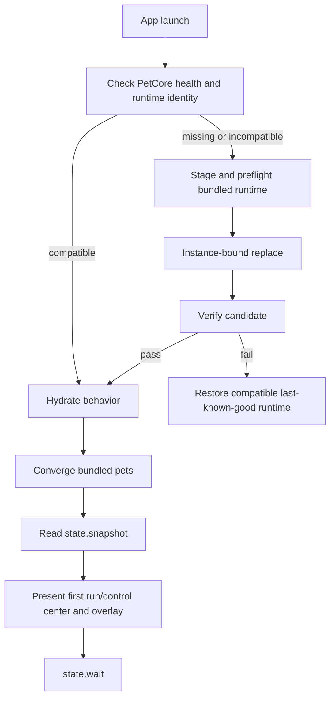

# Runtime and IPC

This document owns process lifetime, runtime compatibility, local transport, update convergence, and diagnostics. Exact RPC methods and field allowlists remain in source.

## Processes

| Process | Lifetime | Responsibility |
|---|---|---|
| `AgentPetCompanion` | Single UI host | Control center, menu bar, overlay, rendering, App diagnostics |
| `petcore` | Per-user KeepAlive LaunchAgent when available | Durable state, RPC, event ingress, pet library, generation, connectors, diagnostics |
| `petcore-cli` | One command/event | Stable connector, RPC, package, and explicit offline-maintenance entrypoint |
| `codex app-server --stdio` | Private generation child group | Codex thread/turn protocol for in-App Pet Studio |

The App and PetCore each hold a private instance lock. A second App instance requests activation from the existing UI host and exits. Shutdown and replacement target an expected instance ID rather than a process name.

Closing the control-center window leaves the menu bar and enabled overlay active. Reopen targets the registered control-center scene; About cannot intercept it. Standard Quit closes the App and overlay. A LaunchAgent-hosted PetCore remains available, while a direct-child fallback is tied to the App process.

## Startup and managed runtime

```mermaid
flowchart TD
    Launch["App launch"] --> Health["Check PetCore health and runtime identity"]
    Health -->|"compatible"| Ready["Hydrate behavior"]
    Health -->|"missing or incompatible"| Stage["Stage and preflight bundled runtime"]
    Stage --> Replace["Instance-bound replace"]
    Replace --> Verify["Verify candidate"]
    Verify -->|"pass"| Ready
    Verify -->|"fail"| Rollback["Restore compatible last-known-good runtime"]
    Ready --> Seed["Converge bundled pets"]
    Seed --> Snapshot["Read state.snapshot"]
    Snapshot --> UI["Present first run/control center and overlay"]
    UI --> Wait["state.wait"]
```

`runtime-manifest.json` (`apc.runtime-manifest.v1`) binds the App version/build, shared build ID, PetCore/CLI IDs, RPC protocol, supported SQLite range, Agent event schema, readable/writable package versions, and connector contract versions. Health is accepted only when those identities and the connector environment agree. A database newer than the candidate supports is rejected before replacement.

Every current managed runtime also carries the build-bound `interaction-attestation.json` produced by the native overlay interaction suites. The App stages a candidate, verifies its manifest and database compatibility, performs an instance-bound replacement, and commits `runtime/current` only after exact health succeeds. Before that boundary, failure restores the verified checkpoint and compatible last-known-good runtime; ambiguous or malformed rollback state fails closed.

At bootstrap, the App applies persisted interface language and appearance before showing ordinary windows. A short system-default fallback prevents a stalled PetCore read from leaving them invisible. Initial launch and recovery coalesce onto one behavior → seed → snapshot → overlay pipeline. PetCore's first complete snapshot is the final authority for settings, onboarding, pets, placement, connections, and active sessions.

## Overlay and state delivery

The App reads a consistent `state.snapshot`, then waits with `state.wait(after_revision, timeout_ms)`. `state_revision` is a decimal string and changes only with committed durable state. A process-local display epoch can also wake a wait when bounded host display hydration changes without inventing a database revision.

`OverlayPlacementAuthority` is the only owner of presented pet position. A drag derives every frame from one captured absolute-screen anchor, moves the pet plus attached bubble/menu composition, and commits one final hard-clamped placement. Persistence uses a latest-generation journal with bounded retry; stale snapshots, late acknowledgements, superseded responses, and failed saves cannot move the presented pet. Explicit external reset/reposition intent is revisioned and remains pending until the App acknowledges it.

Display width is stored separately and changed only through Pet Configuration. Bubble and menu geometry stays App-local and does not cross RPC. Interaction telemetry is aggregate-only and excludes coordinates, display/session identifiers, paths, payloads, and user text.

The App exposes typed service states (`checking`, `recovering`, `online`, `offline`, `runtimeMismatch`, `error`). Human-readable copy never grants recovery authority. Service & Diagnostics projects one aggregate state while preserving typed component and renderer detail.

## Update discovery and convergence

The App is the only update coordinator. PetCore, CLI, connectors, plugins, and Skills do not independently check the network or advertise product versions.

Automatic and manual checks use GitHub's public latest-Release endpoint. A response is accepted only for a newer stable `vX.Y.Z` release with the exact official asset inventory, architecture ZIP, digest metadata, and official URLs. Automatic checks begin after healthy bootstrap, honor ETag, and run at most once per 24 hours; manual checks bypass the interval. The App opens validated browser destinations but never downloads or installs an update.

Release handoff accepts only the real canonical `/Applications/AgentPetCompanion.app` identity. A replacement is revalidated immediately before quit/relaunch and waits for protected user mutations, connector work, generation work, or placement persistence. If safety cannot be established, the old App stays open and presents manual recovery.

After replacement, the runtime transaction converges PetCore, CLI, missing or updated trusted bundled-pet revisions, and only integrations already managed by Agent Pet Companion. Core failure rolls back the runtime. A connector failure is isolated to that Agent and remains repairable. A completed convergence receipt is written only for the exact runtime build and complete typed four-Agent result.

The Codex plugin plus bundled Studio and Maker Skills form one versioned capability bundle. Content changes require a greater plugin version; Studio upgrades additionally preserve the previous shipped Skill digest in the append-only retired ownership history.

## Local transports

### Unix-socket JSON-RPC

The primary endpoint is private `run/petcore.sock` (`0600`). Messages are newline-delimited JSON-RPC 2.0. PetCore bounds frames/responses to 256 KiB, batches to 64 requests, and concurrent work to 32 connections. Swift uses short default timeouts and longer bounded package, diagnostics, connector, and generation budgets.

Method families are:

| Area | Capabilities |
|---|---|
| Runtime | health and instance-bound shutdown |
| Projection | snapshot and revision-based wait |
| Configuration | behavior, onboarding, placement, client settings |
| Events | normalized ingest, bounded history, completion acknowledgement |
| Pets | list/history, activate/delete, validate/import/seed/export, runtime-asset repair |
| Generation | create/edit/retry, wait/reply/cancel, private recovery |
| Connections | check, repair, refresh, test, uninstall, managed-component evidence |
| Convergence | receipt and read-only replacement preflight |
| Support | renderer budget, App Server probe, diagnostics export |

[rpc.rs](../../crates/petcore/src/rpc.rs) and the Swift client own the exact method and parameter contract. Long-running App Server turns distinguish retryable transport errors from terminal protocol failure; the shared production verifier remains the final package trust boundary.

### Capability-token loopback

PetCore may publish a random `127.0.0.1` port for `POST /agent-events`. Requests require the private project-owned bearer token and enter the same validation and persistence path as UDS ingest. The endpoint is never exposed to the LAN or internet.

## Diagnostics

App and PetCore logs use bounded `apc.diagnostic-log.v1` JSONL rotation. Export produces `apc.diagnostics-bundle.v1`; if PetCore is unavailable, the App creates an offline bundle with the same manifest shape. Recovery and export have independent operation state.

The ZIP is allowlist-only: manifest, bounded environment summary, explanatory README, and sanitized/truncated logs. It excludes SQLite, pet assets, generation workspaces, connector configuration, runtime tokens, prompts, complete messages, commands/tool data, credentials, raw identifiers, and user paths. Export staging expires and is size/count bounded.

## Primary sources

- [App lifecycle](../../apps/macos/Sources/AgentPetCompanion/App/AgentPetCompanionApp.swift)
- [PetCore process manager](../../apps/macos/Sources/AgentPetCompanion/App/PetCoreProcessManager.swift)
- [Swift transport](../../apps/macos/Sources/AgentPetCompanionCore/PetCoreTransport.swift)
- [PetCore daemon and RPC](../../crates/petcore/src/daemon.rs)
- [Runtime manifest](../../crates/petcore/src/runtime_manifest.rs)
- [Diagnostics](../../crates/petcore/src/diagnostics.rs)

For lifecycle or IPC changes, update Rust and Swift mirrors, method validation, compatibility tests, runtime/database ranges when applicable, and release acceptance together.
