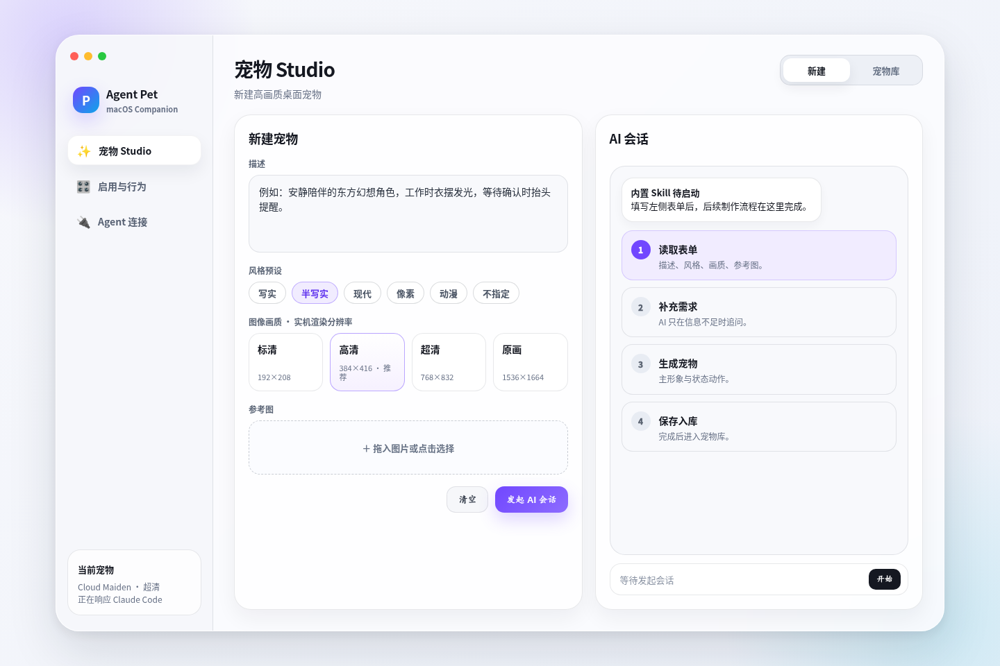
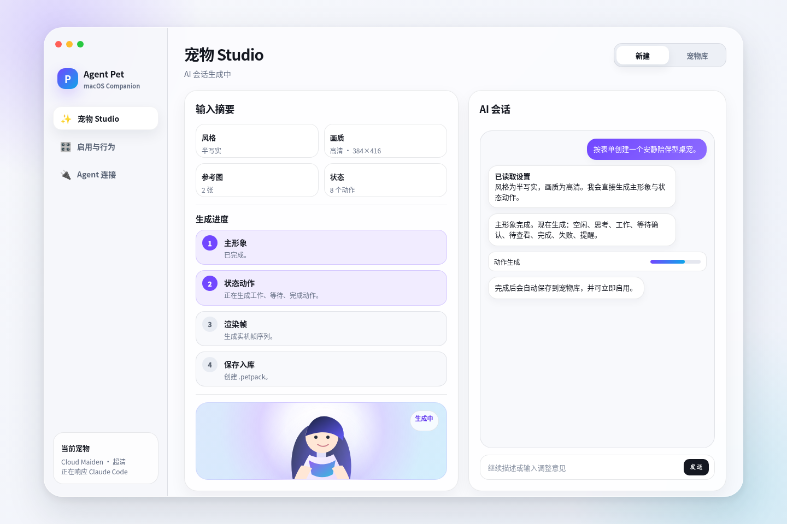
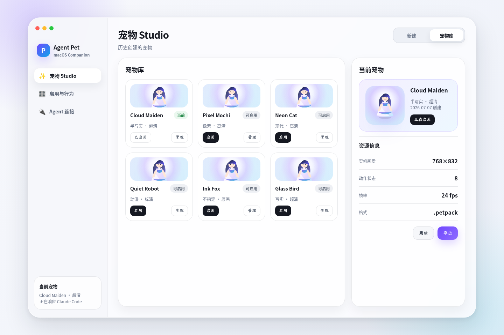
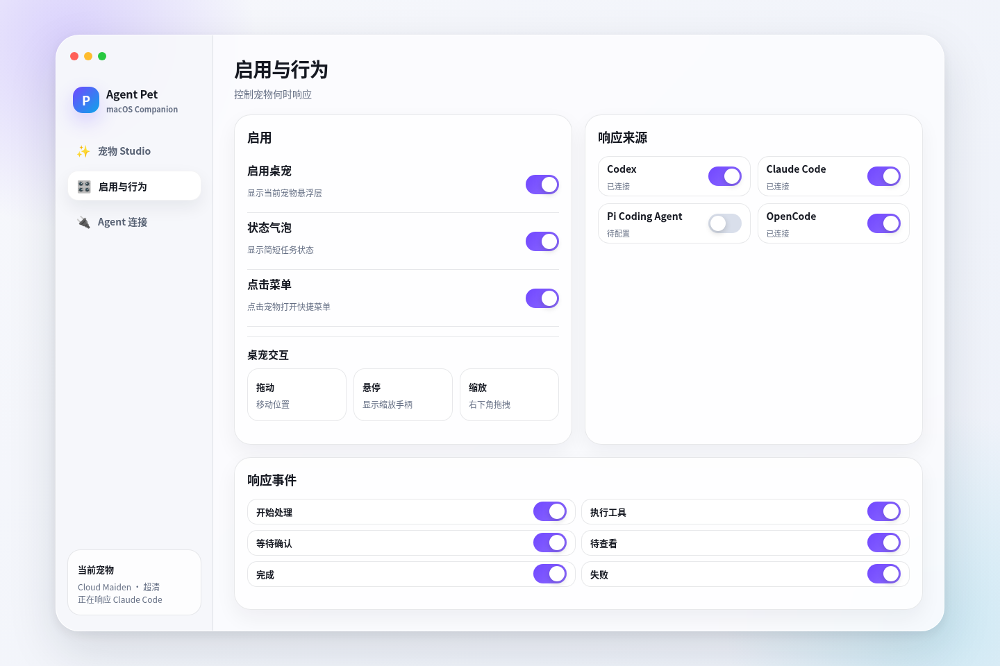
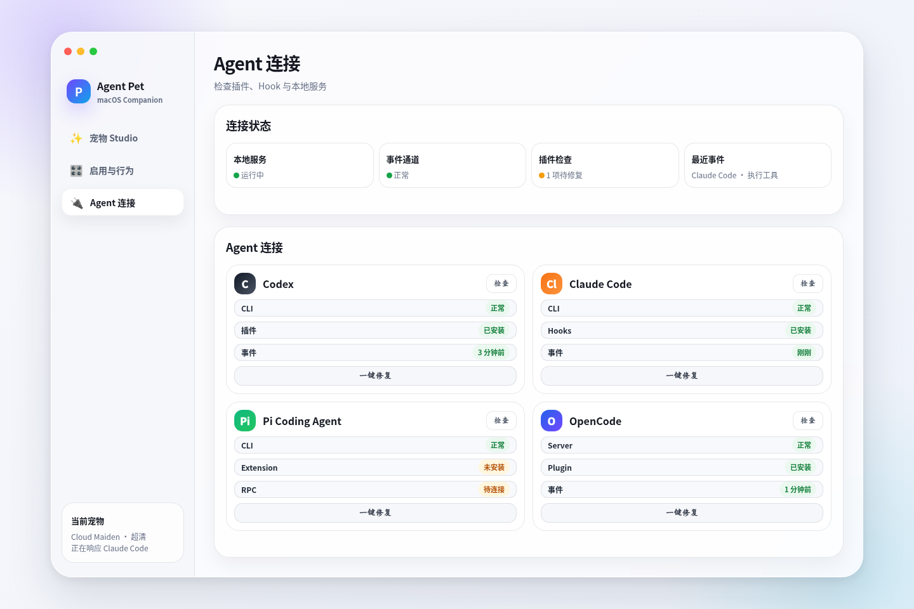
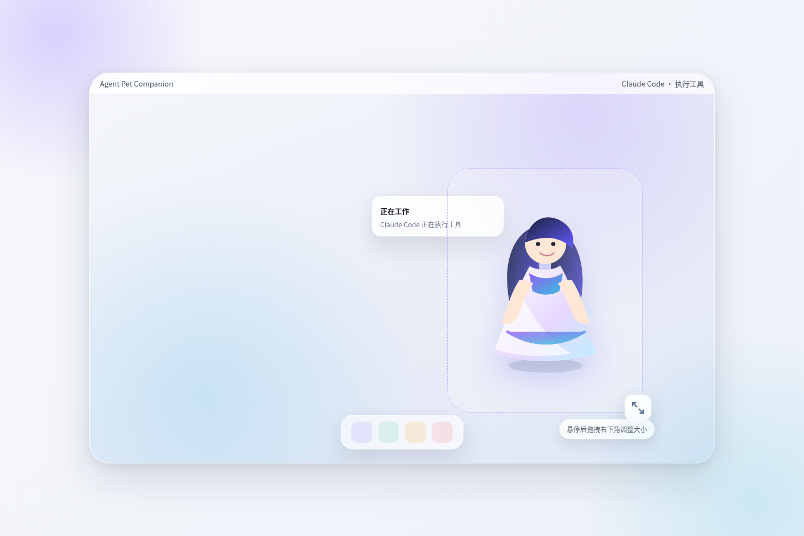

# Agent Pet Companion 产品方案 V5

## 1. 产品定位

**Agent Pet Companion** 是一款 macOS 原生高画质桌宠 App。

它的核心不是 Agent 管理平台，也不是公共宠物图库，而是：

- 通过 AI 生成高自由度桌宠。
- 在桌面显示高画质宠物悬浮层。
- 让宠物响应 Codex、Claude Code、Pi Coding Agent、OpenCode 的工作状态。
- 在 App 内完成宠物制作、启用、行为配置和 Agent 连接检查。

V5 中，新建宠物只在初始表单中指定风格、画质和参考要求；后续制作全部进入内置 Skill 驱动的 AI 会话中完成。

---

## 2. V5 信息架构

主导航只保留三个入口：

```text
宠物 Studio
启用与行为
Agent 连接
```

「宠物 Studio」内部只保留两个页签：

```text
新建
宠物库
```

「宠物库」不再作为侧栏入口，只展示用户历史创建的宠物。

主窗口采用 macOS 原生侧栏、统一工具栏与透明 Liquid Glass 视觉体系：macOS 26 使用最高透明度的 clear glass，macOS 14–15 使用系统 ultra-thin material 回退。页面只保留一层主要信息面板，状态与操作就近展示；主操作使用系统按钮，选中、禁用、高对比度和 Reduce Transparency 行为交给系统处理，不绘制模拟 macOS 的不透明卡片或菜单。

### 2.1 运行方式与生命周期

Agent Pet Companion 采用两进程运行方式：App 是轻量 UI Host，承载按需打开的控制中心、状态栏菜单、桌宠和消息气泡；PetCore 是独立常驻的数据服务，负责 Agent 事件、状态、配置和本地数据，不显示任何 UI。状态栏菜单属于 App UI Host，不是第三个后台服务。

关闭控制中心窗口或按 `⌘W` 不会退出 App，状态栏菜单、桌宠、消息气泡和事件同步继续工作。用户可从状态栏菜单、桌宠右击菜单、Dock 或再次打开 App 恢复同一个控制中心。状态栏菜单固定提供「打开控制中心」「显示/隐藏桌宠」「检查连接」和「退出 Agent Pet」。

「退出 Agent Pet」、`⌘Q` 和 Dock 的「退出」遵循标准 macOS Quit 语义，会同时退出控制中心、状态栏菜单和桌宠，但不会停止独立运行的 PetCore。再次启动 App 后，从 PetCore 恢复当前宠物、配置和仍在展示时限内的会话。控制中心关闭后释放不再需要的界面与临时渲染资源，使长期常驻部分保持轻量。

App 与 PetCore 必须作为同一运行时版本集更新。App 不得静默复用不兼容的 PetCore，也不得让旧 App 无提示降级数据库或连接器协议。更新期间使用简短、可恢复的「正在更新服务」状态；新服务启动、版本与数据兼容检查失败时自动回到上一份可用版本，并向用户提供明确的重试或退出操作，不能以桌宠行为异常代替错误提示。

---

## 3. 宠物 Studio

### 3.1 新建宠物

新建宠物只在开始时填写一个预设表单。表单字段固定为：

| 字段 | 说明 |
|---|---|
| 描述 | 用户对宠物外观、气质、动作的自然语言要求 |
| 风格预设 | 写实、半写实、现代、像素、动漫、不指定 |
| 图像画质 | 实机宠物渲染分辨率 |
| 参考图 | 可选，用于角色形象或风格参考 |

风格预设中的「不指定」表示 AI 根据用户描述自行决定视觉方向。

图像画质定义为实机桌宠帧分辨率：

| 画质 | 单帧分辨率 | 用途 |
|---|---:|---|
| 标清 | 192×208 | 低占用、小尺寸显示 |
| 高清 | 384×416 | 默认推荐 |
| 超清 | 768×832 | 高清桌面显示 |
| 原画 | 1536×1664 | 高质量显示与二次生成 |



### 3.2 AI 会话式生成

用户点击「发起 AI 会话」后，App 启动内置 Skill，并在 Studio 右侧展示会话窗口。

后续流程全部在 AI 会话中进行：

```text
读取表单
→ 必要时补充追问
→ 生成主形象
→ 生成状态动作
→ 渲染实机帧
→ 保存 .petpack
→ 出现在宠物库
```

用户可以在会话中继续提出调整意见，例如“裙摆更轻一点”“等待确认动作更明显”“换成像素风”。

App 内置 Studio 当前只以 Codex App Server 作为会话后端。宠物库中的任意 `.petpack`（包括外部导入包）都可以发起新的 Codex 修改会话：以当前已校验 revision 为不可信数据基线，保持宠物 ID 与结构契约，校验通过后原子提交同 ID 新 revision；若工作期间基线变化则拒绝覆盖。



### 3.3 宠物库

宠物库展示 App 创建和用户导入的本地宠物。新建完成或导入成功后，宠物进入同一个本地库。

宠物库支持：

- 查看历史宠物。
- 启用某个宠物。
- 查看资源信息。
- 删除本地宠物。
- 导入符合 V1 契约的 `.petpack`。
- 原子导出当前 revision 的 `.petpack`，导出文件可重新导入。
- 对任意库内宠物发起 Codex AI 修改。

不做公共素材库、分享社区、Petdex 类图库。

### 3.4 可移植 Agent 制作技能

项目同时提供与供应商无关的 `agent-pet-maker` 技能，供具备真实图像理解和图像生成/编辑能力的 Claude Code、Pi、Hermes、OpenCode 或其他 Agent Skills 宿主在 App 外创建、修改并校验 `.petpack`。宿主缺少真实图像能力时必须返回 `capability_missing`，不得用样例或几何占位图冒充生成结果。

制作/修改默认只输出便携文件；只有用户明确要求“导入/启用/使用”时，技能才可通过当前在线 PetCore 导入并激活，且不得静默使用离线数据库路径或擅自开启全局桌宠开关。



---

## 4. 启用与行为

「启用与行为」用于控制桌宠是否运行，以及响应哪些 Agent 和事件。

页面包含：

| 模块 | 功能 |
|---|---|
| 启用 | 桌宠开关、状态气泡、会话消息收起时间（默认 15 分钟）、右击菜单 |
| 响应来源 | Codex、Claude Code、Pi Coding Agent、OpenCode |
| 响应事件 | 开始处理、执行工具、等待确认、待查看、完成、失败 |
| 桌宠交互 | 拖动移动、悬停显示缩放手柄、宠物右侧拖拽缩放 |

显示尺寸不在设置页配置。用户把鼠标放在桌宠区域后，直接拖拽宠物右侧缩放手柄调整大小；缩放手柄与会话气泡收起/展开按钮使用同一右侧控制列。



---

## 5. Agent 连接

「Agent 连接」只检查桌宠响应所必需的连接条件。

每个 Agent 检查项固定为：

| Agent | 检查内容 |
|---|---|
| Codex | CLI、插件、Hook、事件通道 |
| Claude Code | CLI、Hooks、事件通道 |
| Pi Coding Agent | CLI、Extension、事件流 |
| OpenCode | Plugin、事件流；非必需 Server 单独显示且不冒充健康 |

该页提供「检查」和「一键修复」。修复范围仅限安装或更新连接所需的本地插件、Hook、Extension、服务配置。
检查结果必须区分“已验证”“未验证”“暂不支持”和“非必需”，不能把配置存在等同于运行时可用。PetCore 本地通道自检只证明 CLI、socket 与数据库链路，不代表 Agent 已实际触发 Hook。

Agent 连接页、行为页和桌宠消息气泡必须共用同一品牌图标来源：优先使用已安装官方 App 或官方品牌资源，Pi 使用随 App 打包的品牌徽标；只有无法解析资源时才显示一致的文字 fallback，不能在不同页面各自绘制风格不一致的临时图标。



---

## 6. 桌宠悬浮层

桌宠悬浮层负责实际显示宠物和状态气泡。

固定交互：

- 拖动宠物区域移动位置。
- 鼠标悬停显示宠物右侧缩放手柄；其横向位置与会话气泡收起/展开按钮对齐。
- 拖拽缩放手柄调整显示大小。
- 左键单击宠物不触发额外 UI；按住左键拖动仍用于移动位置，仅右击宠物打开快捷菜单。
- Agent 事件触发对应动作。
- 每个 Agent 使用独立气泡；同一 Agent 的多个会话放在同一个气泡中，并以分隔行区分。
- 消息气泡整体使用 macOS 系统原生 Liquid Glass；macOS 26 采用公开 API 中最高透明度的 AppKit clear glass，不加 tint、不透明填充、边框或玻璃层 opacity。完整气泡内容放入系统保证前景层级的 glass `contentView`；透明 `NSPanel` 不再额外使用会提升后代玻璃层级的共享容器，避免光学层遮住文字。旧系统使用原生 ultra-thin material 回退，不绘制不透明白色卡片。
- 缩放手柄、缩放值、会话收起/展开按钮和悬浮操作统一使用原生透明玻璃；不额外显示“拖动”悬浮标签，宠物帧素材保持无遮挡，脚下不绘制玻璃底座或装饰承托层。控制视觉尺寸保持紧凑，但缩放与收起/展开按钮保留独立的可访问命中区。右击操作固定使用系统 `NSMenu`，不自绘仿系统菜单。
- 每个会话行左侧显示会话标题，右侧显示运行状态，下方显示当前信息；正文最多显示两行并在末尾截断，气泡测量高度与两行限制保持一致。运行中优先显示上游公开的实时活动摘要（例如 Codex 的 reasoning summary、计划、搜索、文件修改或工具类别）；没有新实时信号时保留最近公开信息，再退回 Agent 回复或「思考中」。已完成的工具项不得继续冒充当前活动，Ready/完成态显示最终 Agent 回复，Needs input/Blocked 显示交互或错误状态提示，不能用旧回复掩盖当前状态。Codex 精确的实时 Shell/读取/搜索切换来自用户已信任的官方 hooks；未信任时 App Server 有损快照只做标题、消息、公开摘要和有限状态兜底，不伪造被省略的具体工具。标题不可用时固定退回该会话第一条用户消息的单行摘要；若首条消息也不可用，再退回项目标识和 Agent 会话占位名。后续用户消息不得改写已形成的降级标题。
- 活跃会话没有新事件时继续保留当前状态与消息，不退回“等待 Agent 事件”。普通会话从最近一次可观测活动起超过配置时长后收起，默认 15 分钟；用户发送新消息或 Agent 产生新活动后重新展示。ChatGPT 桌面 Codex 在 hooks 暂未触发时由官方 App Server 的有界近期任务查询兜底，不要求用户先重启任务。
- 需要用户确认、回答或决策时明确显示「需要输入」，失败会话明确显示「已阻塞」；仍处于 active 的这两类会话不受普通超时收起影响，已明确关闭的等待状态不作为历史待办长期占位。
- 每个会话行只提供「打开」。点击或右击时优先定位该会话仍存活的运行页面；CLI 会话优先使用终端提供的精确 pane 定位，缺少精确能力时激活原终端 App。Codex 仅在已确认会话属于 ChatGPT 桌面任务时使用 `codex://threads/<session_id>`，CLI/未知 surface 不盲用任务深链。收到明确退出事件后不再显示可用的「打开」操作；状态刷新滞后导致终端报错可接受。
- Warp 作为完整支持的终端：连接器继承并安全转发 Warp 提供的会话 focus URL 时精确定位对应 pane；focus URL 缺失或失效时退回打开 Warp App，不在 UI 标记“有限支持”。

状态语义对齐 ChatGPT 官方 Pets：`Running`（运行中）、`Needs input`（需要输入）、`Ready`（待查看）、`Blocked`（已阻塞）。宠物动作的唯一主状态仍按 `Needs input > Blocked > Ready > Running` 仲裁；气泡展示列表最多保留 8 个会话。V1 不扩展为完整任务控制台。



---

## 7. 宠物资源格式

App 内部只使用自己的 `.petpack`，不再生成 Codex 内置宠物素材包。

格式的完整字段、预算、安全、修订、导入导出与兼容策略以 [`.petpack` V1 白皮书](../../specifications/AgentPetCompanion_Petpack_Whitepaper_V1.md)为准；本节仅保留产品级摘要。

`.petpack` 是 App 自有的 ZIP 格式，以下条目直接位于归档根目录；导入与安装由 App/PetCore 完成，不作为 Codex 内置宠物兼容包：

```text
manifest.json
brief.json
assets/
  frames/
    idle/
    start/
    tool/
    waiting/
    review/
    done/
    failed/
  preview/
    cover.png
    animated_preview.webp
source/
  prompt.md
  source.json
  references/
  skill_session.jsonl
build/
  validation.json
```

核心状态：

```text
idle
start
tool
waiting
review
done
failed
```

其中 Agent 事件到宠物状态的映射为：

| Agent 事件 | 宠物状态 |
|---|---|
| 开始处理 | start |
| 执行工具 | tool |
| 等待确认 | waiting |
| 待查看 | review |
| 完成 | done |
| 失败 | failed |

---

## 8. 借鉴 Petdex 的技术点

产品层不做 Petdex 类公共图库。仅借鉴这些实现思路：

- 本地 sidecar 接收 Agent 事件。
- Hook / Plugin / Extension 写入事件。
- 本地连接 doctor 检查。
- 本地事件接口使用 token 或 socket 权限保护。
- 宠物资源包本地化管理。

---

## 9. V1 验收标准

V1 完成时必须满足：

1. App 主导航只有「宠物 Studio」「启用与行为」「Agent 连接」。
2. 宠物 Studio 只有「新建」「宠物库」。
3. 新建宠物初始表单包含描述、风格预设、图像画质、参考图。
4. 点击「发起 AI 会话」后，后续制作流程在会话窗口内完成。
5. 生成完成后，宠物自动进入宠物库。
6. 用户可以从宠物库启用历史宠物。
7. 启用与行为页只配置响应来源与 Agent 事件。
8. 显示大小通过悬浮层宠物右侧缩放手柄调整，手柄与会话气泡收起/展开按钮纵向排列在同一控制列。
9. 支持 Codex、Claude Code、Pi Coding Agent、OpenCode 的连接检查。
10. 不生成 Codex 内置宠物兼容包。
11. 关闭控制中心后状态栏、桌宠、消息气泡和事件同步继续运行；标准 Quit 只退出 UI，PetCore 保持可用。
12. 每个 Agent 使用一个消息气泡，同 Agent 多会话按标题、右对齐状态和当前消息/活动分行展示。
13. 普通会话默认 15 分钟无新活动后收起，新用户消息重新展示；Needs input 与 Blocked 不被普通超时隐藏。
14. 点击「打开」优先进入原会话；无法精确定位时至少打开对应 Agent 或终端 App。
15. App/PetCore 更新必须验证统一运行时版本与数据兼容；失败时可恢复上一可用版本，不运行静默不兼容组合。
16. 正式 Studio 只把真实图像能力生成、通过七状态与 provenance 校验的完整 source 标记为已验证 AI 宠物；确定性预览不得冒充 AI 生成。
17. Pet Studio 自己创建的内部 Codex 生成任务不得出现在普通 Agent 会话气泡中。
18. 已安装连接器通过稳定的当前 runtime CLI 入口工作，App 更新后不得继续固化到旧 build 的 CLI 路径。
19. 任意符合 `.petpack` V1 运行时契约的包均可导入、进入宠物库并渲染七状态；生产者身份不影响格式兼容性。
20. 当前库内 revision 可以原子导出，导出文件重新导入后保持同一宠物 ID 与资源内容。
21. App 创建与外部导入的宠物都可通过 Codex 发起同 ID 修改；并发基线变化时不得覆盖较新 revision。
22. 可移植技能可由具备真实图像能力的外部 Agent 创建/修改包；仅在用户明确授权时导入和激活，且所有路径仍由 PetCore 校验。
