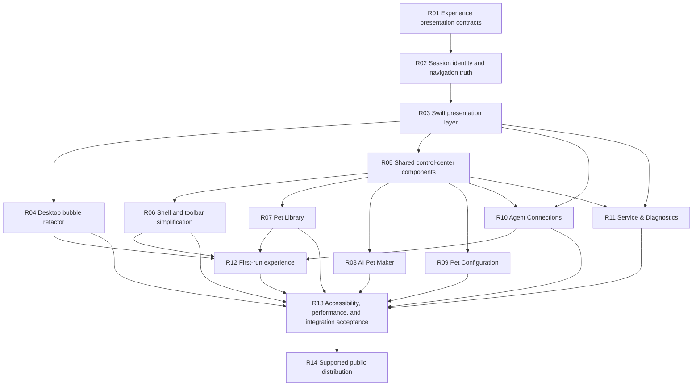

# Product Refactor Execution / 产品重构实施任务

This is the canonical dependency-ordered task specification for implementing the [Product Experience Contract](../product/experience-contract.md). It contains no schedule, dates, milestones, progress percentages, or completion ledger.

本文是落实[产品体验合同](../product/experience-contract.md)的唯一顺序化任务规范，不包含排期、日期、里程碑、完成百分比或状态台账。

## 1. Execution protocol / 执行规则

Development Agents execute tasks in the numbered order below.

For each task:

1. Read this document, the product experience contract, `AGENTS.md`, and the current implementation/tests/documents named by the task.
2. Confirm the task's prerequisites are implemented in the current branch.
3. Compare the current implementation with the task's acceptance contract. If it already satisfies the contract, run the relevant validation and continue without a no-op rewrite or status-only commit.
4. Change the smallest coherent implementation slice. Preserve unrelated user changes.
5. Update Rust authority, Swift mirrors, schemas, fixtures, runtime manifests, migrations, tests, localization, and the owning durable document together whenever the contract requires them.
6. Record user-visible behavior under `[Unreleased]` in `CHANGELOG.md`.
7. Run the task-specific deterministic gate first, then broader gates proportional to risk.
8. Do not edit this document to mark progress. Commit history, issues, CI, and release evidence carry execution state.

No task may claim a later task's acceptance without running that later task's required proof.

## 2. Task dependency map / 任务依赖图



Tasks whose prerequisites are satisfied may be developed in separate focused branches, but merge order must preserve this dependency graph.

## R01 — Establish experience presentation contracts

### Purpose

Create typed, testable product presentation concepts before changing visible layouts. Views must stop independently interpreting low-level state.

### Required work

- Define the closed user-facing lifecycle mapping for the seven protocol/package states without renaming stored values.
- Define `NavigationCapability` with exact-session, Agent-host, and unavailable cases.
- Define aggregate `AgentConnectionHealth`.
- Define `AttentionPreset` and its exact event-set mappings.
- Define page-level primary-action presentation types for Library, Maker, Connections, and Diagnostics.
- Centralize bilingual user copy mappings. Do not infer state from localized strings.
- Preserve bounded session title/user/assistant display content as first-class local product data.

### Primary areas

- `apps/macos/Sources/AgentPetCompanionCore/AppModels.swift`
- `apps/macos/Sources/AgentPetCompanion/App/Localization.swift`
- `apps/macos/Sources/AgentPetCompanion/Resources/`
- existing `*Presentation.swift` files or a narrowly scoped presentation module

### Required proof

- Unit tests cover every enum case and localization mapping in English and Simplified Chinese.
- Unknown/future values fail closed or use an explicitly safe fallback.
- No mutation authority is derived from display strings.

### Acceptance

Every later UI task can consume a typed presentation value without inspecting raw check names, arbitrary payload text, or protocol strings.

## R02 — Make session identity and navigation truthful

### Purpose

Keep every visible session distinguishable while preserving Agent-scoped grouping, bounded context, and privacy.

### Required work

- Keep PetCore as the authority for session grouping, priority, leases, suppression, and display projection.
- Preserve the preferred title order: explicit bounded session title, then bounded latest user context, then generic Agent-session fallback.
- Add a stable content-free fallback identity only when the same Agent has multiple anonymous sessions. It must not be derived from display order, project data, or raw session IDs.
- Decide and implement the smallest durable authority for that fallback, including explicit retention/bounds if persistence is required.
- Add typed navigation capability to the PetCore projection or derive it from a closed, fully tested structural rule shared with Swift.
- Exact-session capability requires a validated exact target. Host-only fallback must remain distinguishable.
- Remove active emission or actionable recovery of `project_directory` and `choose_project_directory`; keep decode-only compatibility only if required by the existing contract version.
- Preserve the maximum of eight concrete sessions plus an omitted count.
- Preserve bounded session title and current-turn user/assistant messages; do not reintroduce complete transcript or project-path projection.

### Primary areas

- `crates/petcore/src/agent_state.rs`
- `crates/petcore/src/db.rs`
- `crates/petcore/src/rpc.rs`
- `crates/petcore/src/event_envelope.rs`
- `crates/petcore-types/src/lib.rs`
- `schemas/agent-event.schema.json`
- `apps/macos/Sources/AgentPetCompanionCore/AppModels.swift`
- [Data model](../architecture/data-model.md)
- [Agent connectors](../integrations/agent-connectors.md)

### Required proof

- Rust tests cover two or more anonymous sessions whose activity order changes without changing their fallback identity.
- Tests cover bounded titles/messages, stale-assistant filtering, omitted-session count, suppression, restart reconstruction, and retention.
- Navigation tests cover exact Codex routing, validated terminal URL routing, Agent-host fallback, closed session, malformed target, and unavailable target.
- Negative fixtures prove project paths, raw IDs, credentials, commands, and unbounded content do not enter the App projection.
- Swift decoding rejects malformed/unknown mutation-capable values.

### Acceptance

The App receives enough typed data to render honest, stable session rows without using array position or project identity.

## R03 — Build the Swift product presentation layer

### Purpose

Separate product decisions from SwiftUI layout code.

### Required work

- Introduce focused presentation models for:
  - overlay sessions and Agent groups;
  - Pet Library selection/actions;
  - Maker phases and primary actions;
  - configuration presets and supported playback;
  - connection health and action;
  - diagnostics health and action.
- Keep AppStore responsible for orchestration and state mutation, not localized layout decisions.
- Keep Swift views free from host-specific connector parsing.
- Derive `AttentionPreset` from existing event booleans and write the exact event set when a preset is selected. Any other combination renders as Custom.
- Derive Standard/Smooth availability from the active pet's validated native FPS.
- Add stable accessibility labels and values at the presentation layer when multiple views consume the same meaning.

### Primary areas

- `apps/macos/Sources/AgentPetCompanion/App/AppStore.swift`
- `apps/macos/Sources/AgentPetCompanion/Views/*Presentation.swift`
- `apps/macos/Sources/AgentPetCompanionCore/`

### Required proof

- UI-model tests cover every product state and primary-action resolution.
- Tests prove 10 FPS pets never expose Smooth playback.
- Tests prove exact-session and host-only actions use different copy and accessibility values.
- Tests prove no project path or runtime identity is exposed by the presentation models.

### Acceptance

Visible views can be refactored without duplicating state resolution or changing domain truth.

## R04 — Refactor desktop bubbles as the primary product

### Purpose

Make the desktop pet and session bubble complete the daily loop without the control center.

### Required work

- Render groups by Agent and rows by stable projected session identity.
- Use bounded title/user context and current-turn Agent message where available.
- Use typed status/activity only as fallback or as additive information; remove redundant title/status/detail phrases.
- Show truthful action copy for exact-session, Agent-host, and unavailable navigation.
- Keep attention rows visible in collapsed groups.
- Keep single-session controls compact and omitted-session summary bounded.
- Preserve per-session dismissal and reopen identity behavior.
- Preserve Full Keyboard Access entry, VoiceOver actions, mouse passthrough, resize, drag, and non-focus-stealing updates.
- Preserve geometric hit-test fallback whenever the alpha mask is unavailable.

### Primary areas

- `apps/macos/Sources/AgentPetCompanion/Overlay/OverlayGeometry.swift`
- `apps/macos/Sources/AgentPetCompanion/Overlay/OverlayRootView.swift`
- `apps/macos/Sources/AgentPetCompanion/Overlay/PetOverlayController.swift`
- `apps/macos/Sources/AgentPetCompanion/Overlay/OverlayValidationContract.swift`

### Required proof

- Offline overlay validation covers all six event types plus idle.
- Multi-session tests cover title/message fallback, anonymous-session fallback, reordering, attention persistence, dismissal, reopening, and omitted count.
- Accessibility tests cover reading order and distinct actions.
- Interaction tests cover missing alpha mask, transparent-pixel passthrough, drag, resize, and first-click behavior.
- Live visual acceptance uses Computer Use first.

### Acceptance

The user can identify the Agent/session, understand the current need, and perform the best available return action from the bubble alone.

## R05 — Create shared control-center presentation components

### Purpose

Prevent each page from inventing its own card, status, empty-state, and action hierarchy.

### Required work

Create or consolidate shared native macOS components equivalent to:

```text
ProductPageHeader
PrimaryExperienceCard
PetPreviewStage
AgentHealthRow
SessionBubbleRow
AttentionPresetPicker
AdvancedDetailsDisclosure
EmptyStateAction
InlineRecoveryBanner
```

Rules:

- one contextual page heading;
- one prominent primary action;
- common normal/attention/error/checking semantics;
- grouped technical disclosures;
- native controls and materials;
- layouts that tolerate bilingual copy and supported minimum width;
- no placeholder assets or decorative fake controls.

### Primary areas

- `apps/macos/Sources/AgentPetCompanion/Views/`
- `apps/macos/Sources/AgentPetCompanion/Views/DesignSystem.swift`
- localization resources

### Required proof

- UI-model/component tests cover state and action variants.
- Accessibility identifiers are stable and unique.
- English and Chinese longest-copy fixtures do not truncate required actions.

### Acceptance

The five pages can share a coherent visual and interaction grammar without a new design framework or duplicated local styles.

## R06 — Simplify the control-center shell and toolbar

### Purpose

Make the control center a quiet setup/support surface instead of a permanent runtime dashboard.

### Required work

- Preserve the five main navigation entries and their required order.
- Preserve the stable brand title.
- Remove the always-visible healthy service indicator from the toolbar.
- Show service attention in the toolbar only for actionable unhealthy/recovery states.
- Remove duplicate Connection navigation from overflow if it adds no unique action.
- Keep one global pet visibility action only if its current state and result remain clear.
- Preserve window identity, reopen behavior, responsive split-view behavior, and About isolation.
- Ensure global failure banners link to the relevant recovery surface without repeating diagnostics rows.

### Primary areas

- `apps/macos/Sources/AgentPetCompanion/Views/ContentView.swift`
- `apps/macos/Sources/AgentPetCompanion/Views/SidebarView.swift`
- `apps/macos/Sources/AgentPetCompanion/Views/ControlCenterShell.swift`
- App/window lifecycle tests

### Required proof

- Tests verify navigation order and selection.
- Healthy, checking, recovering, offline, runtime-mismatch, and error toolbar states are covered.
- Window lifecycle and second-instance activation tests remain green.
- Live UI acceptance uses Computer Use first.

### Acceptance

Healthy runtime information no longer competes with product actions, while recovery remains immediately available when required.

## R07 — Refactor Pet Library around the active pet

### Purpose

Make the pet—not package metadata—the visual subject.

### Required work

- Lead with the active/selected pet's large motion preview, name, style/source summary, and one primary Use action.
- Keep the pet collection visually scannable.
- Make search conditional on collection density rather than permanently occupying the page for the two bundled pets.
- Move stable ID, revision ID/count, exact timing, frame counts, provenance, package version, and validation details into Technical Information.
- Keep revision history in a bounded sheet.
- Preserve import, export, activation, deletion rules, and same-name/different-ID behavior.
- Preserve bundled read-only actions and new-ID customization.
- Preserve loading hydration so the library never flashes a false empty state.

### Primary areas

- `apps/macos/Sources/AgentPetCompanion/Views/PetLibraryView.swift`
- `apps/macos/Sources/AgentPetCompanion/Views/PetLibraryPresentation.swift`
- `apps/macos/Sources/AgentPetCompanion/Views/PetLibraryAnimationPreview.swift`
- `apps/macos/Sources/AgentPetCompanion/App/PetAssetLocator.swift`

### Required proof

- Tests cover two bundled pets, same-name/different-ID imports, active selection, technical disclosure, history bounds, bundled actions, custom-pet actions, and loading/empty states.
- Preview rendering respects native timing without opening unvalidated assets.
- Default and minimum window widths pass bilingual visual acceptance.

### Acceptance

A user can choose and use a pet without reading IDs, revisions, frame counts, or validation internals.

## R08 — Refactor AI Pet Maker into describe, create, use

### Purpose

Make creation feel like an AI collaboration rather than an animation-engineering form.

### Required work

- Before job start, center the brief experience and remove the permanent empty conversation panel.
- Expose description, style, quality, and references by default.
- Keep native FPS and per-state duration in one compact collapsed Animation Settings disclosure.
- Use Standard/Smooth product labels while retaining exact technical values in help/accessibility/advanced text.
- On submission, compress the brief into a stable summary and make the creation session primary.
- On completion, lead with Use This Pet, then Continue Editing and export.
- Preserve restart recovery, input requests, retry, cancellation, historical-baseline selection, reference reselection, and result identity.
- Preserve exact timing through create/edit/retry/recovery.
- Timing changes regenerate affected actions and create a new immutable revision.

### Primary areas

- `apps/macos/Sources/AgentPetCompanion/Views/PetStudioView.swift`
- `apps/macos/Sources/AgentPetCompanion/App/AppStore.swift`
- `apps/macos/Sources/AgentPetCompanionCore/GenerationSessionState.swift`
- `skills/agent-pet-studio/`
- `skills/agent-pet-maker/`
- pet brief/source/validation schemas and fixtures when contracts change

### Required proof

- Tests cover untouched defaults, custom native FPS/durations, clear/reset, create, edit, retry, restart, historical revision, failure, cancel, waiting-for-user, and completed result.
- Reference-image byte/pixel/count/no-follow/digest boundaries remain enforced.
- Portable and in-app Skills agree with the `.petpack` timing contract.
- Live App Server validation remains an explicit opt-in gate.

### Acceptance

The ordinary creation path requires no knowledge of protocol-state names, frame counts, or revision mechanics, while advanced creation remains exact and reproducible.

## R09 — Replace configuration complexity with product presets

### Purpose

Let the product make good default decisions while retaining advanced control.

### Required work

- Replace the permanent wide settings sub-sidebar with a compact in-page Appearance/Messages switch.
- Keep the total wide shell to main navigation, settings, and optional preview.
- Add the three exact attention presets from the product contract and a derived Custom state.
- Enable all connected Agent sources by default; place per-source toggles in advanced settings.
- Keep per-event controls, timeout, group display, transparency, auto-hide, context menu, and pointer behavior under clear advanced groupings.
- Preserve live previews.
- Keep display size out of settings.
- Expose Smooth only for validated native-20 pets; changing profile never changes state duration.

### Primary areas

- `apps/macos/Sources/AgentPetCompanion/Views/BehaviorSettingsView.swift`
- `apps/macos/Sources/AgentPetCompanion/App/AppStore.swift`
- behavior settings models and RPC

### Required proof

- UI-model tests cover all presets, Custom derivation, source defaults, advanced controls, concurrent expected-revision writes, and rollback on failure.
- 10 FPS and 20 FPS pet capability tests remain exact.
- Visual acceptance covers default/minimum widths and both languages.

### Acceptance

The default page explains the ambient behavior in product language; advanced users can still reach every supported setting.

## R10 — Reduce Agent Connections to health and one action

### Purpose

Make connection management understandable without exposing the implementation stack.

### Required work

- Present each Agent's aggregate health and one contextual primary action.
- Move check-item rows, managed artifacts, host verification, event delivery, and App Server details under Technical Details.
- Keep typed PetCore capability checks as the only mutation authority.
- Keep serialized operation coordination, explicit confirmation, inline failure, retry, and managed-only uninstall.
- Remove healthy App/PetCore runtime information, renderer data, diagnostics export, project directory, and project selection from the page.
- Distinguish local channel validation from real provider/task validation in user copy.

### Primary areas

- `apps/macos/Sources/AgentPetCompanion/Views/AgentConnectionsView.swift`
- `apps/macos/Sources/AgentPetCompanion/App/AppStore.swift`
- `crates/petcore/src/connections.rs`
- `crates/petcore-types/src/lib.rs`
- connector contract tests

### Required proof

- Tests cover connected, repairable, unavailable, checking, conflict, policy-restricted, legacy, unknown, incomplete, failed-operation, and uninstall states.
- Project-directory and runtime-detail strings are absent from ordinary presentation and accessibility output.
- Simulated connector gates remain isolated; real connector validation remains explicit and credential-free.

### Acceptance

For each Agent, the user can answer “is it connected?” and “what should I do?” without understanding CLI, hooks, plugins, runtime identity, or project scope.

## R11 — Make Service & Diagnostics quiet when healthy

### Purpose

Keep complete support capability without making it the product's visual center.

### Required work

- Lead with one aggregate healthy, checking, recovering, or failed statement.
- Show one contextual Refresh, Recover, or Retry action.
- Keep diagnostic export prominent and independent from service recovery state.
- Collapse PetCore, RPC, event channel, renderer, archive retention, and technical metadata by default.
- Remove recent Agent activity from the service-health summary.
- Preserve offline diagnostic fallback, redaction, retention, archive bounds, and save/retry behavior.

### Primary areas

- `apps/macos/Sources/AgentPetCompanion/Views/ServiceDiagnosticsView.swift`
- `apps/macos/Sources/AgentPetCompanion/App/Diagnostics.swift`
- diagnostics tests and export fixtures

### Required proof

- Tests cover every service operational state and export state independently.
- Export contents remain allowlist-only and exclude messages, credentials, paths, SQLite, pet assets, and generation workspaces.
- Healthy default presentation contains no redundant runtime rows outside the collapsed details.

### Acceptance

Healthy users see a quiet support page; unhealthy users see one clear recovery path; support still receives a bounded useful archive.

## R12 — Add the first-run experience

### Purpose

Deliver the product promise before asking the user to learn the control center.

### Required work

- Add a versioned, resumable onboarding state owned through the normal PetCore settings/client-settings boundary; do not create a second App-local durable authority.
- Present the three required scenes: choose pet, connect Agents, see a local demo.
- Reuse real Library activation and Connection actions rather than duplicating mutation logic.
- Keep Agent detection nonblocking: a slow host check must not prevent entry to the local demo.
- Use a separate App-local demo projection that cannot enter PetCore events, receipts, diagnostics, or session suppression.
- Allow safe resume after App/service interruption.
- Provide explicit skip/close behavior without disabling the bundled-pet seed or later access to Connections.
- Completion leaves the pet visible and the main window optional.

### Primary areas

- AppStore/startup coordinator
- control-center scene/root presentation
- PetCore client settings/RPC only if durable state requires a new typed key
- localization and onboarding UI tests

### Required proof

- Fresh-home tests cover each scene, resume, skip, service failure, no detected Agent, repairable Agent, and completion.
- Tests prove checking and unavailable Agent states can continue to the local demo.
- Tests prove demo events never appear in event history, active sessions, receipts, retention counts, or diagnostics.
- Packaged visible acceptance uses Computer Use first.

### Acceptance

A new user can understand and witness the core value without reading the README or opening every navigation page.

## R13 — Run cross-surface accessibility, performance, and integration acceptance

### Purpose

Prove that simplification did not weaken interaction, privacy, performance, or runtime integrity.

### Required work

- Validate VoiceOver order, Full Keyboard Access, focus restoration, Reduce Motion, Reduce Transparency, and long bilingual copy.
- Validate pet drag/resize/hit testing through launch and state transitions.
- Validate all supported Agent sources in simulated contracts and the explicitly enabled real gates.
- Validate event storm, lease/persistence, session omission, and restart reconstruction.
- Preserve existing hidden and active renderer budgets.
- Capture before/after UI evidence only in the relevant PR/CI artifact, not long-lived docs.
- Synchronize current-state architecture, data, connector, validation, public README, and changelog documentation with the implemented behavior.

### Primary gates

```bash
APC_VALIDATE_HOST_UI=0 \
APC_VALIDATE_OVERLAY_INTERACTION=0 \
APC_VALIDATE_REAL_AGENT_CONNECTORS=0 \
APC_VALIDATE_REAL_APP_SERVER=0 \
./script/test_all.sh
```

Then run only explicitly authorized environment-dependent gates described in [Validation profiles](validation.md).

### Required proof

- Fresh deterministic source/core gates.
- Packaged-App structural and visible UI acceptance.
- Renderer-budget and event-storm evidence.
- Explicit skipped/pass reporting for real Agent and App Server gates.
- Documentation link and terminology validation.

### Acceptance

The exact candidate commit satisfies the product contract without regression in architecture identity, privacy, accessibility, interaction, or resource budgets.

## R14 — Implement supported public distribution

### Purpose

Turn a validated development build into a directly installable supported macOS product.

### Required work

- Preserve the two architecture-specific artifacts unless a separately approved universal-distribution decision changes that contract.
- Add explicit Developer ID Application signing for PetCore, `petcore-cli`, helper executables, the App, and any other nested code in inside-out order.
- Verify designated requirements, hardened runtime, entitlements, and exact architecture.
- Submit the final archive to Apple's notary service using an approved keychain/notary profile without storing credentials in the repository.
- Staple the accepted ticket to the App and validate it.
- Run Gatekeeper assessment against the stapled artifact.
- Re-extract and revalidate the exact published ZIP.
- Publish versioned checksums, matching tag, changelog section, and GitHub Release.
- Keep ad-hoc builds available only as development artifacts; do not label them as the supported public package.

### Primary areas

- `script/build_release.sh`
- `script/validate_app_bundle.sh`
- `script/validate_build_scripts_safety.sh`
- release CI workflow
- entitlements/signing configuration
- [macOS release procedure](../release/macos-release.md)
- public READMEs

### Required proof

- Nested and outer signatures verify with the expected Developer ID identity.
- Notarization succeeds for the exact artifact.
- Stapling validation succeeds.
- Gatekeeper accepts the extracted App on a clean supported macOS environment.
- App, PetCore, CLI, runtime manifest, architecture, version, build, and shared build ID match.
- Packaged functional acceptance passes on the compatible native architecture.
- Published checksum matches the downloaded artifact.

### Acceptance

A user can download the documented architecture-specific ZIP, verify it, move the App to `/Applications`, and launch it through normal macOS trust behavior without source toolchains or a quarantine workaround.

## 3. Completion rule / 完成规则

The product refactor is complete only when every task's acceptance contract is satisfied by the same integrated implementation and R14's exact published artifact passes its distribution gates.

Do not replace this document with a progress ledger. When the entire refactor is implemented and the product contract becomes ordinary current behavior, fold stable implementation facts into their owning documents and remove obsolete task instructions in one explicit documentation cleanup change.
