# Agent Connectors

Agent Pet Companion supports Codex, Claude Code, Pi Coding Agent, and OpenCode through host-native hooks, plugins, or extensions. These adapters emit a small local event contract; they do not turn third-party agents into in-app AI Pet Maker backends.

## Integration matrix

| Source | Managed integration | In-app role |
|---|---|---|
| Codex | Project plugin and hooks using the stable `petcore-cli` adapter | Agent activity plus Codex App Server for AI Pet Maker |
| Claude Code | Managed hook settings fragment invoking `petcore-cli` | Agent activity only |
| Pi Coding Agent | Managed TypeScript extension and portable Skill support | Agent activity only |
| OpenCode | Managed JavaScript plugin and portable Skill support | Agent activity only |

Connector templates live under [plugins](../../plugins/). Installation, repair, verification, receipt freshness, and uninstall behavior live in [connections.rs](../../crates/petcore/src/connections.rs). The App surface is implemented by [AgentConnectionsView](../../apps/macos/Sources/AgentPetCompanion/Views/AgentConnectionsView.swift).

## Event path

```mermaid
flowchart LR
    Host["Agent host event"] --> Adapter["Host-specific adapter"]
    Adapter -->|"allowlisted stdin fields"| CLI["petcore-cli agent hook"]
    CLI -->|"normalized UDS request"| Core["PetCore ingest"]
    Core --> Filter["Bound · redact · deduplicate · suppress"]
    Filter --> DB["Persisted event envelope"]
    DB --> Project["Session/activity projection"]
    Project --> App["App bubble and pet state"]
```

The normal managed path invokes `runtime/current/petcore-cli`, so a PetCore runtime replacement does not leave connector files pointing to an obsolete version. A token-protected `127.0.0.1` event endpoint is available for adapters that cannot use UDS directly; it enters the same normalization path.

## Contract layers

1. **Host input** — host-specific payloads are treated as untrusted data. Adapters extract a closed, size-bounded field set rather than forwarding arbitrary JSON.
2. **Normalized ingest** — source, external event identity, session identity, event type, contract version, activity outcome, and explicitly permitted display fields are validated by the CLI/PetCore implementation.
3. **Persisted envelope** — `apc.agent-event.v1` stores privacy-filtered fields and a normalized session key. The database unique key makes retrying a host event idempotent.
4. **Derived display state** — PetCore applies leases, source/event enablement, session suppression, grouping, and priority. Swift consumes the projection; it does not reimplement connector semantics.

Relevant sources are [CLI adapters](../../crates/petcore-cli/src/main.rs), [adapter contracts](../../crates/petcore/src/adapter_contracts.rs), [event envelope](../../crates/petcore/src/event_envelope.rs), [Agent state projection](../../crates/petcore/src/agent_state.rs), [raw hook schema](../../schemas/agent-hook-input.schema.json), and [persisted event schema](../../schemas/agent-event.schema.json). If schema, runtime allowlist, and fixtures disagree, synchronize them in the same change; do not choose a convenient version in documentation.

## Connection status and evidence

The App exposes source-scoped operations:

- **Check** inspects expected CLI availability and managed artifacts without reading credentials.
- **Repair** installs or updates the project-owned hook/plugin/extension files.
- **Test** emits a diagnostic event through the current local runtime.
- **Uninstall** removes only project-owned integration artifacts.
- **Refresh** rewrites installed references after a managed runtime replacement.

PetCore stores connection status and computes evidence from bounded events. Ordinary, diagnostic, and full task receipts are distinguished and checked against the current connector contract and installation time. A diagnostic test proves the local adapter path; it does not prove provider authentication, real model execution, or a complete interactive task.

Check, test, repair, and uninstall share one App-side typed operation coordinator and one PetCore-side serial gate. A running operation disables conflicting actions regardless of whether it was started from the connection page, menu bar, or application commands. Failures remain as typed inline state with an explicit retry action instead of existing only in the App's general status copy. The connection page owns these operations and its environment inspector; privacy-filtered archive export remains exclusively under **Service & Diagnostics**.

Each current status also reports three optional typed management capabilities under `capabilities`: `repairable_connector_issue`, `managed_path_conflict`, and `can_uninstall_managed_connector`. PetCore derives them from managed-path ownership and structured check results; Agent CLI availability, project-directory access, runtime smoke tests, and real-task verification never make a connector appear repairable. The fields remain optional so older PetCore responses decode safely, but missing or incomplete capability tuples never authorize repair or uninstall. The App does not infer mutation authority from item names or technical detail.

Every serialized check item also carries a stable presentation `code` and an optional item-scoped `recovery_action`: `choose_project_directory`, `confirm_managed_repair`, `test_channel`, or `recheck`. Producers assign both fields directly; neither is derived from human-readable `name` or `detail`. The App localizes each check name and a code-specific, recovery-oriented explanation from `code` plus the typed `status`; it does not render PetCore's internal Chinese `name` or `detail` as ordinary interface copy. In particular, the channel-test explanation says that a local diagnostic round trip does not verify a real Agent task. Unknown or legacy codes use a localized generic row, while an absent or unknown recovery action safely becomes recheck (or no action for terminal rows), never repair. `confirm_managed_repair` is still accepted only when the status explicitly reports `repairable_connector_issue=true` and `managed_path_conflict=false`, and the App then opens the existing impact confirmation rather than mutating immediately. Claude Hooks Policy uses the dedicated `claude_hooks_policy` presentation code and always reports `recovery_action=recheck`; its localized explanation directs the user to adjust `disableAllHooks`, `allowManagedHooksOnly`, or another managed policy, or to contact an administrator. It never presents Install or Repair as a policy remedy, even when a separate missing connector-owned file makes the overall connector repairable.

## Security and privacy boundary

- Never read or export Agent auth, token, cookie, API key, or secret files.
- Never forward command arguments, tool input/output, hidden reasoning, complete transcripts, arbitrary environment variables, or unbounded host payloads.
- Only explicit, bounded user/assistant display text may enter a message bubble.
- Project paths and session IDs are normalized for local correlation and removed or redacted from diagnostics.
- Internal Codex suggestion/Pet Studio sessions are suppressed from ordinary desktop activity.
- Connector files must be attributable to the project, updated atomically, and removed without changing unrelated user configuration.
- UDS and loopback ingress are local-only. Loopback access requires the project-owned capability token.

The provider-neutral [agent-pet-maker Skill](../../skills/agent-pet-maker/) can create or modify a `.petpack` in another image-capable Agent host. That workflow remains outside the in-app AI Pet Maker. Import and activation require explicit user actions, and the package still crosses the standard PetCore validator.

## Adding or changing a connector

1. Add a typed host adapter and a versioned connector contract.
2. Restrict raw input to an explicit allowlist with size limits and negative security fixtures.
3. Normalize into the shared source/event/session model; do not add host-specific UI parsing.
4. Implement project-owned check, repair, refresh, test, receipt, and uninstall behavior.
5. Point managed commands at `runtime/current/petcore-cli` and preserve local-only transport.
6. Add simulated contract tests and keep real-host validation behind the explicit gate in [Validation profiles](../development/validation.md).
7. Update the runtime manifest, this document, public feature list, and root changelog if the supported user surface changes.
