# Agent Connectors

Agent Pet Companion supports Codex, Claude Code, Pi Coding Agent, and OpenCode through host-native hooks, plugins, or extensions. These adapters emit a small local event contract; they do not turn third-party agents into in-app AI Pet Maker backends. This document owns the current connection and event boundary.

## Integration matrix

| Source | Managed integration | In-app role |
|---|---|---|
| Codex | User-level plugin and hooks using the stable `petcore-cli` adapter | Agent activity plus Codex App Server for AI Pet Maker |
| Claude Code | Managed hook settings fragment invoking `petcore-cli` | Agent activity only |
| Pi Coding Agent | Managed TypeScript extension and portable Skill support | Agent activity only |
| OpenCode | Managed JavaScript plugin and portable Skill support | Agent activity only |

Connector templates live under [plugins](../../plugins/). Installation, repair, verification, receipt freshness, and uninstall behavior live in [connections.rs](../../crates/petcore/src/connections.rs). The App surface is implemented by [AgentConnectionsView](../../apps/macos/Sources/AgentPetCompanion/Views/AgentConnectionsView.swift).

## Event path

```mermaid
flowchart LR
    Host["Agent host event"] --> Adapter["Host-specific adapter"]
    Adapter -->|"allowlisted stdin fields"| CLI["petcore-cli agent hook"]
    CLI -->|"normalized UDS request"| Core["PetCore ingest"]
    Core --> Filter["Bound · redact · deduplicate · suppress"]
    Filter --> DB["Persisted event envelope"]
    DB --> Project["Session/activity projection"]
    Project --> App["App bubble and pet state"]
```

The normal managed path invokes `runtime/current/petcore-cli`, so a PetCore runtime replacement does not leave connector files pointing to an obsolete version. A token-protected `127.0.0.1` event endpoint is available for adapters that cannot use UDS directly; it enters the same normalization path.

Connections and desktop bubbles are Agent-scoped, not project-scoped. The App does not select a project folder for an Agent connection. Supported events from every project enter the same source/session projection, and each concurrent session can appear in its Agent's message-bubble group. A bounded `project_path` may still be normalized internally as event correlation metadata, but it is not a connection setting, display filter, or user-facing identity.

## Contract layers

1. **Host input** — host-specific payloads are treated as untrusted data. Adapters extract a closed, size-bounded field set rather than forwarding arbitrary JSON.
2. **Normalized ingest** — source, external event identity, session identity, event type, contract version, activity outcome, and explicitly permitted display fields are validated by the CLI/PetCore implementation.
3. **Persisted envelope** — `apc.agent-event.v1` stores typed, size-bounded fields and a normalized session key. The database unique key makes retrying a host event idempotent.
4. **Derived display state** — PetCore applies leases, source/event enablement, session suppression, grouping, and priority. Swift consumes the projection; it does not reimplement connector semantics.

Relevant sources are [CLI adapters](../../crates/petcore-cli/src/main.rs), [adapter contracts](../../crates/petcore/src/adapter_contracts.rs), [event envelope](../../crates/petcore/src/event_envelope.rs), [Agent state projection](../../crates/petcore/src/agent_state.rs), [raw hook schema](../../schemas/agent-hook-input.schema.json), and [persisted event schema](../../schemas/agent-event.schema.json). If schema, runtime allowlist, and fixtures disagree, synchronize them in the same change; do not choose a convenient version in documentation.

## Connection operations

The App exposes Agent-scoped operations:

- **Check** inspects expected CLI availability and managed artifacts without reading credentials.
- **Repair** installs or updates the App-managed hook/plugin/extension files for that Agent.
- **Test** emits a diagnostic event through the current local runtime.
- **Uninstall** removes only App-managed integration artifacts.

The managed runtime lifecycle separately refreshes installed references after
the user replaces the App. It refreshes only integrations already attributable
to Agent Pet Companion; it does not silently connect a previously unmanaged
Agent. Refresh returns typed per-Agent results, so one failed host becomes
**Needs Update** without blocking healthy Agents or the core App.

The page shows each Agent's identity with two independent indicators. Local
integration health is **Not Checked**, **Checking**, **Healthy**,
**Needs Repair**, or **Unavailable**. Real-task verification is **Not Run**,
**Awaiting Evidence**, or **Verified**. A healthy local adapter never implies
that a provider task has run, and missing real-task evidence never makes the
local integration unhealthy. The page has one prominent **Check All** action;
per-Agent check, repair, test, and uninstall controls are contextual secondary
actions. Project directories, App/PetCore runtime details, renderer state, and
diagnostics export do not belong on this page. Service state and archive export
live under **Service & Diagnostics**. Individual CLI, managed connector, host
verification, event delivery, and App Server checks remain typed support data
behind Technical Details.

Check, test, repair, and uninstall share a typed App coordinator and a serialized PetCore mutation gate. A running operation disables conflicting actions, and failures remain inline with an explicit retry path.

PetCore returns typed check items and explicit management capabilities: `repairable_connector_issue`, `managed_path_conflict`, and `can_uninstall_managed_connector`. The App never infers repair or uninstall authority from display text. **Needs Repair** is projected only when an executable typed repair authority is present; a failed check without that authority is **Unavailable**. Missing capability data denies mutation. Current check items use stable presentation codes and only `confirm_managed_repair`, `test_channel`, or `recheck` recovery actions. `project_directory` and `choose_project_directory` are decode-only compatibility values: PetCore does not emit or reproject them, and the App never presents or executes them.

PetCore distinguishes ordinary, diagnostic, and full-task receipts against the current connector contract and install time. The page labels these proofs separately: a local-channel test proves only the on-device adapter round trip, while real Agent verification requires a qualifying event from an actual provider task. A local test does not prove provider authentication, model execution, or completion of a real Agent task.

The desktop bubble keeps the same Agent → session boundary but exposes only the
bounded daily return path: one row while collapsed, at most three while
expanded, and a Control Center action for the remainder. The whole session row
is the navigation target; a chevron is visual hover/focus affordance rather
than repeated action copy. The row's **Busy**, **Needs You**, or **Ended**
intent is a localized projection over the unchanged fixed lifecycle states.

## Security and privacy boundary

- Never read or export Agent auth, token, cookie, API key, or secret files.
- Do not forward arbitrary command/tool payloads, hidden reasoning, complete transcript archives, arbitrary environment variables, or unbounded host payloads as event structure.
- Explicit, bounded session titles and latest user/assistant display messages are product data and remain available to the desktop bubble.
- Project paths and session IDs are normalized for local correlation and removed or redacted from diagnostics.
- Internal Codex suggestion/Pet Studio sessions are suppressed from ordinary desktop activity.
- Connector files must be attributable to Agent Pet Companion, updated atomically, and removed without changing unrelated user configuration or projects.
- UDS and loopback ingress are local-only. Loopback access requires the App-managed capability token.

The provider-neutral [agent-pet-maker Skill](../../skills/agent-pet-maker/) can create or modify a `.petpack` in another image-capable Agent host. That workflow remains outside the in-app AI Pet Maker. Import and activation require explicit user actions, and the package still crosses the standard PetCore validator.

### Codex plugin and Skill convergence

Codex receives one App-managed plugin bundle containing its hook plus the
internal `agent-pet-studio` and portable `agent-pet-maker` Skills. There is no
separate standalone Codex Skill installation. The repository plugin manifest
owns a strict `X.Y.Z` version; CI and release validation require that version
to increase whenever any of the plugin, Studio Skill, or Maker Skill content
changes.

Repair and post-App-update refresh atomically publish the complete owned source,
invoke Codex's plugin installation path, and verify the expected manifest
version and content against the active Codex plugin state. A marketplace source
write and installed/enabled flags do not prove convergence when Codex still
loads an older versioned cache. A stale or unverifiable active cache remains a
typed repairable condition and cannot project `connected`.

In-app Maker work uses the internal Studio Skill; portable user-invoked work
uses the Maker Skill. They ship together but remain separate behavioral
contracts. A running generation retains the version with which it started, and
new work begins only with the newly verified capability.

## Adding or changing a connector

1. Add a typed host adapter and a versioned connector contract.
2. Restrict raw input to an explicit allowlist with size limits and negative security fixtures.
3. Normalize into the shared source/event/session model; do not add host-specific UI parsing.
4. Implement Agent-scoped check, repair, refresh, test, receipt, and uninstall behavior for App-managed artifacts.
5. Point managed commands at `runtime/current/petcore-cli` and preserve local-only transport.
6. Add simulated contract tests and keep real-host validation behind the explicit gate in [Validation profiles](../development/validation.md).
7. When the Codex plugin or either bundled Skill changes, increase
   `plugins/codex/.codex-plugin/plugin.json` and run
   `validate_codex_plugin_version.py` against the intended base.
8. Update the runtime manifest, this document, public feature list, and root changelog if the supported user surface changes.
