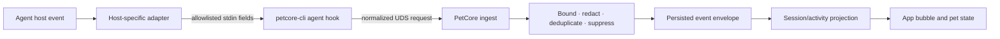

# Agent Connectors

Agent Pet Companion supports Codex, Claude Code, Pi Coding Agent, and OpenCode through host-native hooks, plugins, or extensions. These adapters emit a small local event contract; they do not turn third-party agents into in-app AI Pet Maker backends. This document owns the current connection and event boundary.

## Integration matrix

| Source | Managed integration | In-app role |
|---|---|---|
| Codex | User-level plugin and hooks using the stable `petcore-cli` adapter | Agent activity plus Codex App Server for AI Pet Maker |
| Claude Code | Managed hook settings fragment invoking `petcore-cli` | Agent activity only |
| Pi Coding Agent | Managed TypeScript extension and portable Skill support | Agent activity only |
| OpenCode | Managed JavaScript plugin and portable Skill support | Agent activity only |

Connector templates live under [plugins](../../plugins/). Installation, repair, verification, receipt freshness, and uninstall behavior live in [connections.rs](../../crates/petcore/src/connections.rs). The App surface is implemented by [AgentConnectionsView](../../apps/macos/Sources/AgentPetCompanion/Views/AgentConnectionsView.swift).

## Event path

```mermaid
flowchart LR
    Host["Agent host event"] --> Adapter["Host-specific adapter"]
    Adapter -->|"allowlisted stdin fields"| CLI["petcore-cli agent hook"]
    CLI -->|"normalized UDS request"| Core["PetCore ingest"]
    Core --> Filter["Bound · redact · deduplicate · suppress"]
    Filter --> DB["Persisted event envelope"]
    DB --> Sessions["Session/activity projection"]
    Sessions --> App["App bubble and pet state"]
```

The normal managed path invokes `runtime/current/petcore-cli`, so a PetCore runtime replacement does not leave connector files pointing to an obsolete version. A token-protected `127.0.0.1` event endpoint is available for adapters that cannot use UDS directly; it enters the same normalization path.

Connections and desktop bubbles are Agent-scoped, not project-scoped. The App does not select a project folder for an Agent connection. Supported events from every project enter the same source/session projection, and each concurrent session can appear in its Agent's message-bubble group. A bounded `project_path` may still be normalized internally as event correlation metadata, but it is not a connection setting, display filter, or user-facing identity.

## Session host and return routing

The adapter records where each event actually originated instead of treating an
Agent name as one application. Audited host markers take precedence over
inherited terminal variables; without a recognized App marker, the
`petcore-cli` hook path is classified as CLI. The closed support matrix is:

| Source | App surface | CLI surface |
|---|---|---|
| Codex | ChatGPT/Codex App; canonical UUID routes to the exact task | Warp exact-session URL when present; otherwise a known terminal opens at host level |
| Claude Code | Claude App; canonical UUID routes through `claude://resume?session=…` | Warp exact-session URL when present; otherwise a known terminal opens at host level |
| OpenCode | OpenCode App production, beta, or dev host activation; no audited existing-session deep link | Warp exact-session URL when present; otherwise a known terminal opens at host level |
| Pi Coding Agent | Not supported; Pi is CLI-only | Warp exact-session URL when present; otherwise a known terminal opens at host level |

The current markers are the ChatGPT bundle identity or its inherited
`CODEX_INTERNAL_ORIGINATOR_OVERRIDE=Codex Desktop`, Claude Desktop's
`CLAUDE_CODE_ENTRYPOINT`, and OpenCode Desktop's `OPENCODE_CLIENT` or bundle
identity. They are normalized into `chatgpt_app`, `claude_app`,
`opencode_app`, or `cli_terminal`; they are never inferred from a prompt,
session title, project path, or past display order. Unknown terminals and
source/surface mismatches expose no navigation. Existing rows that predate
these markers remain unchanged and fail closed when their App-versus-CLI
origin is ambiguous; the next real event for that session can advance the
projection with accurate metadata.

## Contract layers

1. **Host input** — host-specific payloads are treated as untrusted data. Adapters extract a closed, size-bounded field set rather than forwarding arbitrary JSON.
2. **Normalized ingest** — source, external event identity, session identity, event type, contract version, activity outcome, and explicitly permitted display fields are validated by the CLI/PetCore implementation.
3. **Persisted envelope** — `apc.agent-event.v1` stores typed, size-bounded fields and a normalized session key. The database unique key makes retrying a host event idempotent.
4. **Derived display state** — PetCore applies leases, source/event enablement, session suppression, grouping, and priority. Swift consumes the projection; it does not reimplement connector semantics.

Relevant sources are [CLI adapters](../../crates/petcore-cli/src/main.rs), [adapter contracts](../../crates/petcore/src/adapter_contracts.rs), [event envelope](../../crates/petcore/src/event_envelope.rs), [Agent state projection](../../crates/petcore/src/agent_state.rs), [raw hook schema](../../schemas/agent-hook-input.schema.json), and [persisted event schema](../../schemas/agent-event.schema.json). If schema, runtime allowlist, and fixtures disagree, synchronize them in the same change; do not choose a convenient version in documentation.

## Connection operations

The App exposes Agent-scoped operations:

- **Check** inspects expected CLI availability and managed artifacts without reading credentials.
- **Repair** installs or updates the App-managed hook/plugin/extension files for that Agent.
- **Test** emits a diagnostic event through the current local runtime.
- **Uninstall** removes only App-managed integration artifacts.

The managed runtime lifecycle separately refreshes installed references after
the user replaces the App. It refreshes only integrations already attributable
to Agent Pet Companion; it does not silently connect a previously unmanaged
Agent. Refresh returns typed per-Agent results, so one failed host becomes
**Needs Update** without blocking healthy Agents or the core App.

The page presents the four Agents as a single-selection accordion. A collapsed
row shows only identity, a short connection summary, and local integration
health: **Not Checked**, **Checking**, **Connected**, **Needs Repair**, or
**Unavailable**. Selecting the whole row opens that Agent and closes the
previous one. The open row adds the independent real-task state—**Not
Verified**, **Waiting for a Real Task**, or **Verified with a Real Task**—plus
only actionable guidance and controls. A healthy local adapter never implies
that a provider task has run, and missing real-task evidence never makes the
local integration unhealthy.

The page keeps **Check All** prominent and keeps a typed **Set Up or Repair
All** entry whenever at least one managed connector can be safely installed or
reapplied, including after a successful repair. An expanded Agent shows at most
one action required by its current state—**Check Connection**, **Set Up or
Repair**, or **Retry**—plus one **More** menu. Routine rechecks for an already
connected Agent, **Send Test Message**, safe managed reconfiguration, and
removal live in that menu according to explicit capabilities; removal remains
destructive and confirmed. Each expanded Agent also lists only the plugin,
connector, extension, or bundled Skills owned by Agent Pet Companion, with the
component name, user-facing kind, current check status, and verified active
release version. Codex uses the independent version from its bundled plugin
manifest. The Claude Code fragment, Pi extension, and OpenCode plugin instead
carry the App/PetCore release version that rendered them; PetCore reads that
marker only from an owned regular file and still requires the complete artifact
set to match the current templates exactly. When an active release version
differs from the version shipped with the current App, the row names both the
installed and App-required versions. A legacy owned artifact without a release
marker names only the required version. Both states direct the user to the
existing setup/repair action. Typed support checks still decide status and
mutation authority, but CLI names, runtime terminology, internal contract
identities, exact-content evidence, and managed-location counts are not
rendered in the ordinary connection card.
An unavailable Agent receives a short user-facing install, update, settings,
restart, repair, or service-recovery instruction derived from those typed
checks. Project directories, App/PetCore runtime details, renderer state, and
diagnostics export do not belong on this page. Service state and archive export
live under **Service & Diagnostics**.

Check, test, repair, and uninstall share a typed App coordinator and a
serialized PetCore mutation gate. A running operation disables conflicting
actions but never disables opening or switching Agent rows; the active row
shows visible progress, and failures remain inline with an explicit retry path.
The lightweight connection test uses a dedicated three-second transport bound
and completes from its RPC result without waiting for an unrelated full state
refresh.

PetCore returns typed check items and explicit management capabilities: `repairable_connector_issue`, `can_repair_managed_connector`, `managed_path_conflict`, and `can_uninstall_managed_connector`. `repairable_connector_issue` authorizes issue-specific **Connect/Repair** presentation; `can_repair_managed_connector` independently keeps the safe managed install/reapply entry available after that issue clears. The App never infers repair or uninstall authority from display text. **Needs Repair** is projected only when an executable typed repair authority is present; a failed check without that authority is **Unavailable**. Missing capability data denies mutation. Current check items use stable presentation codes and only `confirm_managed_repair`, `test_channel`, or `recheck` recovery actions. `project_directory` and `choose_project_directory` are decode-only compatibility values: PetCore does not emit or reproject them, and the App never presents or executes them.

A current light snapshot may authorize only an explicitly typed managed
installation or repair. It cannot claim **Healthy** or **Verified**, and policy
restrictions, missing Agent/runtime dependencies, unknown checks, and managed
path conflicts still deny mutation. A full runtime check remains required for
healthy integration and real-task verification presentation.

PetCore distinguishes ordinary, diagnostic, and full-task receipts against the
current connector contract and install time. **Send Test Message** proves only
that the desktop pet can receive the App's local test message, while real Agent
verification requires a qualifying event from an actual provider task. A test
message does not prove provider authentication, model execution, or completion
of a real Agent task. Every single-Agent operation produces a persistent,
dismissible success or failure notice in that Agent section, so test messages
and managed writes have visible feedback.

The internal support projection remains bounded and typed. Agent-version
evidence contains only the detected semantic version and closed supported set;
Codex host verification may contain bounded disabled, modified, and untrusted
hook counts. The `managed_components` projection identifies only App-owned
connector and Skill components, their expected and active release version, and
an exact-content boolean. The component-version fields use only the independent
Codex bundle version or the App release embedded in the three static
connectors; compatibility contract identities remain in the separate internal
capability contract. The expanded Agent renders only each safe name, kind,
user-facing release version, and derived status. A mismatch additionally
renders the safe App-required release version; internal contract identities and
exact-content evidence stay internal. The projection never exposes a digest or
path. User-managed plugins, extensions, packages, and Skills are neither
scanned nor shown. Arbitrary diagnostic prose, paths, identifiers, and
credential-like values never cross into ordinary or accessibility presentation.

Runtime version checks fail closed outside the protocol surfaces audited by the
current connector: Codex accepts only `0.144.5`, `0.145.0-alpha.18`, and the
ChatGPT-bundled `0.146.0-alpha.3.1` and `0.146.0-alpha.9.2`; Claude Code accepts
`2.1.212`–`2.1.216`; Pi requires exactly `0.80.10`; and OpenCode accepts
`1.18.0`–`1.18.4`. Codex additionally requires the complete canonical
`codex-cli <version>` output; an allowlisted-looking token embedded in warning,
mixed-version, or otherwise extended output is not treated as compatibility
evidence. The Codex `0.146.0-alpha.3.1` and `0.146.0-alpha.9.2` App Server
notification schemas are exact 70-method matches to the recorded inventory,
and the OpenCode
`1.18.4` plugin hook plus v1/v2 event inventories are exact matches to the
managed adapter. Pi `0.79.x` is intentionally not treated as compatible:
although it has the older task lifecycle events, its ExtensionAPI does not
expose the required `session_info_changed` and `agent_settled` boundaries.

Agent rows and the other shared disclosure cards use a full-width header button
with expanded/collapsed accessibility state. The complete rounded header area
toggles the section; controls inside expanded content remain independently
interactive.

Every connector preserves its allowlisted `source_event` for local audit, then
maps only stable user-meaningful boundaries into the shared atomic session-event
vocabulary. The mapping is intentionally not one event per host callback:

| Atomic event | Required evidence and rejected inference | Bubble badge | Pet reaction |
|---|---|---|---|
| `start` | Explicit request admission or execution-epoch start. Generic timestamp movement and completion tails do not become thinking. | Started / 已开始 | none; render `idle` |
| `thinking` | Explicit current Codex reasoning or a stable OpenCode reasoning-completed boundary. Token/reasoning deltas and a submitted prompt are ignored as thinking evidence. | Thinking / 正在思考 | package `thinking` |
| `plan` | Explicit Codex plan/review-mode item or stable OpenCode plan update. | Planning / 正在规划 | package `thinking` |
| `tool` | Tool/command/sub-Agent start or completion. Recoverable tool failure and a tool result remain tool activity. | Using Tools or a closed command/file/search/network subtype | package `tool` |
| `waiting` | The Agent is blocked on an approval, answer, or decision. | Waiting for You / 等待你操作 | package `waiting` |
| `done` | A supported successful settled/idle/stop boundary with the required prior activation. | Completed / 已完成 | package `done` |
| `failed` | A terminal task/session failure. A recoverable tool failure is not sufficient. | Failed / 执行失败 | package `failed` |

The package keeps six Agent-driven semantic actions because `start` has no pet
reaction and `thinking` plus `plan` share the package `thinking` action. V3 adds
three local-only actions—`acknowledge`, `drag_left`, and `drag_right`—for nine
authored actions total. Local interaction never emits an Agent event or changes
the semantic state. Event labels remain distinct, and a Thinking↔Planning
transition in the same activation keeps one animation identity so it does not
replay the action.

The desktop bubble keeps the same Agent → session boundary but exposes only the
bounded daily return path: one attention-prioritized/latest row while
collapsed, and every concrete session already present in the bounded PetCore
snapshot while expanded. The whole session row is the navigation target; a
chevron is visual hover/focus affordance rather than repeated action copy. The
pet body is not a navigation target: its primary click toggles the bubble once,
and subsequent releases in the same double-click sequence do nothing. The
trailing-aligned row badge names the filtered session event; for `tool`, it may
use a closed stable semantic subtype supplied by PetCore. Pet Configuration
session-event filters, attention summaries/previews, menu-bar recent activity,
Pet Library current state, and desktop bubbles use the same event-label
authority. Pet animation independently uses the sparse reaction mapping above.
Connector protocol names and canonical persisted titles do not provide
surface-specific UI wording. Its two
detail lines are reserved for a bounded current-turn Agent message,
host-exposed reasoning, commands, tool input/output, errors, or another
normalized semantic activity detail. When a concrete activity detail exists, the Agent message and activity
use one line each; otherwise the Agent message may use both detail lines. The
App does not insert a duplicate generic thinking/working sentence. When Codex
App Server persistence temporarily omits new hidden activity, PetCore preserves
the newest concrete host-exposed reasoning or tool detail instead of replacing
it with an empty inferred category. Once a later `thread/read` exposes a
current concrete item for the same turn, that item supersedes the older
running hook detail; waiting and terminal hooks remain authoritative.
App Server status events still receive a direct per-thread display read because
the cached recent-task list may not revise while live reasoning changes.
That bounded, read-only hydration does not share the mutation/admission gate
used by background recent-thread scans, connection checks, or generation
startup, so unrelated host work cannot serialize the current bubble behind a
multi-second queue. A materially changed per-thread display advances a
process-local display epoch and wakes the current `state.wait` immediately;
the App retains a one-second active-session timeout only as a fallback.

After these connector-specific inputs enter the shared source/session
projection, completion consumption is connector-neutral. Opening a completed
row sends its opaque projected `acknowledgement_id` to PetCore;
PetCore persists and reapplies the same filter for Codex, Claude Code, Pi, and
OpenCode across App or service relaunch. A later normalized activity event
produces a new identity and reopens that session normally.

The normalized `session_active = true` field is a host observation attached to
one event, not a durable heartbeat. For ordinary start/thinking/plan/tool/done
work, PetCore caps that hint at the configured session-message window; a missing
Stop, settled, or idle callback therefore cannot keep an old action on the pet
indefinitely. `waiting` and `failed` remain persistent attention states because
they require a newer session event rather than silent timeout to resolve.

Concrete activity availability follows the host API rather than the generic pet
state:

| Source | Concrete running detail available to the bubble |
|---|---|
| Codex | Persisted App Server reasoning summaries and tool/command/file activity, plus managed-hook tool input/output when the host invokes those hooks. A separately spawned App Server may lag activity still hidden inside the live desktop turn. |
| Claude Code | Concise tool descriptions, commands or semantic result/error text, plus permission/input requests, sub-Agent/task and compaction details exposed by hooks. Claude's structured tool-response envelope and internal status flags never become bubble copy. Claude hooks do not expose private model reasoning, so prompt-only thinking has no concrete second-line text. |
| Pi Coding Agent | Tool start/end input/output and the bounded Agent reply exposed by stable message/settled events. The audited API does not expose a timely explicit reasoning or plan boundary, so the connector does not infer either one. |
| OpenCode | Stable reasoning-completed and plan-update boundaries, command/tool input/output, compaction, error, and session-step details exposed by the managed plugin. High-frequency reasoning/tool/compaction deltas are dropped. |

Terminal rows prioritize the final Agent message. A short prompt-only task or a
task that never invokes a tool legitimately has no concrete activity line.
For the Codex App Server fallback, only a successful, complete unarchived
`thread/list` round (one with no continuation page) closes a previously
observed task that has disappeared, which covers stop-then-archive without
waiting for the activity lease. Raw list membership is independent from the
recent-message age window: a listed task can age out of bounded `thread/read`
hydration and remain an openable Codex destination, and renewed list evidence
repairs any stale synthetic closure for that task. A failed or paginated list
round preserves closure ambiguity, and a listed task is not closed when only
its bounded detail refresh fails. Once the complete list proves closure, the
resulting `done` record remains in bounded audit history but is excluded from
the active pet and bubble projections immediately; the App never presents an
archived task as an unavailable completed row.

## Security and privacy boundary

- Never read or export Agent auth, token, cookie, API key, or secret files.
- Session-scoped reasoning, commands, tool input/output, errors, and other semantic activity details may cross only as bounded scalar `activity_content`. Adapters recursively discard credential-shaped containers and never stringify an arbitrary host object or array for display. A bounded JSON-encoded string is decoded through the same semantic filter instead of bypassing it. Stable completion content is preferred over persisting every high-frequency token delta.
- Explicit, bounded session titles, first/latest user and latest assistant display messages, host-exposed activity content, and closed tool categories are product data and remain available to the desktop bubble. Each Agent connector forwards later generated-title metadata without inventing activity; PetCore uses the first user message only until that explicit title arrives.
- Claude Code display projection removes only leading quoted file-attachment references from `UserPromptSubmit` copy, so an attachment path cannot become the first-message title fallback. Uncontracted generic `title` input is ignored. For successful tool hooks, a bounded host description or concise input is preferred over a semantic result leaf; the complete structured response object is never serialized into the bubble. The read-only session projection reapplies the same cleanup to older persisted rows without rewriting their audit envelope.
- Never read or forward credential stores, auth headers, cookies, API keys, complete environment dumps, or complete transcript archives. Credential-shaped object fields are removed recursively before structured tool/activity values are selected. Explicit command text may remain visible, including an inline environment assignment authored as part of that command; non-command header/environment dumps and JSON-encoded structured output are re-normalized and cannot bypass the credential filter.
- Project paths and session IDs are normalized for local correlation and removed or redacted from diagnostics.
- Internal Codex suggestion/Pet Studio sessions are suppressed from ordinary desktop activity.
- Connector files must be attributable to Agent Pet Companion, updated atomically, and removed without changing unrelated user configuration or projects.
- UDS and loopback ingress are local-only. Loopback access requires the App-managed capability token.

The provider-neutral [agent-pet-maker Skill](../../skills/agent-pet-maker/) can create or modify a `.petpack` in another image-capable Agent host, including exact-runtime `high` 576×624 output when that host can provide complete 12:13 source crops of at least 576×624. The returned sheet or cells do not need to equal the runtime dimensions; the shared pipeline may downscale each larger crop once. That workflow remains outside the in-app AI Pet Maker, whose Codex image path supports only `low` and `standard`. Import and activation require explicit user actions, and the package still crosses the standard PetCore validator and runtime action review.

### Codex plugin and Skill convergence

Codex receives one App-managed plugin bundle containing its hook plus the
internal `agent-pet-studio` and portable `agent-pet-maker` Skills. There is no
separate standalone Codex Skill installation. The repository plugin manifest
owns a strict `X.Y.Z` version; CI and release validation require that version
to increase whenever any of the plugin, Studio Skill, or Maker Skill content
changes.

Repair and post-App-update refresh atomically publish the complete owned source,
invoke Codex's plugin installation path, and verify the expected manifest
version and content against the active Codex plugin state. A marketplace source
write and installed/enabled flags do not prove convergence when Codex still
loads an older versioned cache. A stale or unverifiable active cache remains a
typed repairable condition and cannot project `connected`.

The repair ownership check recognizes only the current Studio Skill or an exact
SHA-256 in the structured, App-owned retired-Skill history. That history covers
the retired V1 Skill plus the previously shipped plugin v0.4.5 and v0.5.0
Studio Skills, remains append-only across official releases, and never includes
the current Skill. When a release changes the Studio Skill, both the GitHub
workflow and the official local release builder require the previous release's
exact Skill digest to be present before packaging can begin; a new history
digest that is not that previous shipped Skill is rejected. This is an
upgrade-only ownership rule: it does not make old packages valid at runtime,
and a customized or merely similar Skill remains a managed path conflict and is
preserved.

In-app Maker work uses the internal Studio Skill; portable user-invoked work
uses the Maker Skill. They ship together but remain separate behavioral
contracts. A running generation retains the version with which it started, and
new work begins only with the newly verified capability.

## Adding or changing a connector

1. Add a typed host adapter and a versioned connector contract.
2. Restrict raw input to an explicit allowlist with size limits and negative security fixtures.
3. Normalize into the shared source/event/session model; do not add host-specific UI parsing.
4. Implement Agent-scoped check, repair, refresh, test, receipt, and uninstall behavior for App-managed artifacts.
5. Point managed commands at `runtime/current/petcore-cli` and preserve local-only transport.
6. Add simulated contract tests and keep real-host validation behind the explicit gate in [Validation profiles](../development/validation.md).
7. When the Codex plugin or either bundled Skill changes, increase
   `plugins/codex/.codex-plugin/plugin.json` and run
   `validate_codex_plugin_version.py` against the intended release base. If the
   Studio Skill changed, append that base Skill's exact digest to the shared
   retired-Skill history; the validator rejects omission, removal, or unrelated
   ownership digests.
8. Update the runtime manifest, this document, public feature list, and root changelog if the supported user surface changes.
