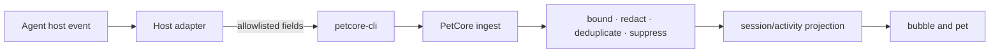

# Agent Connectors

Agent Pet Companion supports Codex, Claude Code, Pi Coding Agent, and OpenCode through host-native managed adapters. They emit a bounded local event contract; only Codex App Server is an in-App AI Pet Maker backend.

## Integrations

| Source | Managed integration | Product role |
|---|---|---|
| Codex | User plugin and hooks using `petcore-cli` | Activity plus Codex App Server generation |
| Claude Code | Managed hook settings fragment | Activity only |
| Pi Coding Agent | Managed TypeScript extension | Activity only |
| OpenCode | Managed JavaScript plugin | Activity only |

Templates live in [plugins](../../plugins/); installation and verification live in [connections.rs](../../crates/petcore/src/connections.rs).

```mermaid
flowchart LR
    Host["Agent host event"] --> Adapter["Host adapter"]
    Adapter -->|"allowlisted fields"| CLI["petcore-cli"]
    CLI --> Core["PetCore ingest"]
    Core --> Filter["bound · redact · deduplicate · suppress"]
    Filter --> Projection["session/activity projection"]
    Projection --> App["bubble and pet"]
```

Managed commands resolve `runtime/current/petcore-cli`, so runtime replacement does not leave stale executable paths. Adapters that cannot use UDS may use the capability-token-protected `127.0.0.1` ingress; both paths share normalization and persistence.

Connections and bubbles are Agent/session scoped across all projects. Project paths may be bounded correlation input but are never connection settings, display filters, or user-facing session identity.

## Host and return routing

Adapters record the actual App or CLI origin. Audited App markers override inherited terminal variables; prompts, titles, project paths, and previous card order never infer origin.

| Source | App surface | CLI surface |
|---|---|---|
| Codex | Exact ChatGPT/Codex session for a canonical routable UUID | Exact Warp URL when present; otherwise known terminal host |
| Claude Code | Claude App host activation only | Exact Warp URL when present; otherwise known terminal host |
| OpenCode | OpenCode App host activation only | Exact Warp URL when present; otherwise known terminal host |
| Pi | No App surface | Exact Warp URL when present; otherwise known terminal host |

Claude hook UUIDs identify CLI transcripts, not existing Claude Desktop sessions, so they are never published as exact Desktop routes. Unknown terminals, malformed targets, source/surface mismatches, and ambiguous historical origins are unavailable rather than guessed. A source-matching audited App origin remains authoritative within one activity epoch even if a later terminal hook loses the marker; a genuine new activation may select a different surface.

Rows expose `exact_session`, `agent_host`, or `unavailable`. The App acknowledges a completed row only after its declared route succeeds. Opening a host after an exact deep-link failure is recovery assistance, not proof that the session opened, so the row remains visible with a retryable error.

## Session display fields

Each projected session carries separate bounded fields for title, latest user message, current-turn Agent message, and normalized activity. The title is the latest explicit title, falling back to the first user message only until one exists. Later prompts update context without renaming the session.

Codex, Pi, and OpenCode publish available display fields in their managed event paths. Codex may also hydrate current bounded display state through a read-only App Server thread read.

Claude Desktop hooks omit the message-bearing prompt/stop events needed for a useful bubble. When a Claude hook supplies `transcript_path`, the adapter may read a fixed tail of that one file to recover only title, latest user prompt, and latest Agent text. The path must be absolute, current-user-owned, regular, and not a symlink; the read is size bounded. Tool results, structured message envelopes, sub-Agent turns, and transcript history are excluded. Failure leaves fields absent and never changes connector health.

Activity normalization selects only bounded semantic scalars such as reasoning, command, tool input/output, error, compaction, or sub-Agent detail. Generic lifecycle copy is not duplicated into the two detail lines. Host-specific availability is summarized below:

| Source | Concrete activity available |
|---|---|
| Codex | App Server reasoning/tool items and managed-hook command/tool detail |
| Claude Code | Tool descriptions, commands/results/errors, permission/input requests, sub-Agent and compaction hooks; no private model reasoning |
| Pi | Tool input/output and bounded Agent reply; no inferred reasoning or plan |
| OpenCode | Stable reasoning/plan boundaries, command/tool data, compaction, errors, and session steps |

## Event mapping

Connectors preserve an allowlisted source event for audit and map only stable user-meaningful boundaries:

| Event | Required meaning | Pet action |
|---|---|---|
| `start` | Explicit request admission or activation start | `idle` |
| `thinking` | Explicit supported reasoning boundary; never generic timestamp/token churn | `thinking` |
| `plan` | Explicit supported plan/review boundary | `thinking` |
| `tool` | Command, tool, file, search, network, or sub-Agent activity; recoverable tool failure stays `tool` | `tool` |
| `waiting` | Blocked on approval, answer, or decision | `waiting` |
| `done` | Supported successful settled boundary with required prior activation | `done` |
| `failed` | Terminal task/session failure | `failed` |

Local package actions `acknowledge`, `drag_left`, and `drag_right` never emit events or change semantic state. Event labels remain distinct even when two events share one pet action.

Ordinary `session_active` is a bounded observation, not a permanent heartbeat. `waiting` and `failed` remain until a newer event resolves them. Repeated terminal notifications in one activity epoch share one completion acknowledgement identity; a later true activation creates a new scope.

## Managed connection operations

The App offers Agent-scoped operations:

- **Check** inspects supported runtime and App-owned artifacts without reading credentials.
- **Set Up or Repair** installs or updates only attributable managed artifacts.
- **Test** emits a local diagnostic event; it does not prove provider authentication or model execution.
- **Uninstall** removes only Agent Pet Companion-managed artifacts.

PetCore supplies typed capabilities for safe repair and removal; the App never infers mutation authority from text. Missing capability denies mutation. Operations are serialized, publish inline progress/result, and do not prevent switching Agent rows.

Agent Connections distinguishes local integration health from evidence of a real provider task. It lists only App-owned plugins, connectors, extensions, and bundled Skills with safe names and verified active/required release versions. Paths, digests, internal contract IDs, user-managed components, and unrelated runtime diagnostics remain hidden. Exact supported host versions are a closed implementation allowlist in [adapter contracts](../../crates/petcore/src/adapter_contracts.rs) and tests rather than a duplicated documentation list.

After an App replacement, PetCore refreshes only previously managed integrations. One failed Agent remains repairable without rolling back the core runtime or healthy Agents.

## Security and privacy boundary

- Never read or export Agent auth stores, tokens, cookies, API keys, secrets, authorization headers, or complete environment dumps.
- Forward only allowlisted bounded fields. Arbitrary host objects and arrays are not stringified; JSON-encoded structured strings pass through the same semantic and credential filter.
- Explicit title/user/Agent display messages and selected session activity are product data. Complete transcripts and high-frequency token streams are not.
- Claude transcript hydration reads only the hook-supplied safe file and returns three bounded display strings; it never becomes a general transcript reader.
- Project paths and raw session IDs are correlation data and are removed or redacted from diagnostics.
- Internal Codex suggestion/Studio sessions are suppressed from ordinary desktop activity.
- Managed connector files must be attributable, atomically replaced, and removable without modifying unrelated user configuration. Foreign or customized commands remain untouched and create a managed-path conflict.
- UDS and loopback ingress are local-only; loopback requires the private App-managed capability token.

## Codex capability convergence

Codex receives one App-managed plugin containing its hook and the bundled Studio and Maker Skills. Any content change under those three areas requires a strictly greater plugin version. Repair and post-update refresh verify the active cache content, not only installed/enabled flags.

Studio upgrade ownership recognizes the current Skill or an exact digest in the append-only retired-Skill history. When Studio changes for a release, that history must add the previous shipped Skill digest; customized or merely similar content remains a conflict. A running generation retains the capability version with which it started.

## Changing a connector

1. Add or update the typed host adapter and versioned runtime contract.
2. Keep raw input allowlisted, byte-bounded, and covered by negative security fixtures.
3. Normalize into the shared event/session model; do not add host-specific parsing to Swift UI.
4. Implement typed check, repair, refresh, test, receipt, and uninstall behavior for owned artifacts.
5. Keep transport local and managed commands pointed at `runtime/current/petcore-cli`.
6. Update simulated and real-host validation, runtime manifest, this document, and the changelog when the supported user surface changes.
7. If the Codex bundle changes, increase its plugin version; if Studio changes, add the previous release's exact digest to retired ownership history.
