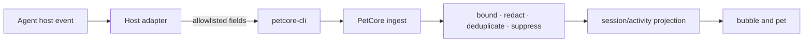

# Agent Connectors

Agent Pet Companion supports Codex, Claude Code, Pi Coding Agent, OpenCode, and DeepSeek Harness through host-native managed adapters. They emit a bounded local event contract; only Codex App Server is an in-App AI Pet Maker backend.

## Integrations

| Source | Managed integration | Product role |
|---|---|---|
| Codex | User plugin and hooks using `petcore-cli` | Activity plus Codex App Server generation |
| Claude Code | Managed hook settings fragment | Activity only |
| Pi Coding Agent | Managed TypeScript extension | Activity only |
| OpenCode | Managed JavaScript plugin | Activity only |
| DeepSeek Harness | Managed Cordis plugin | Activity only |

Templates live in [plugins](../../plugins/); the stable check/repair/refresh/uninstall interface and shared managed-tree engine live in [connections](../../crates/petcore/src/connections/), while each host's audited constants and templates are isolated under `connections/adapters/`.

```mermaid
flowchart LR
    Host["Agent host event"] --> Adapter["Host adapter"]
    Adapter -->|"allowlisted fields"| CLI["petcore-cli"]
    CLI --> Core["PetCore ingest"]
    Core --> Filter["bound · redact · deduplicate · suppress"]
    Filter --> Projection["session/activity projection"]
    Projection --> App["bubble and pet"]
```

Managed commands resolve `runtime/current/petcore-cli`, so runtime replacement does not leave stale executable paths. Adapters that cannot use UDS may use the capability-token-protected `127.0.0.1` ingress; both paths share normalization and persistence.

Connections and bubbles are Agent/session scoped across all projects. Project paths may be bounded correlation input but are never connection settings, display filters, or user-facing session identity.

## Host and return routing

Adapters record the actual App or CLI origin. Audited App markers override inherited terminal variables; prompts, titles, project paths, and previous card order never infer origin.

| Source | App surface | CLI surface |
|---|---|---|
| Codex | Exact ChatGPT/Codex session for a canonical routable UUID | Exact Warp URL when present; otherwise known terminal host |
| Claude Code | Claude App host activation only | Exact Warp URL when present; otherwise known terminal host |
| OpenCode | OpenCode App host activation only | Exact Warp URL when present; otherwise known terminal host |
| Pi | No App surface | Exact Warp URL when present; otherwise known terminal host |
| DeepSeek Harness | No App surface | Exact Warp URL when present; otherwise known terminal host |

Claude hook UUIDs identify CLI transcripts, not existing Claude Desktop sessions, so they are never published as exact Desktop routes. Unknown terminals, malformed targets, source/surface mismatches, and ambiguous historical origins are unavailable rather than guessed. A source-matching audited App origin remains authoritative within one activity epoch even if a later terminal hook loses the marker; a genuine new activation may select a different surface.

Rows expose `exact_session`, `agent_host`, or `unavailable`. The App acknowledges a completed row only after its declared route succeeds. Opening a host after an exact deep-link failure is recovery assistance, not proof that the session opened, so the row remains visible with a retryable error.

## Session display fields

Each projected session carries separate bounded fields for title, latest user message, Agent message, and normalized activity. The title is the latest explicit title, falling back to the first user message only until one exists. Later prompts update context without renaming the session. The bubble body selects only the newest Agent message or explicit thinking/plan text and retains it across user, tool, and lifecycle activity. Tool and other activity still update the closed status summary but do not enter or clear the body. Navigation notices remain a separate higher-priority presentation.

Only root Agent sessions enter the session projection. Connectors use explicit host lineage—not user-facing titles or display order—to suppress child sessions: OpenCode `parentID`, Codex App Server sub-Agent source kinds and `parentThreadId`, Pi session-header `parentSession`, Claude sidechain markers, and DeepSeek Harness `session.header.origin === 'subagent'` / `parentSession`. Pi parallel subagent runners that omit `parentSession` are additionally recognized only through Pi's closed, host-reserved `subagent-*` session-name namespace; arbitrary session names are not classified. The suppression marker contains only the child session identity; it deletes any earlier projection for that identity, blocks later events, and never persists the parent identity or reserved name. Sub-Agent lifecycle may still update the owning root session's status, but it never creates another desktop card.

OpenCode queues bounded existing-session discovery for the first task after Plugin activation instead of entering its own in-process Server API while that activation is still being constructed. Every session-bearing live hook waits behind the same lineage gate, so activation can complete without deadlocking while an already-running child is still classified before any of its activity can enter the projection. Cleanup-marker delivery is queued asynchronously after classification and does not carry the parent identity.

Codex, Pi, and OpenCode publish available display fields in their managed event paths. Codex may also hydrate current bounded display state through a read-only App Server thread read. For Codex, an `interrupted` turn with a persisted `completedAt` boundary is terminal and refreshes the session bubble to done; an externally running turn reloaded by another App Server as `interrupted` without that boundary remains active under the bounded activity lease.

Claude Desktop hooks omit the message-bearing prompt/stop events needed for a useful bubble. When a Claude hook supplies `transcript_path`, the adapter may read a fixed tail of that one file to recover only title, latest user prompt, and latest Agent text. The path must be absolute, current-user-owned, regular, and not a symlink; the read is size bounded. Tool results, structured message envelopes, sub-Agent turns, and transcript history are excluded. Failure leaves fields absent and never changes connector health.

Activity normalization selects only bounded semantic scalars such as reasoning, command, tool input/output, error, compaction, or sub-Agent detail. Only explicit reasoning/plan text is eligible to become retained bubble-body copy; commands, tools, errors, compaction, sub-Agent activity, and generic lifecycle copy remain status-only. Host-specific availability is summarized below:

| Source | Concrete activity available |
|---|---|
| Codex | App Server reasoning/tool items and managed-hook command/tool detail |
| Claude Code | Tool descriptions, commands/results/errors, permission/input requests, sub-Agent and compaction hooks; no private model reasoning |
| Pi | Tool input/output, bounded Agent reply, and explicit finalized `ThinkingContent.thinking`; no inference from token/timestamp churn |
| OpenCode | Stable reasoning/plan boundaries, command/tool data, compaction, errors, and session steps |
| DeepSeek Harness | Reasoning `block-start` boundaries, clean tool names, plan/todo snapshots, approval requests/decisions, and subagent lifecycle |

## Event mapping

Connectors preserve an allowlisted source event for audit and map only stable user-meaningful boundaries:

| Event | Required meaning | Pet action |
|---|---|---|
| `start` | Explicit request admission or activation start | `idle` |
| `thinking` | Explicit supported reasoning boundary; never generic timestamp/token churn | `thinking` |
| `plan` | Explicit supported plan/review boundary | `thinking` |
| `tool` | Command, tool, file, search, network, or sub-Agent activity; recoverable tool failure stays `tool` | `tool` |
| `waiting` | Blocked on approval, answer, or decision | `waiting` |
| `done` | Supported successful settled boundary with required prior activation | `done` |
| `failed` | Terminal task/session failure | `failed` |

Local package actions `acknowledge`, `drag_left`, and `drag_right` never emit events or change semantic state. Event labels remain distinct even when two events share one pet action.

Ordinary `session_active` is a bounded observation, not a permanent heartbeat. `waiting` and `failed` remain until a newer event resolves them. Repeated terminal notifications in one activity epoch share one completion acknowledgement identity; a later true activation creates a new scope.

Claude Code's delayed `idle_prompt` notification completes an ordinary turn only when the current session has no unresolved background-work fence. A `Stop` that reports `background_tasks` or `session_crons` opens that fence; the notification remains in bounded audit history but cannot replace the running projection or reject later same-turn tool/sub-Agent activity. A new Claude process boundary or an explicit `Stop`, `StopFailure`, `SessionEnd`, or `agent_completed` edge settles the fence. This distinction is Claude-specific and does not change ordinary `idle_prompt` completion or any other Agent's terminal mapping.

Pi emits `input` before it validates the interactive session's selected model. When the public Extension context has no model at that boundary, the managed adapter closes that admitted input directly as `failed` with the closed `model_unavailable` outcome; it never inspects provider credentials or auth storage. Other Pi failures continue to settle only on a stable terminal host boundary.

DeepSeek Harness emits stream chunks and lifecycle broadcasts through Cordis. The managed plugin subscribes only to the four session-scoped broadcast `emit` events (`session/event`, `subagent/start`, `subagent/end`, and `session/disposed`); `agent/status` is audited but intentionally not subscribed because it has no session identity. It explicitly avoids waterfall/interception events (`agent/pre-step`, `tools/pre-execute`, etc.) to prevent pure observers from stalling the driver chain. `assistant/chunk` events are filtered so only explicit `block-start{blockType:'reasoning'}` boundaries emit `thinking`, while all delta chunks and usage data are dropped locally. Stable host sequence numbers become opaque event identities so repeated same-tool events do not collapse. Bounded user/assistant text and title caches are attached only to semantic start/terminal edges. Active child subagents tracked via `subagent/start`/`subagent/end` maintain a per-parent background fence: a parent `turn/end{completed}` while subagents are running emits `background_active`, and the terminal `done/completed` is deferred until all child runs in that parent's fence settle. Root `session/disposed` is an explicit close and immediately removes any waiting, completed, or failed bubble for that session.

## Managed connection operations

The App offers Agent-scoped operations:

- **Check** inspects supported runtime and App-owned artifacts without reading credentials.
- **Set Up or Repair** installs or updates only attributable managed artifacts.
- **Test** emits a local diagnostic event; it does not prove provider authentication or model execution.
- **Uninstall** removes only Agent Pet Companion-managed artifacts.

PetCore supplies typed capabilities for safe repair and removal; the App never infers mutation authority from text. Missing capability denies mutation. Operations are serialized, publish inline progress/result, and do not prevent switching Agent rows.

Every authoritative App snapshot includes a bounded light check for all five
Agents. Agent Connections presents a healthy light result as **Basic check
complete** and immediately exposes specific missing-host or managed-repair
findings; it never labels an available light result as if no check ran. Every
App launch schedules one full five-Agent runtime check after the authoritative
light projections are loaded and release connector convergence is idle. This
check runs even when a prior runtime projection is available, but remains
outside the launch-critical snapshot and window-presentation path because host
probes may cold-start Agent hosts, load plugins, or encounter host trust and
protected-folder prompts. **Check All** remains the explicit retry path.

The control-center shell shows the launch check while it runs. After completion,
managed plugin/connector setup or version mismatch, managed path conflict, Hook
authorization, host permission/restart requirement, local event-channel
failure, incomplete result, or failed connection operation is a global in-App
notice outside Agent Connections. An Agent App or CLI that is not installed is
a normal optional state: only Agent Connections shows its informational setup
guidance, and the missing host never enters the global issue notice. The notice
names each affected Agent and its closed issue category and opens Agent
Connections for the exact typed recovery steps. Post-update connector
convergence keeps its existing higher-priority scoped notice so the App never
duplicates the same problem. Healthy local integration that only awaits an
ordinary real Agent task remains neutral and does not create a global failure
notice. When the bounded runtime result cache expires, a complete healthy light
snapshot is likewise neutral; normal cache expiry never reclassifies a
successful full check as an incomplete result. Other concrete light-check
findings remain actionable and keep the notice.

Agent Connections distinguishes local integration health from evidence of a real provider task. It lists only App-owned plugins, connectors, extensions, and bundled Skills with safe names and verified active/required release versions. Paths, digests, internal contract IDs, user-managed components, and unrelated runtime diagnostics remain hidden. A detected Agent host version is diagnostic context only and never gates compatibility. Health is decided by the exact App-managed connector contract, host runtime probe, local event channel, and current connector receipts, so a host upgrade does not require a new hardcoded version allowance.

Codex Hook configuration uses only the host-supported top-level `description` and `hooks` fields; Codex rejects unknown metadata fields. The plugin manifest owns the bundle version, each separately parsed Skill repeats that version in front matter, and an installed Hook is bound to the manifest version only after its complete rendered content matches the current Hook template. Active-cache convergence computes and compares the current App, managed-source, and active-cache digests in the same check; it does not look up the Hook in a historical digest registry. A Hook load/configuration failure is action-required or repairable connector state, never evidence that a restart alone will fix the connection.

Native diagnostic canaries prove only that the host loaded the expected managed adapter and that a bounded event reached the local channel; they never claim that an ordinary provider task ran. Pi sends its current `connector.probe` as soon as the real host executes the Extension factory, before a missing model can end a non-interactive probe and before the normal `session_start` fallback. That current canary is authoritative Extension-load evidence even when the probe host subsequently exits because its separate model/runtime configuration is unavailable. Codex additionally requires the authoritative `hooks/list` result to report every managed hook trusted, so modified hooks remain an explicit user-authorization and restart action. OpenCode accepts its native probe only when `debug info` reports the exact expected plugin file (including an equivalent percent-encoded file URL) and the matching `connector.probe` arrives; another or disabled load path is repairable, not verified. Claude Code, Pi, OpenCode, and DeepSeek Harness remain `unverified` until a current-contract ordinary task event exists, even when their no-model host probes pass.

The ordinary Agent card preserves local connector health as a separate internal fact, but projects a healthy connector without ordinary-task evidence as a neutral **Awaiting verification** state. It must not show a green **Connected** badge until that real-task evidence is current, and it must not offer repair merely because verification is pending.

Snapshot evidence is projected from the bounded retained event history through a
per-source cache. Incoming hooks mark that source dirty but are coalesced for a
maximum of five seconds; explicit connection operations and managed-artifact
changes invalidate immediately. Evidence parsing selects only `source_event`,
`contract_version`, `diagnostic`, `affects_activity`, `session_active`, and
`outcome`, never the arbitrary nested content of tool payloads.

A fresh manual runtime check may resolve stale post-update connector attention
only for the checked source when its connector is installed, verification is
exact, the contract is nonempty, its managed connector is healthy, and every
reported item is `ok` or `not_required`. Once all affected sources pass, the
App reruns the authoritative five-Agent convergence flow so a real receipt can
be persisted and the warning does not return at the next launch. The scoped
runtime check itself does not mutate other Agents or synthesize that receipt.

Connector JSON, required event types, and selected display/activity fields are parsed at the bounded adapter boundary. Invalid JSON, missing required fields, wrong field types, unsupported shapes, contract mismatches, and normalized-envelope failures emit content-free structured diagnostics containing only the Agent source, closed field category, and closed failure category. Raw values, messages, tool arguments, paths, identifiers, and credentials are never copied into those warnings or persisted with the Agent event.

After an App replacement, PetCore refreshes only previously managed integrations. One failed Agent remains repairable without rolling back the core runtime or healthy Agents.

The post-update notice preserves a closed App-side reason for each failed Agent: managed-path conflict, unavailable host command, refresh failure, or incomplete runtime verification. It names the affected Agent, gives the corresponding user recovery steps, and opens that Agent expanded in Agent Connections. After repair, authorization, installation, or a full host restart, the notice first runs a scoped runtime check for only the affected sources. Once all of them pass, the App reruns authoritative convergence to persist the exact receipt instead of blindly repeating the entire update as the first response. Missing bundled pets instead direct the user to replace the incomplete App copy, while service verification failure directs them through Service & Diagnostics recovery before rechecking.

## Security and privacy boundary

- Never read or export Agent auth stores, tokens, cookies, API keys, secrets, authorization headers, or complete environment dumps.
- Forward only allowlisted bounded fields. Arbitrary host objects and arrays are not stringified; JSON-encoded structured strings pass through the same semantic and credential filter.
- Explicit title/user/Agent display messages and selected session activity are product data. Complete transcripts and high-frequency token streams are not.
- Claude transcript hydration reads only the hook-supplied safe file and returns three bounded display strings; it never becomes a general transcript reader.
- Project paths and raw session IDs are correlation data and are removed or redacted from diagnostics.
- Connector parse warnings contain only closed source/field/failure categories; the rejected host value is never logged.
- Internal Codex suggestion/Studio sessions are suppressed from ordinary desktop activity. Pet Studio persists its exact thread/job link before the first turn; Maker history is the only App projection for those threads, and its exact ChatGPT route is exposed only after live unarchived verification.
- Host-declared child Agent sessions and subsessions are suppressed before projection; parent lineage is inspected locally and never persisted.
- DeepSeek Harness plugin never reads `~/.dsh/.credentials.yaml`, `settings.yaml` provider credentials, or profile credentials; `subagent/end.lastAssistantMessage` (child content) is never forwarded; all `*-delta` chunks are dropped locally.
- Managed connector files must be attributable, atomically replaced, and removable without modifying unrelated user configuration. Foreign or customized commands remain untouched and create a managed-path conflict.
- UDS and loopback ingress are local-only; loopback requires the private App-managed capability token.

## Codex capability convergence

Codex receives one App-managed plugin containing its hook and the bundled Studio and Maker Skills. Any content change under those three areas requires a strictly greater plugin version. Repair and post-update refresh verify the active cache content, not only installed/enabled flags.

Repair authorization does not depend on a registry of historical plugin or Skill digests. A safe managed root is attributed structurally by its Agent Pet Companion manifest, Hook commands, or recognized Skill identity; within that proven root, repair may replace stale regular files at the App's fixed paths, while symlinks, directories, unreadable entries, and foreign roots still fail closed. Exact digests are post-repair convergence evidence: the current App computes its expected bundle, verifies the managed source and active cache against it, and may recognize the exact Studio revision bound into that installation's last successful verification receipt. A missing digest from some separate release list therefore cannot strand an owned install. A running generation retains the capability version with which it started.

## Changing a connector

1. Add or update the typed host adapter and versioned runtime contract.
2. Keep raw input allowlisted, byte-bounded, and covered by negative security fixtures.
3. Normalize into the shared event/session model; do not add host-specific parsing to Swift UI.
4. Implement typed check, repair, refresh, test, receipt, and uninstall behavior for owned artifacts.
5. Keep transport local and managed commands pointed at `runtime/current/petcore-cli`.
6. Update simulated and real-host validation, runtime manifest, this document, and the changelog when the supported user surface changes.
7. If the Codex bundle changes, increase its plugin version; do not add a historical digest registry as an ownership dependency.
