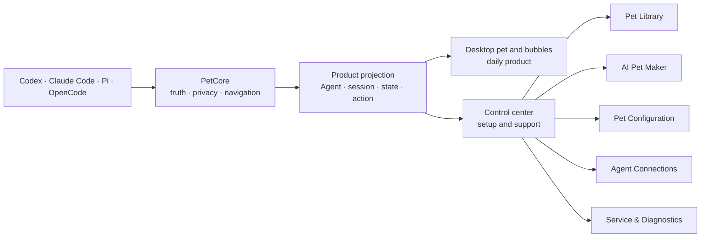

# Product Experience Contract / 产品体验合同

This document defines the intended product experience for the Agent Pet Companion V1 refactor. It is the durable product-design authority for implementation decisions; it is not a status report, schedule, milestone list, or claim that every target is already implemented.

本文定义 Agent Pet Companion V1 重构后的目标产品体验，是后续实现决策的长期产品设计依据；它不是状态报告、排期、里程碑列表，也不表示所有目标已经实现。

Current runtime behavior remains authoritative until the corresponding task in [Product refactor execution](../development/product-refactor-execution.md) changes the implementation, tests, schemas, and owning current-state document together.

## 1. Product promise / 产品承诺

> Stop watching the Agent. The pet comes to you when the Agent needs you.  
> 别再盯着 Agent。它需要你时，桌宠会来找你。

The target user runs one or more coding Agents on macOS and needs to understand four things without reopening every Agent window:

1. whether an Agent is still working;
2. whether the user is needed;
3. which session produced the signal;
4. what action returns to the correct place.

The product is not a project dashboard, mission-control platform, connector inspector, or pet-package database. The desktop pet is the daily product. The control center exists to choose or create a pet, configure the experience, connect Agents, and recover from faults.

## 2. Fixed scope and non-goals / 固定范围与非目标

The following constraints remain fixed:

- The main navigation contains exactly five entries in this order: Pet Library, AI Pet Maker, Pet Configuration, Agent Connections, Service & Diagnostics.
- Connections and desktop bubbles are Agent-scoped, not project-scoped.
- Sessions from all projects may appear under their Agent. Project folders and project paths are never connection settings, display filters, or user-facing identities.
- AI Pet Maker contains only new/edit briefs and their creation sessions.
- The release bundle seeds `星雾团子` and `Bytebud 字节芽`.
- Bundled pets remain read-only; customization creates a new pet identity.
- Display size is adjusted only through the overlay's bottom-right resize handle.
- Protocol/package states remain `idle`, `start`, `tool`, `waiting`, `review`, `done`, and `failed`.
- Authored animation timing remains package-wide native 10 or 20 FPS with per-state durations of 1,000 or 2,000 ms. Runtime never retimes an authored action.

V1 does not add public galleries, sharing/community, Petdex import, Codex built-in pet export, Windows UI, cloud accounts, feeding/health decay, social/RPG systems, or a full Agent task-control platform.

## 3. Experience hierarchy / 体验层级



The hierarchy has three levels:

1. **Ambient layer** — pet motion communicates state at a glance.
2. **Action layer** — a bounded session bubble explains the signal and returns to the best available destination.
3. **Management layer** — the five-entry control center handles setup, creation, configuration, connection, and support.

Healthy runtime details never compete with the pet. Technical information remains available through progressive disclosure and diagnostics.

## 4. Product information model / 产品信息模型

The user-facing hierarchy is:

```text
Agent
└── Session
    ├── bounded title or user context
    ├── current lifecycle state
    ├── bounded current-turn Agent message or typed activity fallback
    ├── attention priority
    └── navigation capability
```

There is no project node.

### 4.1 Session identity

- PetCore owns the stable internal session identity and sends only the bounded projection permitted by the data contract.
- The App groups sessions by Agent source.
- Display order may change with attention priority and activity, but session identity must not.
- The preferred display title is an explicit bounded session title.
- If no title exists, the latest bounded user context may supply the title.
- A single anonymous session uses the localized generic Agent-session label.
- Multiple anonymous sessions for the same Agent require a stable, content-free fallback label assigned independently of current display order. The App must never derive that label from an array index.
- Project path, project directory, and raw session identifiers never become the fallback label.

### 4.2 Session content and privacy

The local bubble may show:

- an explicit, bounded session title;
- a bounded latest user display message used as session context;
- a bounded current-turn Agent display message;
- a closed typed activity/status fallback;
- allowlisted navigation data.

It must not show or export:

- complete transcript archives;
- hidden reasoning;
- arbitrary command/tool payloads;
- credentials, tokens, cookies, or API keys;
- project paths or local file paths;
- raw host/session identifiers except an explicitly allowlisted routing field that never becomes display text.

### 4.3 Navigation truth

Every session action has a typed capability:

| Capability | User action copy | Meaning |
|---|---|---|
| Exact session | Return to Session / 返回会话 | Opens the validated exact session target |
| Agent host | Open `<Agent>` / 打开 `<Agent>` | Activates the host because exact routing is unavailable |
| Unavailable | No action | No safe or valid destination exists |

The UI must not label a host-level fallback as an exact session return.

## 5. First-run experience / 首次体验

First run is a versioned, resumable presentation state, not a sixth navigation page.

It contains three scenes:

1. **Choose a companion** — show the two bundled pets with complete motion previews and one clear confirmation action.
2. **Connect Agents** — detect supported Agents and show only `Connected`, `Needs Repair`, or `Unavailable`, with one contextual primary action.
3. **See the pet come alive** — run a clearly labeled local demo of thinking, working, needs-attention, and completion, then invite the user to run a real Agent task.

Demo events remain App-local presentation data. They do not enter PetCore event history, connection receipts, session projections, or diagnostics.

Completion leaves the desktop pet visible and makes the control center optional for daily work.

## 6. Main navigation page contracts / 主导航页面合同

### 6.1 Pet Library

**Single job:** choose and manage pets.

Default presentation:

- the active pet is the visual hero;
- the selected pet has a large animated preview, name, style, source summary, and one primary `Use This Pet` action;
- other pets appear as visual cards;
- import and create are secondary actions;
- search appears only when the collection needs it;
- technical metadata and history are disclosed on demand.

Bundled-pet actions are preview, enable, export, and customize as a new ID. User-pet actions may also modify, inspect history, and delete when allowed.

Stable IDs, revision IDs, exact validation counts, frame counts, and package details remain available under Technical Information but do not lead the page.

### 6.2 AI Pet Maker

**Single job:** create or modify a pet through an AI creation session.

The experience has three states:

1. describe the pet;
2. create together through the session;
3. preview, use, continue modifying, or export the result.

Before a job starts, the screen is a focused creation canvas rather than a form beside an empty conversation panel. The default brief exposes description, visual style, quality, and references. Animation timing is a collapsed advanced section.

User-facing animation choices are `Standard Motion` and `Smooth Motion`; the advanced section may show the exact native FPS and each state's one- or two-second authored duration.

Once a job starts, the brief becomes a compact submitted summary and the creation session becomes primary. Completion leads with `Use This Pet`, followed by `Continue Editing` and export.

Changing authored FPS or duration is an explicit AI edit that regenerates affected motion and publishes a new immutable revision. Runtime playback never performs that edit.

### 6.3 Pet Configuration

**Single job:** adjust the ambient experience.

The wide layout contains at most:

```text
main navigation | settings content | optional live preview
```

It does not add a permanent settings sub-sidebar. Appearance and Messages use a compact segmented or equivalent in-page switch.

The default settings are:

- show/hide pet;
- show/hide bubbles;
- appearance theme;
- Standard/Smooth playback when supported by the active pet;
- one of the message-attention presets below.

| Preset | Enabled protocol events |
|---|---|
| Only When I Am Needed / 只在需要我时 | `waiting`, `review`, `failed` |
| Standard / 标准 | `start`, `waiting`, `review`, `done`, `failed` |
| All Activity / 全部活动 | all six persisted event types |

Existing per-source, per-event, timeout, grouping, transparency, auto-hide, context-menu, and pointer behavior remain available under the relevant advanced disclosure. A manually customized event set is labeled `Custom`.

Connected Agents are enabled by default. Source selection is not duplicated as a connection workflow.

### 6.4 Agent Connections

**Single job:** connect or repair an Agent integration.

Each Agent presents one aggregate health state:

- checking;
- connected;
- needs repair;
- unavailable.

Only one contextual primary action is visible at a time: Connect, Repair, Verify, or Retry. Uninstall, recheck, and technical inspection are secondary actions.

PetCore remains the typed authority for check items and mutation capabilities. The App must not infer repair authority from display text. Detailed CLI, hook/plugin, host verification, event delivery, and App Server checks are shown only after the user opens Technical Details.

`project_directory` and `choose_project_directory` are compatibility-only values. They are never emitted as active product guidance and can never open a project picker from this page.

### 6.5 Service & Diagnostics

**Single job:** recover the product and export bounded diagnostics.

The healthy default is one compact overall-health statement plus Refresh and Export Diagnostics. Detailed PetCore, RPC, event-channel, renderer, retention, and archive information is collapsed.

When unhealthy, the page leads with the actionable failure and one Recover or Retry action.

Healthy service state does not need a permanent toolbar indicator. The toolbar may surface service state only when attention or recovery is required.

## 7. Desktop pet and bubbles / 桌宠与气泡

### 7.1 Pet interaction

- The pet body remains draggable whenever the overlay is visible.
- A valid alpha mask may pass transparent pixels through.
- A missing mask falls back to the geometric pet region and never disables interaction.
- Display size changes only through the bottom-right resize handle.
- Ordinary overlay updates never steal focus.

### 7.2 Bubble hierarchy

A bubble group shows:

1. Agent identity;
2. one row per visible session;
3. session title/context;
4. current status;
5. current-turn Agent message or typed fallback;
6. a truthful navigation action.

The title, status, and detail must not repeat the same phrase. For example, `Working` plus `Executing a tool` is acceptable only when the second line adds information; `Calling tool` plus `Executing tool` is redundant.

### 7.3 Priority and persistence

- `waiting`, `review`, and `failed` are attention states and remain visible until the session advances, the host closes it, or the user dismisses the presentation.
- `start`, `tool`, and `done` use bounded leases.
- Collapsed groups always retain attention rows.
- The concrete projection remains bounded to eight sessions and exposes an omitted count rather than silently dropping the remainder.

### 7.4 User copy

| Protocol state | Default UI meaning |
|---|---|
| `idle` | no session bubble / pet resting |
| `start` | Thinking / 正在思考 |
| `tool` | Working / 正在工作 |
| `waiting` | Needs You / 等你处理 |
| `review` | Ready to Review / 可以查看 |
| `done` | Completed / 已完成 |
| `failed` | Needs Attention / 遇到问题 |

Stored names do not change.

## 8. Animation presentation contract / 动画呈现合同

- A package has one native rate: 10 or 20 FPS.
- Every state has an authored duration of 1,000 or 2,000 ms.
- A native-10 package supports Standard playback only.
- A native-20 package supports Standard 10 FPS sampling and Smooth 20 FPS playback.
- Playback selection changes cadence and resource demand, never action duration.
- Native-20 Standard sampling follows the deterministic runtime contract.
- A timing edit creates a new immutable revision and regenerates every affected action.
- Higher FPS requires real intermediate motion; longer duration requires authored continuation.

The ordinary UI uses human labels. Exact FPS, frame counts, durations, and revision data belong in advanced or technical surfaces.

## 9. Visual and interaction system / 视觉与交互系统

Every page follows these rules:

- one page title and one concise explanation;
- one primary action for the current state;
- one visual center;
- no more than three simultaneous columns including the main navigation;
- no permanent empty detail panel;
- no duplicate health summaries;
- technical information is disclosed, not deleted;
- native macOS controls, materials, typography, and interaction behavior remain the base design language.

Shared presentation components should cover:

```text
ProductPageHeader
PrimaryExperienceCard
PetPreviewStage
AgentHealthRow
SessionBubbleRow
AttentionPresetPicker
AdvancedDetailsDisclosure
EmptyStateAction
InlineRecoveryBanner
```

Status semantics are shared across pages:

- normal is visually quiet;
- attention is prominent;
- destructive/failure is red;
- checking uses progress without implying failure.

## 10. Accessibility and performance / 无障碍与性能

- VoiceOver reads `Agent → session → status → message → action`.
- Every primary path is keyboard reachable.
- Session close, group expand/collapse, pet movement focus, and resize retain explicit accessibility actions.
- Reduce Motion and Reduce Transparency preserve meaning.
- Small text and status pills meet contrast requirements on material backgrounds.
- Layout remains usable at the supported minimum window size and with longer English and Chinese strings.
- Hidden-overlay CPU remains below the existing one-percent gate.
- Active renderer CPU, memory, observed FPS, and frame-cache behavior remain within the quality/profile budgets enforced by the runtime validation scripts.

## 11. Distribution experience / 分发体验

A supported public package is part of the product experience. It must be directly installable without source toolchains or a quarantine workaround.

The supported public-distribution target requires:

- the exact App/PetCore/CLI runtime identity;
- Developer ID signing of nested executables and the outer App;
- Apple notarization and stapling;
- Gatekeeper assessment of the stapled artifact;
- architecture and package validation;
- published checksums;
- one tag, changelog version, and GitHub Release per version.

Until those gates are implemented, ad-hoc-signed archives are development previews rather than the final supported public distribution.

## 12. Product acceptance / 产品验收

The refactor is complete only when:

- a new user reaches a real or clearly labeled demo reaction without reading documentation;
- normal daily work requires only the pet and session bubble;
- all project sessions are grouped by Agent, never by project;
- every displayed session remains distinguishable without display-order numbering;
- bounded current-turn context remains useful without exposing full transcripts or project paths;
- action copy accurately distinguishes exact-session navigation from host activation;
- each main page has one clear job and one contextual primary action;
- healthy technical state is quiet;
- authored animation timing remains immutable at runtime;
- accessibility, renderer budgets, real connector behavior, packaged-App behavior, signing, and distribution gates pass for the exact release artifact.

