# Agent Pet Companion — UI Next 设计与实施规格

> 版本：Codex Proposal 1.1
> 日期：2026-07-21
> 目标平台：macOS 14+；macOS 26+ 使用原生 Liquid Glass 视觉，macOS 14–15 使用系统材质降级
> 交付性质：UI 改造的设计源、功能映射、工程任务与验收基线，不是当前 App 截图

## 0. 结论先行

全新方案命名为 **Companion Glass**。核心判断是：这个产品不应该像一个由许多“玻璃卡片”拼成的网页仪表盘，而应该像一个安静、可靠、原生的 macOS 控制中心；宠物与即时 Agent 状态才是有个性的前景层。

方案建立两套互相一致但职责不同的界面：

1. **Control Center**：信息密度适中的原生 macOS 工作区。使用 Finder 式 source-list Sidebar、统一 Toolbar、内容区和按需 Inspector 形成稳定层级。
2. **Desktop Pet**：只在需要时出现的轻量悬浮反馈。宠物负责表达状态，气泡负责准确传达来源、会话和下一步。

本方案保留当前产品和协议能力，不改变 PetCore 的状态所有权、`.petpack` 合同、连接器安全边界或七个固定状态。参考图 `images/app` 与 `images/pet` 只被用于确认功能范围，未沿用其样式、卡片结构和页面布局。

## 1. 调研范围与不可变约束

### 1.1 已核对的材料

- `images/app`：13 张 App UI 参考图。
- `images/pet`：22 张桌宠、气泡、上下文菜单与多会话参考图。
- SwiftUI 实现：`ContentView`、`SidebarView`、`PetLibraryView`、`PetStudioView`、`BehaviorSettingsView`、`AgentConnectionsView`、`DesignSystem`。
- 桌宠实现：`OverlayRootView`、`OverlayGeometry`、`PetOverlayController`、帧管线与 UI Validation Contract。
- App 状态与生命周期：`AppStore`、`AgentPetCompanionApp`、PetCore transport/runtime。
- 架构、数据、连接器、验证与 `.petpack` V1 文档。

### 1.2 产品硬约束

以下约束在 UI 改造中不得被“优化”掉：

- 主导航按本轮需求调整为五项：**宠物库、AI 宠物制作、宠物配置、Agent 连接、服务与诊断**。前四项原有顺序不变；“服务与诊断”新增为 App 级入口。
- AI 宠物制作只承载新建/修改表单与对应 AI 会话；宠物库保持独立顶层页面。
- 发布包内置 `星雾团子` 与 `Bytebud 字节芽`；以稳定 manifest ID 识别，不能用显示名去重。
- 内置宠物只读：可预览、启用、导出，不可原地修改或删除；定制必须创建新宠物 ID。
- 桌宠尺寸只允许通过悬浮层右下角缩放手柄调整，配置页不得出现尺寸字段。
- 存储/协议状态固定为 `idle`、`start`、`tool`、`waiting`、`review`、`done`、`failed`。界面可把 `start` 写成“思考中”、`tool` 写成“执行工具”，但不能改协议名。
- 动画档位固定为标准 12 FPS、流畅 20 FPS。
- App、PetCore、CLI runtime identity 必须同步；外部数据仍需经过有界、类型化校验。
- 不读取任何 Agent 凭据、token、cookie 或 secret 文件。

### 1.3 本次不扩展的范围

不增加公共画廊、分享/社区、Petdex 导入、Codex 内建宠物资源导出、Windows UI、云账户或完整 Agent 任务指挥台。连接页只负责安装、检查、修复、卸载和验证本地事件链路。

## 2. 当前 UI 的问题定义

这里描述的是信息设计问题，不是要求复刻当前截图。

1. **层级被材料淹没**：导航、内容、设置项、提示和操作大量使用相似玻璃卡片，导致“什么能点、什么重要、什么只是容器”难以一眼区分。
2. **页面像长表单而不是 Mac 工作区**：宠物库缺少稳定的选择—详情结构；连接页需要反复纵向扫描；配置项挤在一个连续页面中。
3. **玻璃被用作内容背景**：Liquid Glass 应主要服务导航和控制，而不是每一块内容。玻璃叠玻璃也会削弱对比与空间关系。
4. **工具栏和局部操作边界不清**：全局操作、页面操作、对象操作混在页面正文，键盘与菜单映射不够显式。
5. **桌宠反馈承担过多视觉装饰**：状态色覆盖面积过大时，会抢走文字与宠物动作的优先级；多会话在数量增加后也容易失去来源归属。
6. **窗口缩小时依赖内容压缩**：正确策略应是先收起 Inspector，再由系统收起 Sidebar，最后进入单列，而不是继续缩小文字和控件。

## 3. 设计北极星

### 3.1 一句话体验

**“陪伴在桌面，控制归于安静。”**

用户不操作时，控制中心退居背景；Agent 有状态变化时，桌宠用动作和一句准确摘要提醒；需要管理时，再进入结构清晰的原生工作区。

### 3.2 六条原则

1. **原生结构优先**：优先 `NavigationSplitView`、`List`、Toolbar、Inspector、Sheet、Form、Menu、Picker、Toggle 等系统组件。
2. **玻璃属于功能层**：Sidebar、Toolbar、浮层控制、Sheet 和桌宠气泡可用玻璃；文档、列表、表单、网格内容使用安静的系统背景。
3. **对象始终有归属**：宠物操作属于选中宠物；连接操作属于选中 Agent；会话操作属于对应 Agent 气泡。
4. **状态用小面积语义表达**：颜色只出现在 dot、badge、icon 与进度，不给整块内容着色。
5. **减少模态、保留上下文**：宽屏用 Inspector；需要确认或专注编辑时才用 Sheet；危险操作只在最后一步确认。
6. **所有能力可被键盘和辅助技术到达**：菜单命令、快捷键、VoiceOver、Reduced Transparency/Reduce Motion/Increase Contrast 均属于基础验收。
7. **界面文案服从操作**：标题、字段名、状态和必要恢复提示优先；可以由布局、图标或控件本身表达的内容，不再重复写成长段说明。

## 4. 信息架构

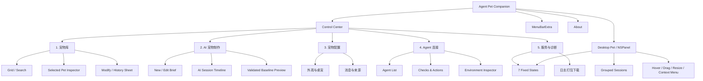

根 Sidebar 使用系统 source-list 结构：一行图标和名称、轻量系统选中态、无卡片阴影。顶部可有简短分组标签，底部只保留一行当前宠物摘要；不显示英文副标题或多行运行说明。

## 5. Liquid Glass 与平台策略

Apple 对 Liquid Glass 的定位是导航与控制的功能层；标准 SwiftUI/AppKit 控件在新系统上会自动获得相应外观。实现时应依靠系统 API，而不是固定透明度、手工高光和仿制折射。

### 5.1 材料分配

| 层级 | 组件 | macOS 26+ | macOS 14–15 | 禁止做法 |
|---|---|---|---|---|
| 导航 | Sidebar、Toolbar、Titlebar accessory | 系统原生 Liquid Glass | 系统 Sidebar/Toolbar material | 给 Sidebar 再套自定义玻璃卡 |
| 控制 | 浮动筛选、悬浮按钮、Sheet 底部动作 | `regular`，仅交互控件启用 interactive | `.regularMaterial` | 把整页内容变成玻璃 |
| 内容 | 列表、网格、表单、Inspector 正文 | 系统 window/content background | 同左 | glass-on-glass、装饰性 blur |
| 桌宠气泡 | 会话摘要与控制 | 默认 `regular`；仅媒体背景满足对比条件时考虑 `clear` | `.regularMaterial` + 系统边界 | 通过降低文字 alpha 模拟透明度 |
| 菜单 | MenuBarExtra、NSMenu、Context Menu | 系统菜单 | 系统菜单 | 自绘网页式菜单 |

实现细则：

- `regular` 是默认玻璃变体；`clear` 只允许用于媒体背景、前景足够粗亮、并具备 dimming/对比保障的场景。
- 多个相邻玻璃控件需要融合/形变时使用同一 `GlassEffectContainer`；不要给父子层同时加玻璃。
- 用户的“气泡透明度”设置只映射背景的光学强度；文字、图标和可点击控件保持完整对比。
- Reduce Transparency 开启时，气泡切换为更实的系统背景和明确 separator；Increase Contrast 开启时增强边界，不引入自定义霓虹描边。
- `#available(macOS 26, *)` 内使用新 API；低版本只做语义和层级等价，不追求伪造相同光学效果。

## 6. 视觉系统

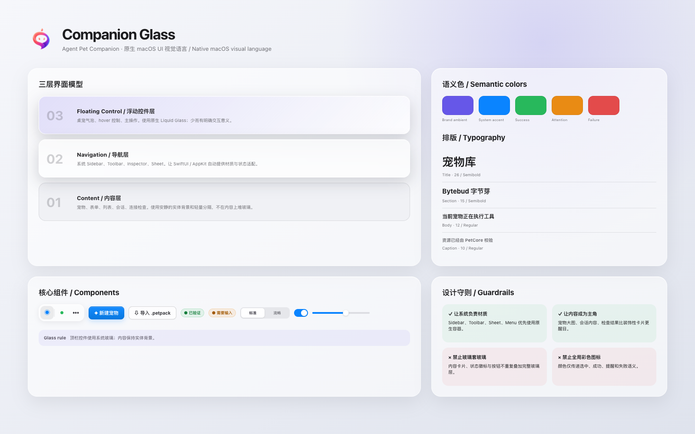

### 6.1 颜色

- 基底全部来自系统语义色：`windowBackgroundColor`、`controlBackgroundColor`、`textColor`、`secondaryLabelColor`、`separatorColor`。
- 品牌主色建议为 **Iris `#6757F3`**，只用于当前选择、主操作、进度和焦点。
- 品牌暖色建议为 **Coral `#FA6F61`**，只用于品牌标记和少量活力提示，不承担错误语义。
- 状态语义使用系统蓝/绿/橙/红；灰色表示未检查或不适用。
- 任何状态色不得铺满整个气泡、Inspector 或列表行。

### 6.2 排版

全部使用系统字体与动态文字样式，不内嵌第三方字体。

| 用途 | 建议样式 | 规则 |
|---|---|---|
| 页面标题 | `.title2.weight(.semibold)` | 一页只出现一次 |
| 区块标题 | `.headline` / `.title3` | 与下一层至少有一个字号层级差 |
| 正文 | `.body` | 不低于系统默认可读尺寸 |
| 辅助信息 | `.caption` / `.secondary` | 不承载唯一关键信息 |
| 协议名、ID、版本 | `.caption.monospaced()` | 可选择、可复制时提供上下文菜单 |

### 6.3 间距、圆角与边界

- 基础间距：4、8、12、16、20、24、32 pt。
- 内容区页边距：24 pt；紧凑宽度可降至 20 pt。
- 系统列表和表单优先使用自身间距，不人为把每一行包成卡片。
- 自定义内容容器圆角 12 pt；媒体预览 16 pt；小 badge 采用 capsule。
- 边界使用 1 px 系统 separator；阴影只用于浮层与 Sheet，不用于普通内容卡。

### 6.4 图标与动作等级

- 使用 SF Symbols；Agent 品牌图标继续由 `AgentIconProvider` 提供。
- 主操作每个界面最多一个 prominent button。
- 对象级次要操作放在选中详情、Inspector 或 `Menu`；危险动作使用红色文字/图标并在 Sheet 中确认。
- 省略号只表示“更多动作”，不能用作未命名的核心操作。
- 顶部 Toolbar 采用系统分组控件：Sidebar toggle 可位于 leading；桌宠显隐、服务状态和更多菜单等固定 App 动作统一靠 trailing 排列。
- 导入、制作、全部检查、取消任务、刷新状态等页面独有动作不进入固定 Toolbar；放在详情区标题下方或标题右侧紧邻位置，并保持左对齐。

### 6.5 动效

- 页面切换：系统 split-view 动画，不做整页滑入。
- Inspector/Sheet：系统呈现。
- 桌宠 hover 控件：120–160 ms 淡入；离开后延迟约 300 ms 淡出，避免指针在宠物和按钮之间移动时闪烁。
- 气泡展开/收起：180–220 ms，布局变化使用 matched geometry 或系统 transition；Reduce Motion 时改为 crossfade。
- 状态变化主要靠宠物帧动画；不要再叠加持续闪烁、呼吸光或大面积渐变动画。

## 7. 全局窗口与响应式布局

### 7.1 Control Center Shell

- 默认窗口：1120 × 720 pt；最小窗口：760 × 520 pt，延续当前运行合同。
- 使用 unified titlebar/toolbar；窗口标题显示当前顶层页面。
- 根 Sidebar 理想宽度 220–248 pt，可由用户调整但设合理上下限；使用 `.listStyle(.sidebar)` 的扁平 source-list 行、系统选中态和单个 leading icon，不把导航行绘制成独立白色卡片。
- Toolbar 高度交给系统；内容不能伪造第二条页面顶栏。
- 固定 Toolbar 只保留 App 级动作并统一放在右侧：桌宠显示、服务状态、更多菜单。Sidebar toggle 属于窗口结构控件，可放在左侧。
- 页面级动作放在详情区顶端左侧：例如宠物库的搜索/导入/制作、AI 会话的取消任务、连接页的全部检查、服务页的刷新状态。
- 所有页面使用相同的 Toolbar 分组、控制尺寸、圆角与图标语义，不能针对单页重画一套顶部按钮。
- 所有 Toolbar 操作在 App menu 中有语义对应；现有 `⇧⌘P` 桌宠显隐快捷键保留。
- 关闭 Control Center 不退出应用；“退出 Agent Pet Companion”继续走既有生命周期逻辑。

### 7.2 宽度策略

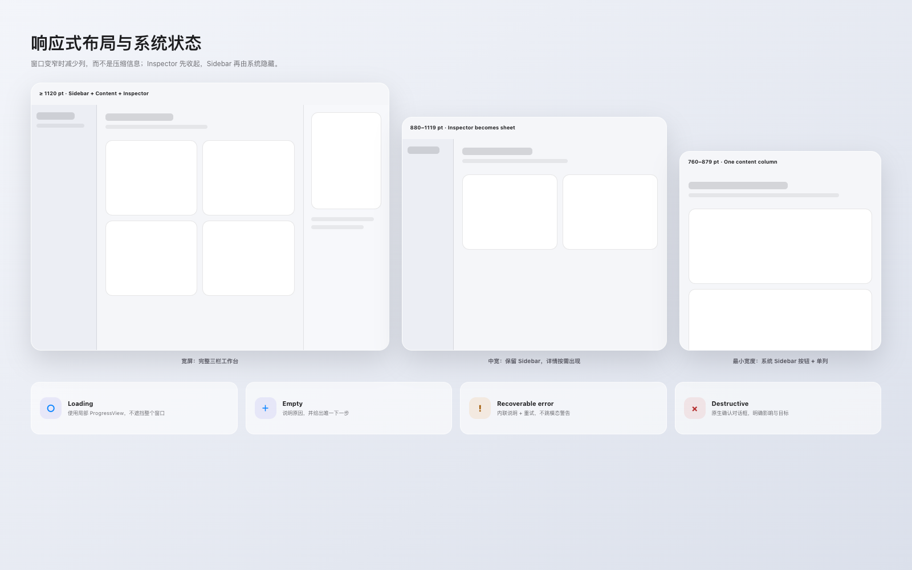

| 内容宽度 | 布局 | 行为 |
|---|---|---|
| ≥ 1120 pt | Sidebar + Content + Inspector | 宠物库、连接页显示完整三栏；详情常驻 |
| 880–1119 pt | Sidebar + Content | Inspector 由 Toolbar 按钮打开为系统 Sheet/Inspector overlay |
| 760–879 pt | 单内容列 | Sidebar 由系统按钮显示/隐藏；表单和网格变为一列 |

收窄优先级固定为：**收起 Inspector → 系统隐藏 Sidebar → 内容单列**。不允许通过压缩字体、缩小按钮命中区或截断关键状态来维持三栏。

### 7.3 通用系统状态

- Loading：在正在加载的局部区域使用 `ProgressView`，不遮罩整个窗口。
- Empty：说明原因 + 一个下一步动作；不使用大面积插画抢占空间。
- Recoverable error：内联提示，保留上下文，提供重试。
- Destructive confirmation：Sheet/confirmationDialog 中明确对象名与后果。

## 8. 界面规格

以下示意图表达布局、组件关系、信息优先级与视觉语气。实现应使用原生 SwiftUI/AppKit 组件，不要求逐像素复刻示意图中的 Web 渲染。

### 8.1 宠物库 / Pet Library

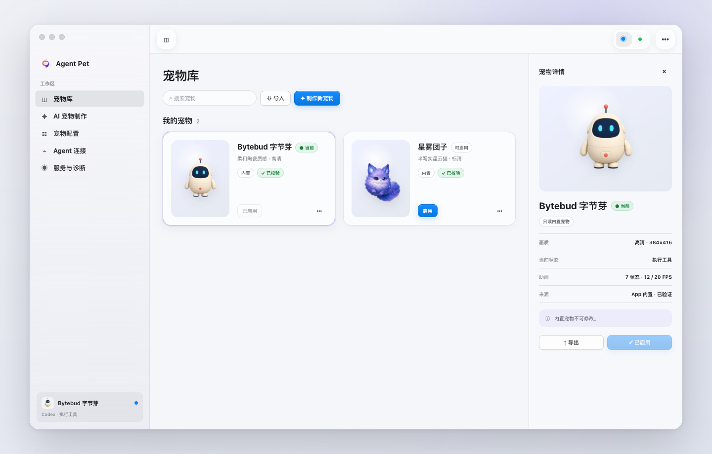

**目标**：在同一视野内完成搜索、选择、预览、启用和对象级操作。

**布局**：

- 详情区顶部：页面标题；下一行左对齐搜索、导入 `.petpack` 和“制作新宠物”。固定 Toolbar 不放宠物库专属动作。
- Content：自适应两到四列宠物网格；卡片只包含预览、名称、来源 badge、当前启用状态。
- Inspector：选中宠物的动画预览、稳定 ID、来源、版本、状态完整性、当前 revision 与操作。

**交互**：

- 单击卡片只选择；双击或按 Return 启用选中宠物。
- “启用”是 Inspector 的唯一 prominent action。
- 内置宠物显示“内置 · 只读”，只提供启用、预览、导出；不显示修改/删除入口。
- 用户宠物提供启用、修改、历史、导出；删除放入更多菜单并二次确认。
- 同名不同 ID 必须同时出现；搜索匹配显示名、ID 和来源，任何去重都以 manifest ID 为准。
- import/validation 失败在页面动作区下方显示可恢复 banner，不清空当前选择。
- 无制作历史的导入宠物，Inspector 显示“暂无制作记录”；“修改”启动新的编辑会话，而不是伪造旧对话。

**实现落点**：重构 `PetLibraryView.swift`；继续复用 `PetLibraryPresentation.swift` 的能力判断，将 presentation model 扩展为 `isBundled`、`canModify`、`canDelete`、`validationSummary`、`revisionSummary` 等显式字段。

**验收**：内置/用户/同名不同 ID/无历史/空库/搜索无结果/导入失败七种状态均可区分；所有对象操作只作用于选中 ID。

### 8.2 宠物修改与历史 Sheet

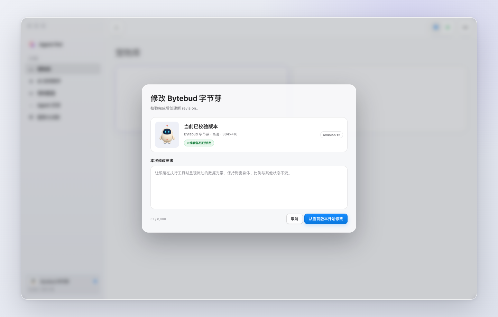

**目标**：在离开宠物库前明确修改基线、不可变规则和下一步。

- 使用原生 Sheet，不做居中的自绘网页 Modal。
- 左侧显示已验证的当前 revision 预览；右侧显示宠物 ID、revision、七状态/FPS 合同与用户修改意图输入。
- 明确提示：保存结果会形成不可变新 revision；旧 revision 仍可查看；宠物 ID 不变。
- 内置宠物不打开此 Sheet；改为“创建副本并定制”，进入 AI 制作并生成新 pet ID。
- 历史列表为信息/选择基线能力，不把 App Server session ID 或 transcript 写入导出的 pet metadata。

**验收**：取消不产生 job；确认后才创建 edit job；基线在会话期间只读；校验成功前不替换当前 revision。

### 8.3 AI 宠物制作 — 新建

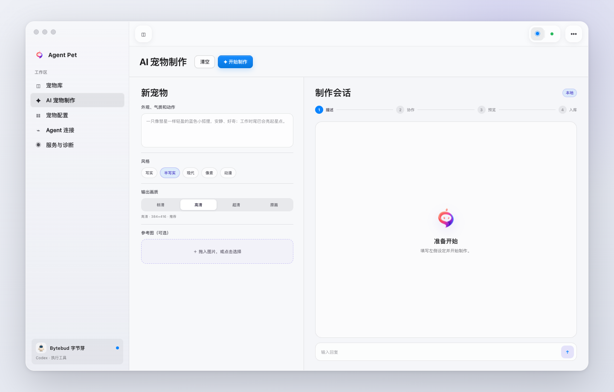

**目标**：把“创作 brief”和“AI 执行会话”区分为两个阶段，但保持在同一顶层页面。

**布局**：

- 左侧约 38%：描述、六个风格预设、四个画质档位、参考图 drop zone。
- 右侧：会话欢迎/空状态、最终会生成的合同摘要与安全说明。
- 页面标题下方左对齐：清空（次要）和开始制作（唯一主操作）；表单底部不重复出现同一组按钮。

**字段合同**：

- 风格：写实、半写实、现代、像素、动漫、不指定。
- 画质：192×208、384×416（推荐）、768×832、1536×1664。
- 参考图支持选择和拖放；导入后以安全拷贝进入 job workspace，不显示原路径中的敏感信息。
- 表单进行有界校验；描述为空时主操作禁用并给出字段级提示。

**状态**：pending/running/waiting/failed/completed/cancelled 必须映射为明确的 UI，不把失败当成对话文本的一部分。

### 8.4 AI 宠物制作 — 进行中与修改会话

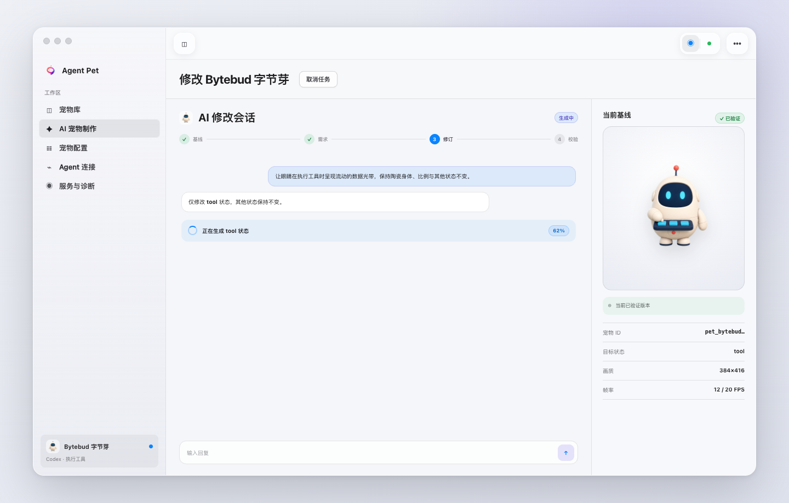

**目标**：让用户始终知道正在做什么、等待谁、当前看到的是哪一版。

- 主区使用四步进度：基线/需求 → 生成 → 校验 → 入库；步骤名称可按新建/修改略有差异，但不能伪造百分比。
- Timeline 区分用户消息、AI 解释与结构化进度事件。
- running 时冻结会改变 job 输入的表单；取消任务放在详情区标题旁，并明确取消不会破坏当前 revision。
- waiting 时 composer 获得焦点，给出明确问题；失败时显示错误摘要、重试和保留输入。
- 右 Inspector 只展示“当前已提交基线”。生成中的未验证资产不得伪装为可用预览。
- completed 后显示验证摘要、新 revision 与“在宠物库中查看”；成功导入/启用仍沿用 PetCore 原子流程。

**实现落点**：拆分当前 `PetStudioView.swift` 为 `MakerBriefView`、`GenerationSessionView`、`GenerationProgressView`、`ValidatedBaselineInspector`，继续复用 `GenerationSessionState` 和 AppStore actions。

**验收**：刷新/重开 App 能恢复已有会话；等待、失败、取消、完成都有唯一主动作；修改模式明确显示目标状态与当前 ID。

### 8.5 宠物配置 — 外观与桌宠

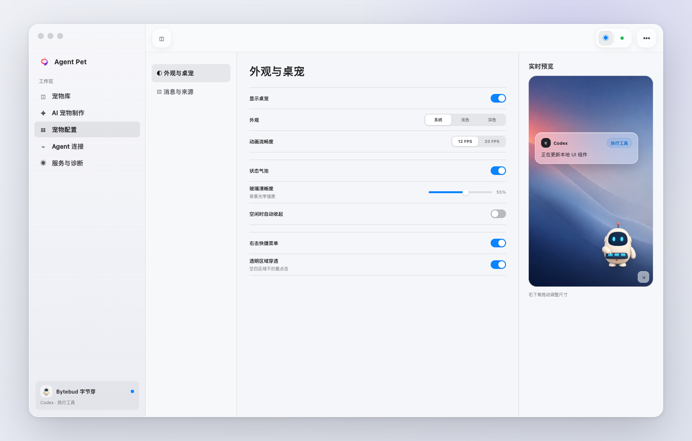

**目标**：把当前长页面拆为稳定子导航，并提供不接管桌面的安全预览。

子导航固定为：

1. 外观与桌宠
2. 消息与来源

子栏不显示“配置”等重复栏目标题；选项使用接近系统 Sidebar 正文的字号和轻量选中态。“服务与诊断”不属于宠物设置，不出现在此处。

外观页包含：显示桌宠、系统/浅色/深色、12/20 FPS、状态气泡、气泡透明度、空闲自动收起、右击菜单、透明区域穿透。会话消息收起时间与多会话默认方式可放在“消息与来源”。

右侧预览模拟真实桌面背景与当前宠物：

- 配置变化实时映射到预览；透明度拖动期间只 preview，结束后一次性 commit，延续现有 store 行为。
- 预览必须画出右下角缩放手柄并说明“尺寸只在桌宠上调整”；不得增加尺寸 Slider。
- 外观主题同时影响 Control Center、气泡、按钮和菜单；透明度仅影响气泡光学背景。

### 8.6 宠物配置 — 消息、来源与会话

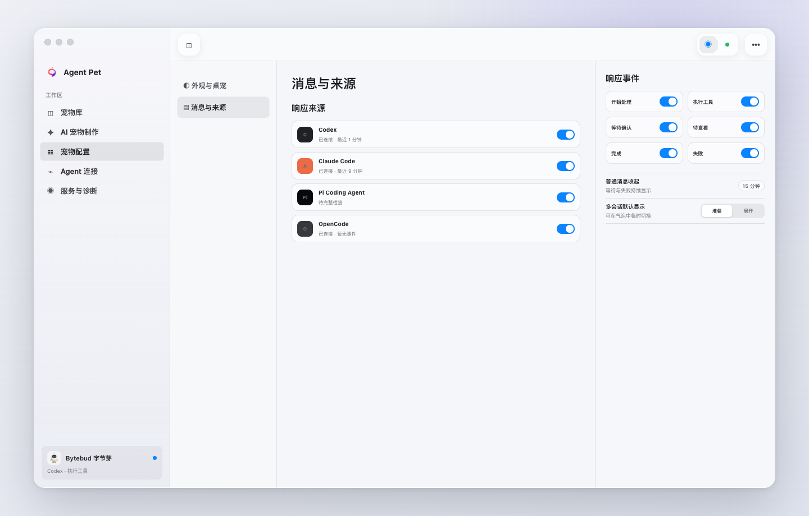

- 四个来源固定为 Codex、Claude Code、Pi Coding Agent、OpenCode；行内显示连接摘要，但修复入口仍在 Agent 连接页。
- 六种可开关事件为 `start`、`tool`、`waiting`、`review`、`done`、`failed`；`idle` 是无活动基态，不作为外部事件开关。
- UI 文案可显示“开始处理、执行工具、等待确认、待查看、完成、失败”，数据键保持原值。
- 会话消息收起时间范围 1–1440 分钟；等待确认和失败始终保持可见，不受普通消息超时影响。
- 多会话默认显示为堆叠/展开；气泡中允许本次临时切换，不反向覆盖全局偏好。
- 本页不得再出现“诊断与反馈”卡片或导出入口。

### 8.7 服务与诊断 / App-level Diagnostics

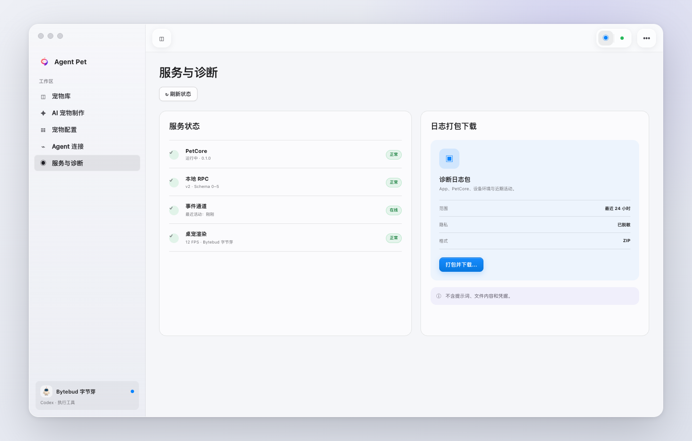

- 这是第五个根 Sidebar 入口，位于“Agent 连接”之后，不属于宠物配置。
- 页面只拆成两个清晰区域：**服务状态**与**日志打包下载**。
- 服务状态展示 PetCore、本地 RPC、事件通道与桌宠渲染；标题下方左对齐“刷新状态”。
- 日志区域展示范围、脱敏状态、格式和唯一主操作“打包并下载…”。
- 一行必要隐私提示即可：不含提示词、文件内容和凭据；不再显示大段包含/排除说明。
- 打包使用现有安全 staging/validate/publish 流程；进行中显示局部 `ProgressView`，主按钮禁用；完成后转换为保存/下载动作。

**实现落点**：`BehaviorSettingsView.swift` 只拆为两个配置子页，并继续绑定同一 `BehaviorSettings` typed model。新增 App 级 `ServiceDiagnosticsView`，复用现有 runtime status 与 diagnostics export action；不要复制服务状态。

### 8.8 Agent 连接

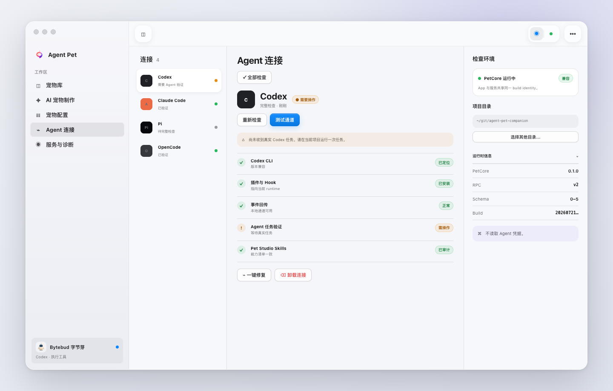

**目标**：把“选哪个 Agent、它哪里有问题、检查发生在哪个环境”固定为三栏，减少长页扫描。

**结构**：

- 左：四个 Agent 列表，显示健康摘要和上次检查模式。
- 中：选中 Agent 的检查项、解释、重新检查、测试通道、修复与卸载。
- 右 Inspector：项目目录、PetCore/runtime identity、RPC/schema/build、安装路径 disclosure 与隐私边界。

**动作规则**：

- “全部检查”放在详情区页面标题下方左侧；检查、修复、测试在同一时间只运行一个 Agent，对其他冲突动作禁用并说明原因。
- “测试通道”只证明本地诊断事件链路，不得显示为“真实 Agent 已验证”。
- 真实验证必须明确要求用户从所选项目触发一次对应 Agent 任务；这是单独的检查项。
- Repair 先展示将修改的托管文件/命令；Uninstall 使用破坏性确认并说明不删除用户 Agent、不读取凭据。
- 项目目录选择/重置属于 Inspector；无权限或路径失效时提供内联恢复。
- 总体健康来自 typed check items，不从人类文本临时解析。

**实现落点**：将 `AgentConnectionsView.swift` 分为 `AgentConnectionList`、`ConnectionCheckDetail`、`ConnectionEnvironmentInspector`、`ConnectionActionBar`；AppStore 的串行任务和能力判断保持唯一来源。

**验收**：light/full check、missing/needs repair/unverified/unsupported/healthy、runtime mismatch、无项目目录、操作进行中和操作失败都有可区分呈现。

### 8.9 桌宠 — 七状态语言

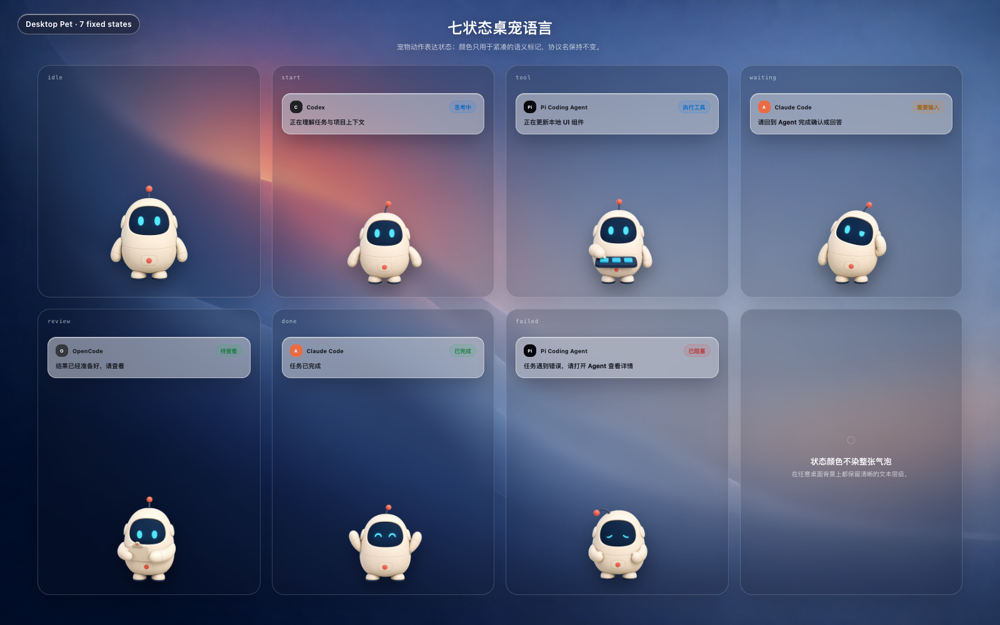

宠物动作是第一信号，气泡文字是精确解释，badge 是第三层语义。固定映射：

| 协议状态 | 推荐 UI 文案 | 颜色 | 气泡持续策略 |
|---|---|---|---|
| `idle` | 无需 badge | 无 | 无活动时可只显示宠物 |
| `start` | 思考中 | 系统蓝 | 普通超时策略 |
| `tool` | 执行工具 | 系统蓝 | 普通超时策略 |
| `waiting` | 需要输入 | 系统橙 | 始终保持，直到状态改变/用户收起 |
| `review` | 待查看 | 系统绿 | 保持到用户查看或状态改变 |
| `done` | 已完成 | 系统绿 | 普通超时策略 |
| `failed` | 已阻塞 | 系统红 | 始终保持，直到状态改变/用户收起 |

气泡必须包含 Agent 标识、Agent 名称、状态 badge、短标题/摘要。不要显示未经允许的 prompt、文件内容、命令参数或凭据。超过可用宽度时摘要最多两行，提供“打开 Agent 会话”而不是无限增高。

### 8.10 桌宠 — 多 Agent / 多会话

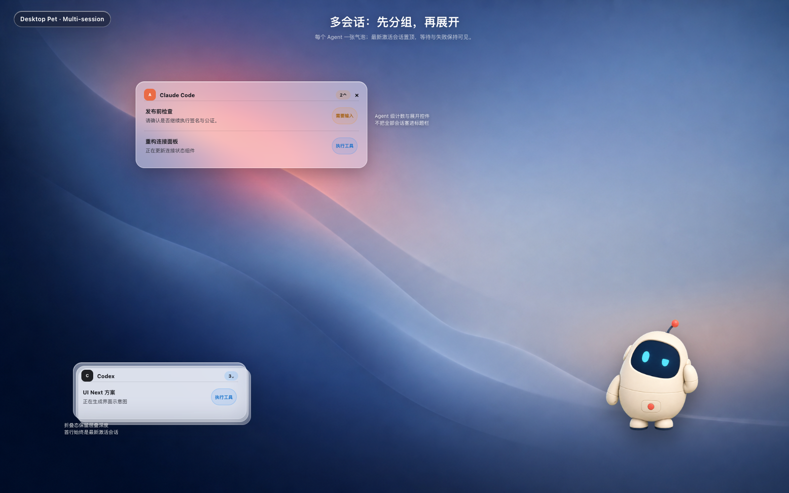

- 每个 Agent 一张组气泡；不要把不同 Agent 混在一张无归属列表中。
- 同一 Agent 多会话：默认只显示最新活跃会话，组头显示数量；用户可展开全部。
- 最新活跃会话置顶；`waiting` 与 `failed` 即使不是最新也必须可见。
- 堆叠模式用轻微层叠提示数量，不让多层玻璃实际叠加渲染；展开时只保留一个组容器。
- 最多展示运行合同允许的有界数量（当前文档合同为最多 8 个活动会话）；超出时给汇总入口。
- 收起单个气泡只改变本地 disclosure/dismissed 状态，不向 Agent 写入会话状态。

### 8.11 桌宠 — 指针、拖动、菜单与缩放

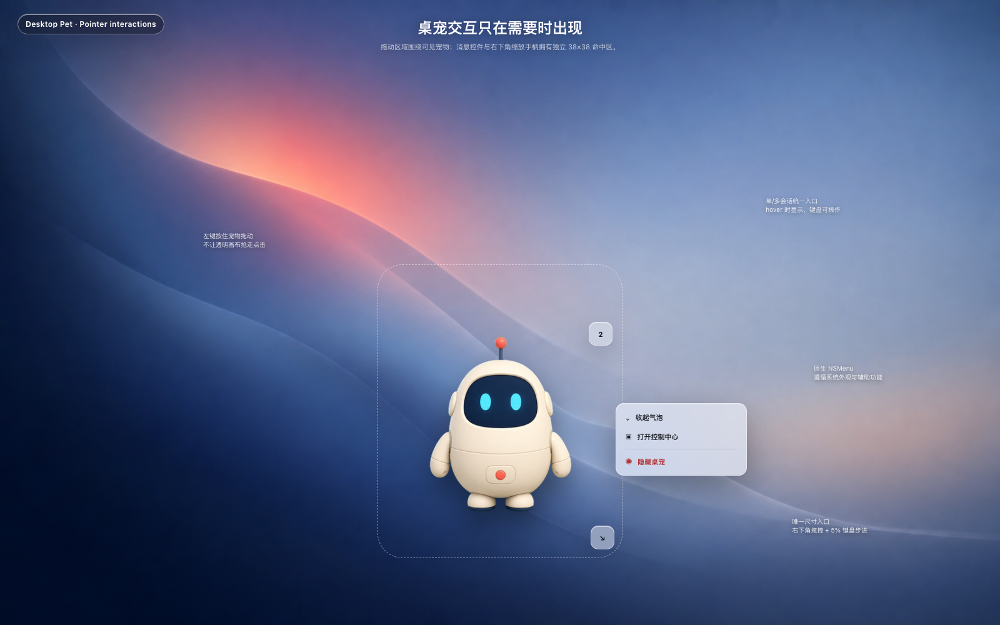

- 左键按住宠物主体拖动；透明区域穿透开启时，透明像素不能抢占其他 App 点击。
- 单击宠物进入/聚焦当前会话；hover 时显示气泡与控制，不依赖 hover 才能完成键盘操作。
- 右击使用原生 `NSMenu`：收起/展开气泡、打开控制中心、隐藏桌宠；根据上下文增减，不加入装饰项。
- 右下角是唯一缩放入口；视觉尺寸约 24 × 24 pt，命中区至少 38 × 38 pt。
- 缩放范围继续使用 `OverlayGeometry`：0.10–1.80，步进 0.05；辅助功能增减动作与拖动结果一致。
- 拖动/缩放过程不显示永久虚线框；示意图中的边框只是开发标注。最终 UI 只在 hover/操作时给出轻量边界或控制柄。
- 多显示器下保持现有屏幕选择、安全区域和位置持久化合同。

**实现落点（8.9–8.11）**：继续以 `OverlayRootView` 为组合入口，把气泡拆为 `AgentBubbleGroupView`、`SessionRowView`、`OverlayHoverControls`；几何与事件路由仍由 `OverlayGeometry`/controller 负责，不能把协议逻辑塞进 View。

### 8.12 MenuBarExtra 与 About

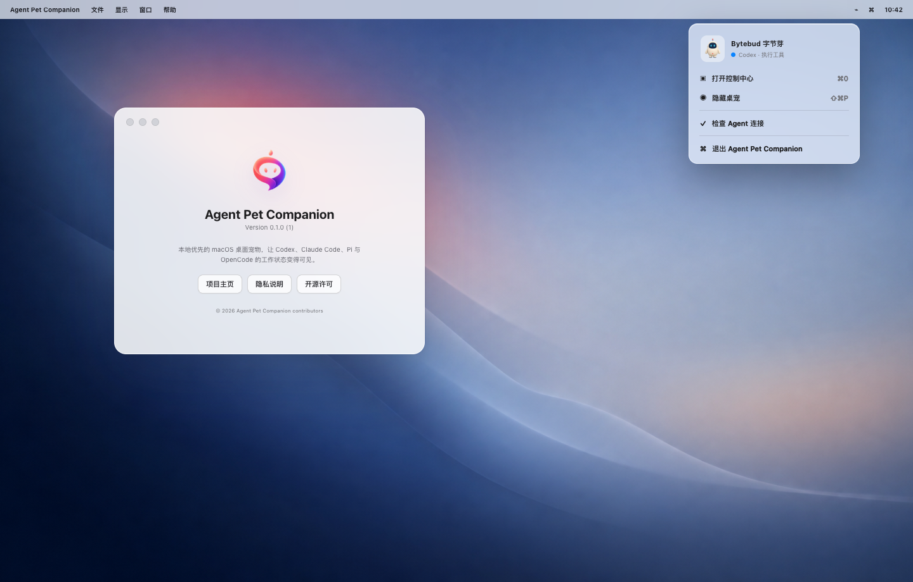

MenuBarExtra 使用系统菜单，不做自定义浮动面板：

- 顶部只读摘要：当前宠物、最近活动 Agent、PetCore 状态。
- 打开控制中心 `⌘0`（若实现现有菜单映射时冲突，以 App 命令体系为准）。
- 显示/隐藏桌宠 `⇧⌘P`。
- 检查 Agent 连接。
- 分隔线后退出 App。

About 保持小型原生窗口：品牌标记、产品名、版本/build、本地优先一句话说明、项目主页/隐私说明/开源许可。不要把 About 变成营销落地页。

## 9. 功能覆盖矩阵

### 9.1 App 参考图覆盖

| 现有参考 | 被新方案承接的位置 |
|---|---|
| `01-pet-library` | 8.1 宠物网格 + Inspector |
| `02-pet-library-bundled-detail` | 8.1 内置只读操作规则 |
| `03-ai-pet-maker-new` | 8.3 新建 brief |
| `04-ai-pet-maker-reference` | 8.3 参考图 drop zone 与安全拷贝 |
| `05-pet-configuration-top` | 8.5 外观与桌宠 |
| `06-pet-configuration-events` | 8.6 消息与来源 |
| `07-pet-configuration-diagnostics` | 8.7 服务与诊断一级入口；原能力从宠物配置迁出 |
| `08-agent-connections-top` | 8.8 三栏连接总览 |
| `09-agent-connections-codex` | 8.8 Codex 检查与真实验证 |
| `10-agent-connections-pi-opencode` | 8.8 不同 Agent 状态与能力项 |
| `11-about` | 8.12 About |
| `12-library-no-making-history` | 8.1 无制作历史状态 |
| `13-ai-pet-maker-edit-session` | 8.2 + 8.4 修改 Sheet/会话 |

### 9.2 桌宠参考图覆盖

| 现有参考组 | 被新方案承接的位置 |
|---|---|
| `01-idle-*` | 8.9 `idle` 与两只内置宠物 |
| `02`–`07` 状态图 | 8.9 七状态动作、badge 和气泡语义 |
| `08-context-menu` | 8.11 原生 NSMenu |
| `09-bubble-*` | 8.10 单组收起/展开 |
| `10-multi-session-*` | 8.10 堆叠与临时切换 |
| `11-multi-session-*` | 8.10 展开组与宠物组合 |

## 10. SwiftUI 组件架构建议

建议逐步形成以下目录，不要求一次性大搬家：

```text
apps/macos/Sources/AgentPetCompanion/
├── App/
│   ├── AgentPetCompanionApp.swift
│   └── AppCommands.swift                 # 新增：菜单与快捷键映射
├── Views/
│   ├── Shell/
│   │   ├── ControlCenterView.swift
│   │   ├── RootSidebar.swift
│   │   ├── ControlCenterToolbar.swift
│   │   └── PageActionHeader.swift
│   ├── Library/
│   │   ├── PetLibraryView.swift
│   │   ├── PetGrid.swift
│   │   ├── PetInspector.swift
│   │   └── PetRevisionSheet.swift
│   ├── Maker/
│   │   ├── PetStudioView.swift
│   │   ├── MakerBriefView.swift
│   │   ├── GenerationSessionView.swift
│   │   └── ValidatedBaselineInspector.swift
│   ├── Configuration/
│   │   ├── BehaviorSettingsView.swift
│   │   ├── AppearancePetSettings.swift
│   │   └── MessageSourceSettings.swift
│   ├── Connections/
│   │   ├── AgentConnectionsView.swift
│   │   ├── AgentConnectionList.swift
│   │   ├── ConnectionCheckDetail.swift
│   │   └── ConnectionEnvironmentInspector.swift
│   ├── Diagnostics/
│   │   ├── ServiceDiagnosticsView.swift
│   │   ├── ServiceStatusRegion.swift
│   │   └── DiagnosticPackageRegion.swift
│   └── Shared/
│       ├── CompanionTheme.swift
│       ├── StatusBadge.swift
│       ├── InlineNotice.swift
│       └── EmptyContent.swift
└── Overlay/
    ├── OverlayRootView.swift
    ├── AgentBubbleGroupView.swift
    ├── SessionRowView.swift
    └── OverlayHoverControls.swift
```

架构边界：

- `AppStore` 继续持有 UI 可观察状态和 actions；视图拆分不能产生第二份业务状态。
- PetCore 继续是在线状态所有者；View 不直接读数据库、socket、Agent 配置或凭据。
- `PetLibraryPresentation`、connection typed checks 与 `GenerationSessionState` 应成为视图的明确 presentation input，避免 UI 解析描述字符串。
- `CompanionTheme` 只封装 token、平台 availability 和少数自定义组件；不要重新实现 Button/List/Form/Menu。
- 现有 `apcLiquidGlass` 应收敛为语义 API，例如 `navigationGlass`、`floatingControlGlass`、`bubbleGlass`，并禁止用于普通内容 Surface。

## 11. 详细实施任务规划

任务按依赖顺序执行。每个阶段都应可独立构建、测试和审查；不要在一个提交里同时改四个页面和桌宠协议。

### Phase 0 — 契约与基线

**UI-000：建立改造基线**

- 为五个根页面、About、MenuBarExtra 和 Overlay 核心状态建立可重复的 preview/fixture。
- 建立五项导航顺序 fixture；同时固化窗口最小尺寸、overlay scale 范围、七状态、FPS 与 bundled pet 权限测试。
- 记录现有 accessibility identifiers；缺失的补齐。
- 完成标准：不改变可见 UI；`swift test` 和现有 UI Validation Contract 可运行。

**UI-001：补充 presentation models**

- 把宠物权限、connection 状态、generation 阶段、bubble group 展示判断从 View 条件分支提取为 typed presentation state。
- 禁止从本地化字符串反推状态。
- 完成标准：关键状态有纯单元测试；AppStore/PetCore 边界不变。

### Phase 1 — Shell 与设计系统

**UI-100：替换根窗口结构**

- 将 `ContentView`/`SidebarView` 改为 `NavigationSplitView` 或等价原生 split view。
- 扩展 `NavigationSection`，按“宠物库、AI 宠物制作、宠物配置、Agent 连接、服务与诊断”显示五个根入口。
- Sidebar 使用原生 source-list 行、系统选中态、单行 label 和系统 sidebar toggle；删除卡片式导航行。
- 配置默认 1120×720、最小 760×520、unified toolbar。

**UI-110：固定 Toolbar、页面动作与 Commands**

- 固定 App 动作统一放 Toolbar trailing；Sidebar toggle 留在 leading。
- 新建 `PageActionHeader`，把搜索、导入、制作、检查、取消、刷新等页面动作放在详情区顶端左侧。
- 同一命令映射到 App menu/快捷键；禁止同一动作同时出现在固定 Toolbar 和页面标题区。
- 保留桌宠显隐与退出生命周期行为。
- MenuBarExtra 改为 8.12 的简洁原生菜单。

**UI-120：CompanionTheme 与 Liquid Glass availability**

- 建立语义 token；删除普通内容上的玻璃 Surface。
- macOS 26+ 使用系统 Liquid Glass；14–15 使用系统 material 降级。
- 加入 Reduce Transparency/Increase Contrast/Reduce Motion 分支。

**阶段验收**：五页可导航、Sidebar 可隐藏、固定 Toolbar 在所有页面一致、页面动作位置一致；浅色/深色/高对比均无玻璃叠层。

### Phase 2 — 宠物库

**UI-200：Pet Grid 与搜索**

- 自适应网格、selection、searchable、空状态和导入失败 banner。
- 大图库滚动时只加载可见预览，避免重启动画。

**UI-210：Pet Inspector**

- 展示选中 ID/revision/来源/验证/状态覆盖；对象操作按 capability 显示。
- bundled 权限使用 typed flag，而非显示名判断。

**UI-220：修改/历史/删除流程**

- 实现 8.2 Sheet；用户宠物支持修改与历史；内置宠物引导创建新 ID。
- 危险删除显示宠物名称与 ID；导出保持 lossless 流程。

**阶段验收**：两个内置宠物不会被删除或原地修改；同名不同 ID 共存；选中和启用语义不混淆。

### Phase 3 — AI 宠物制作

**UI-300：Maker Brief**

- 重建描述、风格、画质、参考图与字段校验。
- pending 前允许编辑；active job 后冻结合同字段。

**UI-310：Generation Timeline**

- 将 pending/running/waiting/failed/completed/cancelled 映射为结构化页面状态。
- 实现步骤、消息、结构化进度、composer、cancel/retry。

**UI-320：Edit Baseline 与完成态**

- 修改任务右侧固定显示已验证 baseline；生成资产在验证前不进入 preview。
- completed 显示 revision/校验摘要与宠物库入口。

**阶段验收**：新建、带参考图、等待回答、失败重试、取消、完成、修改、恢复已有会话八条流程可验证。

### Phase 4 — 宠物配置

**UI-400：配置子导航与绑定**

- 只拆分“外观与桌宠”“消息与来源”两个子页，共用同一 `BehaviorSettings` 状态和保存机制。
- 删除子栏顶部重复的“配置”文字；提高选项字号并使用轻量 source-list 选中态。
- 窄宽度下子导航转换为顶部 Picker/菜单。

**UI-410：实时预览与材料设置**

- 实现气泡/主题/开关预览；透明度滑动遵循 preview + commit。
- 预览呈现右下角缩放说明，但不增加尺寸设置。

**UI-420：来源、事件、超时与多会话**

- 四来源、六事件、1–1440 分钟、堆叠/展开完整绑定。
- `waiting`/`failed` 的保持策略加 model test。
- 删除本页“诊断与反馈”卡片；诊断入口只存在于根 Sidebar。

**阶段验收**：重开 App 后设置持久化；预览与真实 overlay 使用相同 presentation rules；12/20 FPS 不发生第三种值。

### Phase 5 — Agent 连接

**UI-500：三栏连接工作区**

- Agent list、selected detail、environment inspector；中宽度 Inspector 变为 Sheet。

**UI-510：Typed check rows 与摘要**

- 每项显示 status、说明、恢复动作；区分 light/full/unsupported/unverified。
- 全局摘要不能把诊断通道通过等同于真实 Agent 验证。

**UI-520：检查、测试、修复、卸载流程**

- 保留串行互斥；实现进度、失败恢复、repair impact preview、destructive confirm。

**阶段验收**：四 Agent 各状态 fixture 可渲染；Finder 启动环境、runtime mismatch、目录无效和 PetCore 离线均有下一步。

### Phase 6 — 服务与诊断

**UI-600：App 级诊断入口与布局**

- 新增根导航 case 和 `ServiceDiagnosticsView`；从 `BehaviorSettingsView` 移除诊断区域。
- 页面只保留“服务状态”“日志打包下载”两个区域；刷新状态放在页面标题下方左侧。

**UI-610：服务状态**

- 使用现有 AppStore/PetCore runtime 信息展示 PetCore、本地 RPC、事件通道与桌宠渲染。
- offline/recovering/mismatch/error 提供紧凑状态与恢复动作，不展示长篇架构说明。

**UI-620：日志打包下载**

- 复用现有安全导出 action，显示范围、脱敏状态、ZIP 格式、进行中与完成状态。
- 仅保留一行隐私提示；打包前后继续执行 staging/validation/publish 安全流程。

**阶段验收**：宠物配置无诊断子项和诊断卡；根 Sidebar 能直接进入服务页；状态刷新与日志打包互不阻塞；导出内容不含提示词、文件内容和凭据。

### Phase 7 — Desktop Pet Overlay

**UI-700：Bubble 视觉与状态语义**

- 新建单一 `bubbleGlass`，七状态只通过小 badge/图标着色。
- 对比度、文字行数、打开会话 action 和隐私字段白名单固定。

**UI-710：多 Agent / 多会话分组**

- Agent group、session row、stacked/expanded、waiting/failed pinning、最多 8 会话汇总。
- disclosure/dismissed 状态不回写 Agent 生命周期。

**UI-720：Hover controls 与 resize**

- 右下唯一缩放手柄；24 pt 视觉、38 pt 命中；0.10–1.80/0.05 合同不变。
- 实现 hover 延迟、透明区域穿透、拖动与辅助功能 increment/decrement。

**UI-730：Context menu 与多显示器**

- 使用原生 NSMenu；验证打开控制中心、隐藏、收起/展开路由。
- 保留屏幕选择、安全区域、位置/尺寸持久化和 main-window 不抢焦点合同。

**阶段验收**：七状态、单会话、多 Agent、多会话、收起/展开、右击、拖动、缩放、穿透、多显示器与重启恢复全部通过 overlay contract 和可见验收。

### Phase 8 — About、本地化与无障碍

**UI-800：About 与链接**

- 原生 About window；版本/build 从 bundle/runtime 获取；链接可键盘访问。

**UI-810：中英文本地化**

- 所有新增用户可见字符串进入现有 String Catalog；检查中文长文案和英文展开宽度。
- 协议名和宠物 ID 不翻译。

**UI-820：Accessibility 完整性**

- VoiceOver label/value/hint、键盘焦点顺序、Full Keyboard Access、菜单等价动作。
- 状态不只依靠颜色；动画尊重 Reduce Motion；玻璃尊重 Reduce Transparency。

### Phase 9 — 验证与收尾

**UI-900：非交互验证**

- 运行 `cd apps/macos && swift test`。
- 运行与 UI model、overlay geometry、bubble rendering、lifecycle、diagnostics 相关测试。
- 运行默认宿主安全门禁：

  ```bash
  APC_VALIDATE_HOST_UI=0 \
  APC_VALIDATE_OVERLAY_INTERACTION=0 \
  APC_VALIDATE_REAL_AGENT_CONNECTORS=0 \
  APC_VALIDATE_REAL_APP_SERVER=0 \
  ./script/test_all.sh
  ```

**UI-910：可见 UI 验收**

- 使用 Computer Use 优先验证真实 App、MenuBarExtra、About、桌宠、气泡、窗口生命周期与多显示器。
- 不默认使用会抢占鼠标/键盘/焦点的自动化；若 Computer Use 无法覆盖，按仓库规则在使用前取得明确授权。

**UI-920：矩阵与回归**

- macOS 26 原生 Liquid Glass；macOS 14–15 fallback。
- 系统/浅色/深色；Reduce Transparency、Increase Contrast、Reduce Motion。
- 760、880、1120、1440 pt 窗口；1×/2×；中英文。
- PetCore online/offline/recovering；四连接源；七状态；0/1/8 个活动会话。
- 更新 `[Unreleased]` changelog，且只记录实际用户可见改动，不写临时通过数量。

## 12. Definition of Done

UI Next 完成必须同时满足：

- 五个根导航顺序正确；“服务与诊断”位于“Agent 连接”之后，宠物配置只保留两个子项。
- Sidebar 使用原生 source-list 行；固定 Toolbar 在全部页面保持一致，页面独有动作位于详情区顶部左侧。
- 普通内容不使用 Liquid Glass；导航、控件、Sheet、桌宠气泡的材料职责清楚。
- 所有现有功能由第 9 节矩阵覆盖，没有因改布局丢失导入、修改、历史、诊断、连接修复或多会话能力。
- bundled pet、稳定 ID、不可变 revision、七状态、12/20 FPS、右下缩放与隐私边界均有测试。
- 窗口在 760 pt 最小宽度仍可完成核心任务；不靠缩小字体维持布局。
- 键盘、菜单、VoiceOver 和系统辅助显示设置可用。
- App 界面仅保留操作、状态和恢复所需文案，无重复标题、重复说明或大段架构解释。
- 新界面在 macOS 26 使用系统原生 Liquid Glass，在 14–15 使用可靠的系统降级，没有手工仿制玻璃。
- 新鲜构建/测试输出和真实 UI 验收证据与对应 commit 关联；不把临时结果写回长期文档。

## 13. 示意图与源文件

本目录内的交付物：

```text
ui-next/codex/
├── UI-NEXT-SPEC.md
├── README.md
├── assets/
│   ├── desktop-wallpaper.png
│   ├── brand-mark.png
│   ├── bytebud/…
│   └── xingwu/…
├── mockups/
│   ├── 00-visual-system.png
│   ├── 01-library.png
│   ├── 02-library-edit-sheet.png
│   ├── 03-maker-new.png
│   ├── 04-maker-session.png
│   ├── 05-configuration-appearance.png
│   ├── 06-configuration-events.png
│   ├── 07-connections.png
│   ├── 07b-service-diagnostics.png
│   ├── 08-overlay-states.png
│   ├── 09-overlay-multisession.png
│   ├── 10-overlay-interactions.png
│   ├── 11-menubar-about.png
│   └── 12-responsive-and-states.png
└── source/
    ├── mockups.html
    ├── mockups.css
    └── render_mockups.cjs
```

示意图是确定性 HTML/CSS 渲染，可用于讨论和 diff；最终 App 必须用 SwiftUI/AppKit 原生组件实现。

## 14. 外部设计依据

- [Apple Human Interface Guidelines — Designing for macOS](https://developer.apple.com/design/human-interface-guidelines/designing-for-macos/)
- [Apple Human Interface Guidelines — Materials](https://developer.apple.com/design/human-interface-guidelines/materials)
- [Apple Human Interface Guidelines — Sidebars](https://developer.apple.com/design/human-interface-guidelines/sidebars)
- [Apple Human Interface Guidelines — Toolbars](https://developer.apple.com/design/human-interface-guidelines/toolbars)
- [WWDC25 — Meet Liquid Glass](https://developer.apple.com/videos/play/wwdc2025/219/)
- [SwiftUI — Adding a search interface to your app](https://developer.apple.com/documentation/swiftui/adding-a-search-interface-to-your-app)

这些资料用于约束材料、Sidebar、Toolbar、搜索与 macOS 行为；示意图没有复刻任何第三方 App 的视觉资产或布局。
